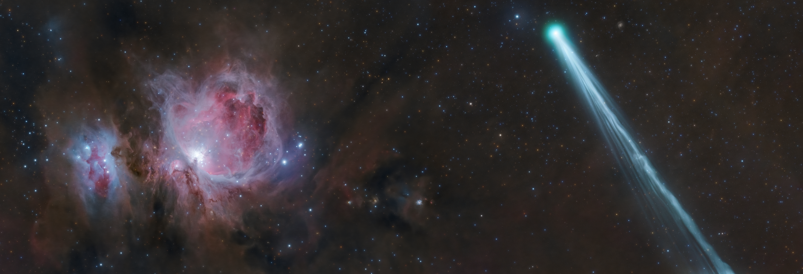

# Cosmos Log

A living archive of the universe, updated every morning by a GitHub Actions cron job.

<!-- COSMOS-START -->
<!-- HEARTBEAT: 2026-05-12 08:45:17 UTC -->
## 🔭 Today's Sky — 2026-05-12
### The Conjunction of Comet R3 PanSTARRS and the Orion Nebula

*Today’s composite image features something old, something new, something borrowed, and something blue! Comet R3 PanSTARRS, streaking across the right of the image, likely originated from the Oort Cloud, meaning it is an old Solar System relic from billions of years ago. It’s brig...*

📂 [Full archive in /log](./log/)
<!-- COSMOS-END -->

## How it works

1. **Scheduled Run**: A GitHub Actions workflow runs every day at 6 AM UTC (or manually via workflow_dispatch).
2. **Fetch Data**: A Python script runs to fetch the latest Astronomy Picture of the Day from NASA's API.
3. **Format & Commit**: The script updates this README, creates or updates a monthly log file in the `/log` directory, and pushes the latest entry directly to the repository.

## Setup

1. Push these files to a new GitHub repository called `cosmos-log`.
2. Go to your repository's **Settings → Secrets and variables → Actions**.
3. Create a new repository secret named `NASA_API_KEY` and paste your NASA API key. (You can register for a free key at [api.nasa.gov](https://api.nasa.gov/)). Alternatively, it will use the `DEMO_KEY` with strict rate limits.
