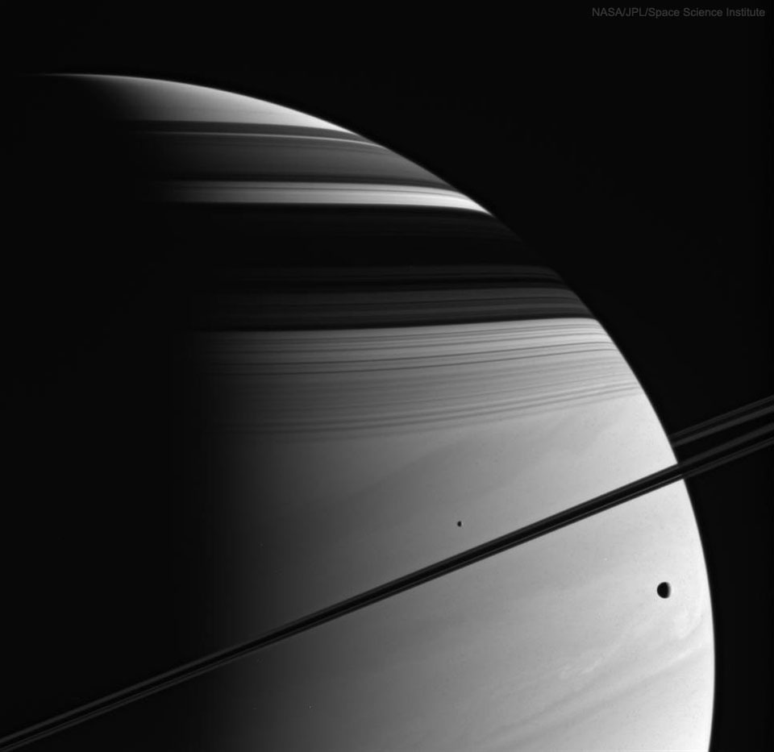

# Cosmos Log

A living archive of the universe, updated every morning by a GitHub Actions cron job.

<!-- COSMOS-START -->
<!-- HEARTBEAT: 2026-06-16 11:18:43 UTC -->
## 🔭 Today's Sky — 2026-06-16
### Moons, Rings, Shadows, Clouds: Saturn (Cassini)

*While cruising around Saturn, be on the lookout for picturesque arrangements of moons, rings, and shadows. One such striking sight occurred in 2005 and was captured by the then Saturn-orbiting Cassini spacecraft. In the featured image, moons Mimas (left) and Tethys (right) are vi...*

📂 [Full archive in /log](./log/)
<!-- COSMOS-END -->

## How it works

1. **Scheduled Run**: A GitHub Actions workflow runs every day at 6 AM UTC (or manually via workflow_dispatch).
2. **Fetch Data**: A Python script runs to fetch the latest Astronomy Picture of the Day from NASA's API.
3. **Format & Commit**: The script updates this README, creates or updates a monthly log file in the `/log` directory, and pushes the latest entry directly to the repository.

## Setup

1. Push these files to a new GitHub repository called `cosmos-log`.
2. Go to your repository's **Settings → Secrets and variables → Actions**.
3. Create a new repository secret named `NASA_API_KEY` and paste your NASA API key. (You can register for a free key at [api.nasa.gov](https://api.nasa.gov/)). Alternatively, it will use the `DEMO_KEY` with strict rate limits.
