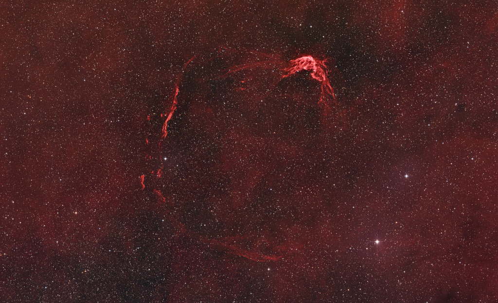

# Cosmos Log

A living archive of the universe, updated every morning by a GitHub Actions cron job.

<!-- COSMOS-START -->
<!-- HEARTBEAT: 2026-07-24 08:31:11 UTC -->
## 🔭 Today's Sky — 2026-07-24
### RCW 86: Historical Supernova Remnant

*In 185 AD, Chinese astronomers recorded the appearance of a new star in the Nanmen asterism. That part of the sky is identified with part of the southern constellation Centaurus on modern star charts. In fact, the new star was reported to be visible to the naked-eye for months be...*

📂 [Full archive in /log](./log/)
<!-- COSMOS-END -->

## How it works

1. **Scheduled Run**: A GitHub Actions workflow runs every day at 6 AM UTC (or manually via workflow_dispatch).
2. **Fetch Data**: A Python script runs to fetch the latest Astronomy Picture of the Day from NASA's API.
3. **Format & Commit**: The script updates this README, creates or updates a monthly log file in the `/log` directory, and pushes the latest entry directly to the repository.

## Setup

1. Push these files to a new GitHub repository called `cosmos-log`.
2. Go to your repository's **Settings → Secrets and variables → Actions**.
3. Create a new repository secret named `NASA_API_KEY` and paste your NASA API key. (You can register for a free key at [api.nasa.gov](https://api.nasa.gov/)). Alternatively, it will use the `DEMO_KEY` with strict rate limits.
