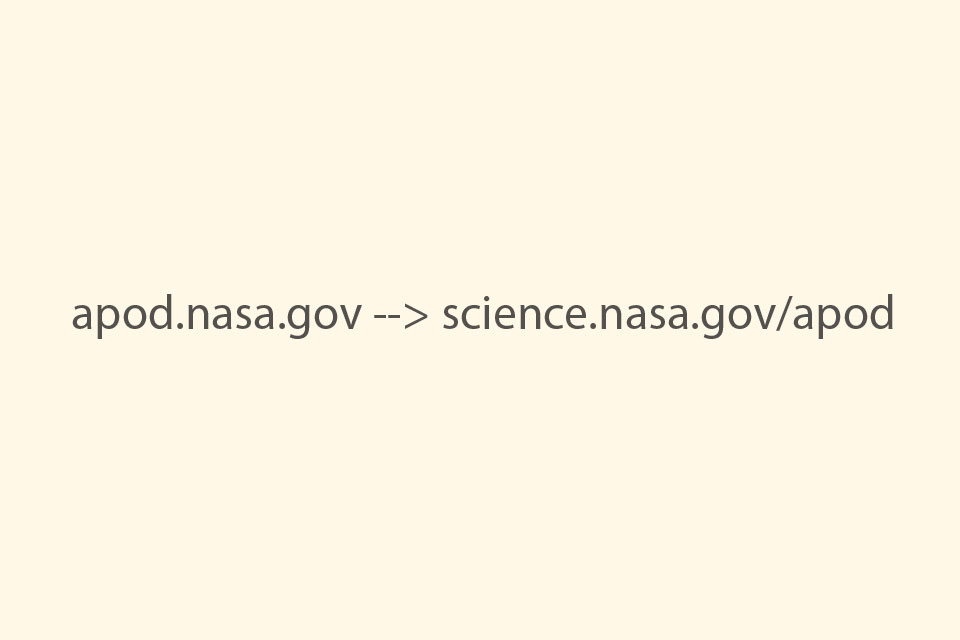

# Cosmos Log

A living archive of the universe, updated every morning by a GitHub Actions cron job.

<!-- COSMOS-START -->
<!-- HEARTBEAT: 2026-09-28 13:17:44 UTC -->
## 🔭 Today's Sky — 2026-09-28
### Cosmic Latte: The Average Color of the Universe

*What color is the universe?  More precisely, if the entire sky were smeared out, what color would the final mix be?  This whimsical question came up when trying to determine what stars are commonplace in nearby galaxies. The answer, depicted here, is a conditionally perceived sha...*

📂 [Full archive in /log](./log/)
<!-- COSMOS-END -->

## How it works

1. **Scheduled Run**: A GitHub Actions workflow runs every day at 6 AM UTC (or manually via workflow_dispatch).
2. **Fetch Data**: A Python script runs to fetch the latest Astronomy Picture of the Day from NASA's API.
3. **Format & Commit**: The script updates this README, creates or updates a monthly log file in the `/log` directory, and pushes the latest entry directly to the repository.

## Setup

1. Push these files to a new GitHub repository called `cosmos-log`.
2. Go to your repository's **Settings → Secrets and variables → Actions**.
3. Create a new repository secret named `NASA_API_KEY` and paste your NASA API key. (You can register for a free key at [api.nasa.gov](https://api.nasa.gov/)). Alternatively, it will use the `DEMO_KEY` with strict rate limits.
