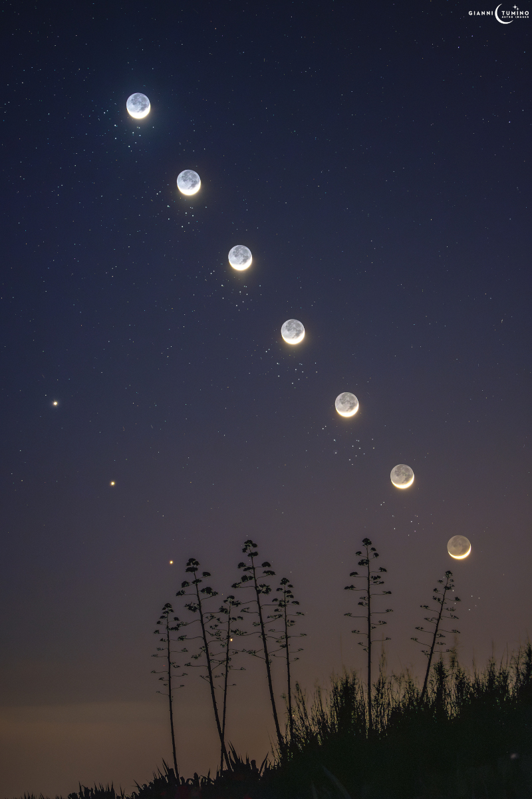
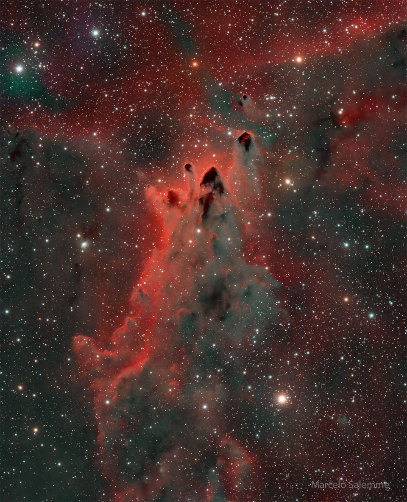
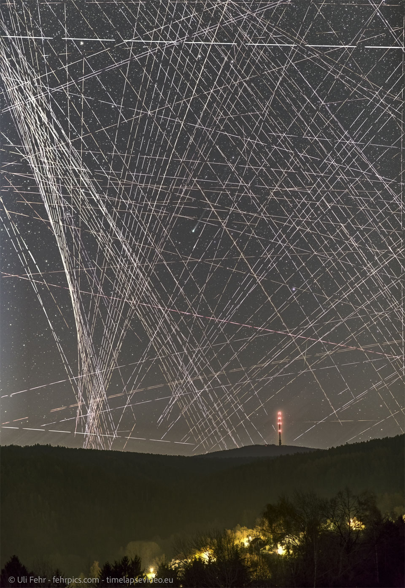
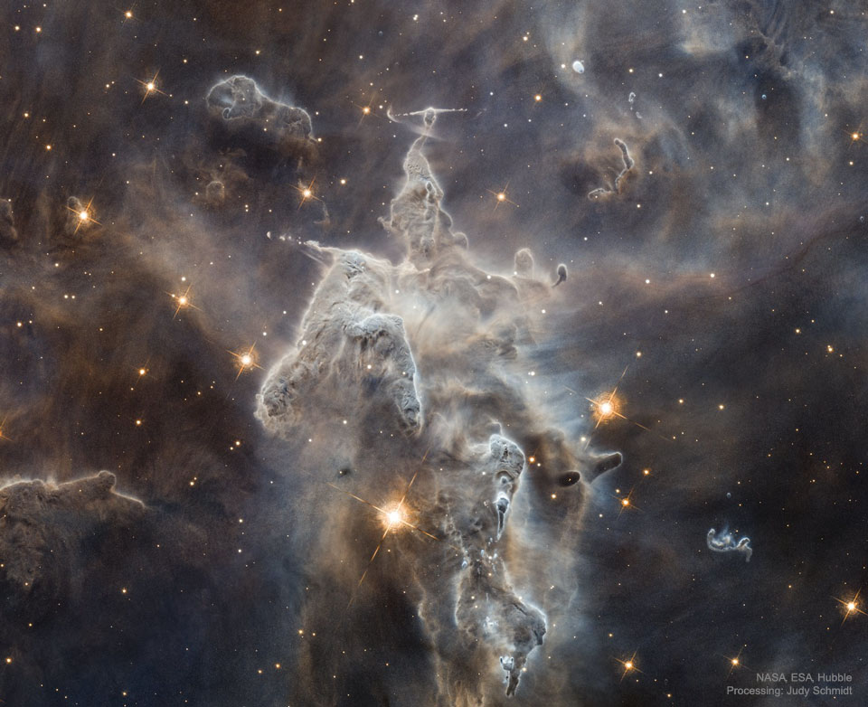

# Cosmos Log — Month 2026-04

## 2026-04-29 — The Moon, Venus, and the Pleiades
**Copyright:** Gianni Tumino  Text: Keighley Rockcliffe   (NASA GSFC,  UMBC CSST,  CRESST II)

> No, Earth did not recently acquire six more moons!  Today’s APOD is a combination of images
> following the Moon, Venus, and the Pleiades across a southern Sicilian sky as twilight turned to
> evening on April 19. From 2023 to 2029, the Pleiades' and the Moon “visit" each other once per month
> due to the Pleiades' location in the ecliptic plane. April 2026 saw the celestial alignment of their
> visit with Venus.  About six stars in the Pleiades cluster (Messier 45) are typically visible with
> the unaided eye. Due to the cluster’s visibility across the world, there are many myths and legends
> across cultures associated with the Pleiades. The Haudenosaunee people of North America, for
> example, say that seven boys danced so enthusiastically that they lifted off into the sky.
> Astronomers recently found thousands more Pleiades members, showing that after thousands of years of
> gazing upon this cluster, there is yet more to learn about the Pleiades.

---

## 2026-04-28 — CG 30: Cometary Globules
**Copyright:** Marcelo Salemme

> They're like mountain peaks, but they are forming stars. Bright-rimmed, flowing shapes gather near
> the center of this rich starfield toward the borders of the nautical southern constellations Puppis
> and Vela. Composed of interstellar gas and  dust, the grouping of light-year sized cometary globules
> is about 1300 light-years distant. Energetic ultraviolet light from nearby hot stars has molded the
> globules and ionized their bright rims. The globules also stream away from the Vela supernova
> remnant which may have influenced their swept-back shapes. Within them, cores of cold gas and dust
> are likely collapsing to form low mass stars whose formation will ultimately cause the globules to
> disperse. In fact, cometary globule CG 30 (upper right in the group) sports a small reddish glow
> inside its head, a telltale sign of energetic jets from a star in the early stages of formation.

---

## 2026-04-27 — Comet R3 PanSTARRS Behind Satellite Trails
**Copyright:** Uli Fehr

> Can you find the comet? Somewhere through this web of satellite trails is Comet C/2025 R3
> (PanSTARRS), a bright visitor passing through the inner Solar System. Now, the orbiting satellites
> themselves only appear as streaks because of the long camera exposure, over 10 minutes in this case.
> On the contrary, to the eye, satellites appear as points that drift slowly across the night sky and
> shine by reflecting sunlight -- primarily just after sunset and before sunrise.  The featured image
> was taken just before sunrise two weeks ago from Bavaria, Germany.  Presently, Comet R3 PanSTARRS is
> hard to see for even another reason -- because it is so (angularly) close to the Sun. As the comet
> rounds the Sun, it will be best seen in coming weeks from southern hemispheree skies, although then
> it will be heading out to interstellar space and fading. If you haven't yet found the comet, don't
> despair; please take a closer look just above the image center.

---

## 2026-04-26 — Mystic Mountain Monster being Destroyed
**Copyright:** Public Domain

> Inside the head of this interstellar monster is a star that is slowly destroying it.  The huge
> monster, actually an inanimate series of pillars of gas and dust, measures light years in length.
> The in-head star is not itself visible through the opaque interstellar dust but is bursting out
> partly by ejecting opposing beams of energetic particles called Herbig-Haro jets.  Located about
> 7,500 light years away in the Carina Nebula and known informally as Mystic Mountain, the appearance
> of these pillars is dominated by dark dust even though they are composed mostly of clear hydrogen
> gas.  The featured image was taken with the Hubble Space Telescope. All over these pillars, the
> energetic light and winds from massive newly formed stars are evaporating and dispersing the dusty
> stellar nurseries in which they formed.  Within a few million years, the head of this giant, as well
> as most of its body, will have been completely evaporated by internal and surrounding stars.

---

## 2026-04-18 — PanSTARRS and Planets
**Copyright:** Luc Perrot

> Near the eastern horizon before sunrise, Comet C/2025 R3 PanSTARRS is getting brighter. Readily
> visible in binoculars and small telescopes, the comet may be just on the verge of naked-eye
> visibility from dark sky sites. Though it was not quite apparent to the eye, PanSTARRS is still easy
> to spot in this camera image taken on April 16. In the view from a volcanic peak overlooking
> France's Reunion Island, planet Earth, the comet shares eastern predawn skies with naked-eye planets
> Mars and Mercury and fainter Neptune. Saturn is hiding behind the low cloudbank that doesn't quite
> hide an old crescent Moon. This is a good weekend for northern hemisphere comet watchers to try to
> catch PanSTARRS an hour or so before sunrise, as the comet grows brighter approaching its perihelion
> on April 19. On April 26 the comet makes its closest approach to our fair planet but by then will be
> difficult to see in the solar glare. Good views of this comet PanSTARRS in late April and early May
> will be from the southern hemisphere.

---

