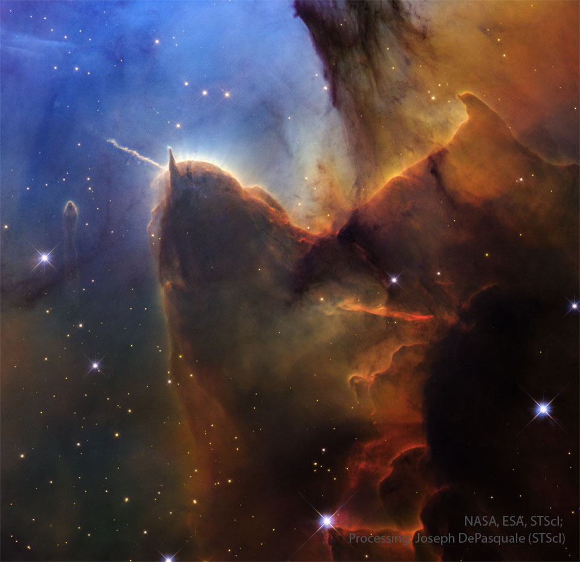
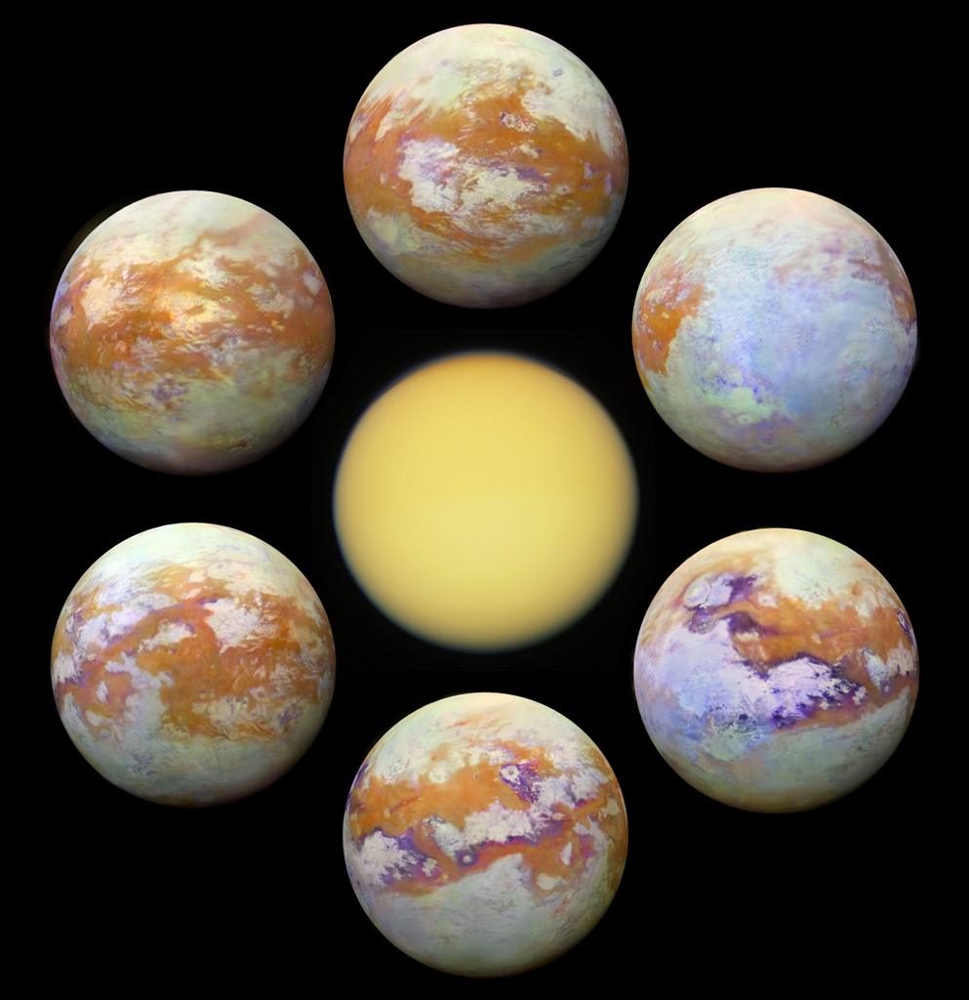
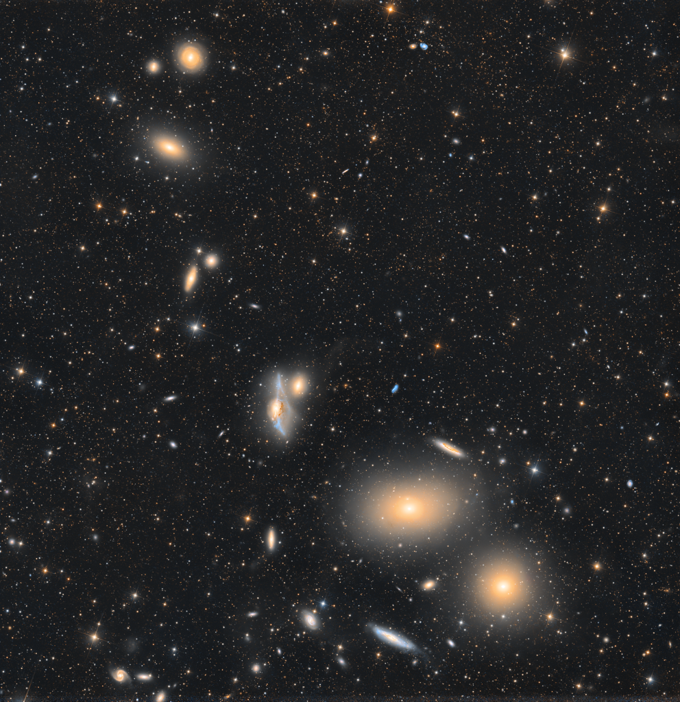

# Cosmos Log — Month 2026-05

## 2026-05-03 — Trifid Pillars and Jets
**Copyright:** Public Domain

> Dust pillars are like interstellar mountains.  They survive because they are more dense than their
> surroundings, but they are slowly being  eroded away by a hostile environment.  Visible in the
> featured picture by the Hubble Space Telescope is the end of a huge gas and dust pillar in the
> Trifid Nebula (M20), punctuated by a smaller pillar pointing up and an unusual jet pointing to the
> upper left.  Many of the bright dots are newly formed stars. A star near the small pillar's end is
> slowly being stripped of its accreting gas by radiation from a tremendously brighter star situated
> off the top of the image.  The jet extends nearly a light-year and would not be visible without
> external illumination.  As gas and dust evaporate from the pillars, the hidden stellar source of
> this jet will likely be uncovered, possibly over the next 20,000 years.   Explore the Universe:
> Random APOD Generator

---

## 2026-05-02 — Seeing Titan
**Copyright:** Public Domain

> Shrouded in a thick atmosphere, the surface of Saturn's largest moon, Titan, is really hard to see.
> Small particles suspended in Titan's upper atmosphere cause an almost impenetrable haze, strongly
> scattering light at visible wavelengths and hiding surface features from prying eyes. Still, Titan's
> surface is better imaged at infrared wavelengths, where scattering is weaker and atmospheric
> absorption is reduced. Arrayed around this visible light image (center) of Titan are some of the
> clearest global infrared views of the tantalizing moon so far. In false color, the six panels
> present a consistent processing of 13 years of infrared image data from the Visual and Infrared
> Mapping Spectrometer (VIMS) on board the Cassini spacecraft orbiting Saturn from 2004 to 2017. They
> offer a stunning comparison with Cassini's visible light view. NASA's revolutionary rotorcraft
> mission to Titan's surface is due to launch no earlier than July, 2028.

---

## 2026-05-01 — Markarian's Chain
**Copyright:** Chuck Ayoub

> Near the heart of the Virgo Galaxy Cluster, a string of galaxies known as Markarian's Chain
> stretches across this telescopic field of view. Anchored in the frame at bottom right by prominent
> lenticular galaxies, M84 (bottom) and M86, you can follow the chain's gentle arc up and toward the
> left. Near center you'll spot the pair of interacting galaxies NGC 4438 and NGC 4435, known to some
> as Markarian's Eyes. An estimated 50 million light-years distant, the Virgo Cluster itself is the
> nearest galaxy cluster. With up to about 2,000 member galaxies, it has a noticeable gravitational
> influence on our own Local Group of Galaxies. Within the Virgo Cluster at least seven galaxies in
> Markarian's Chain  appear to move coherently, while others may appear to be part of the chain by
> chance.

---

