# Cosmos Log — Month 2026-05

## 2026-05-27 — PK 164 +31.1: The Headphone Nebula
**Copyright:** Bernard Miller  Text: Keighley Rockcliffe   (NASA GSFC,  UMBC CSST,  CRESST II)

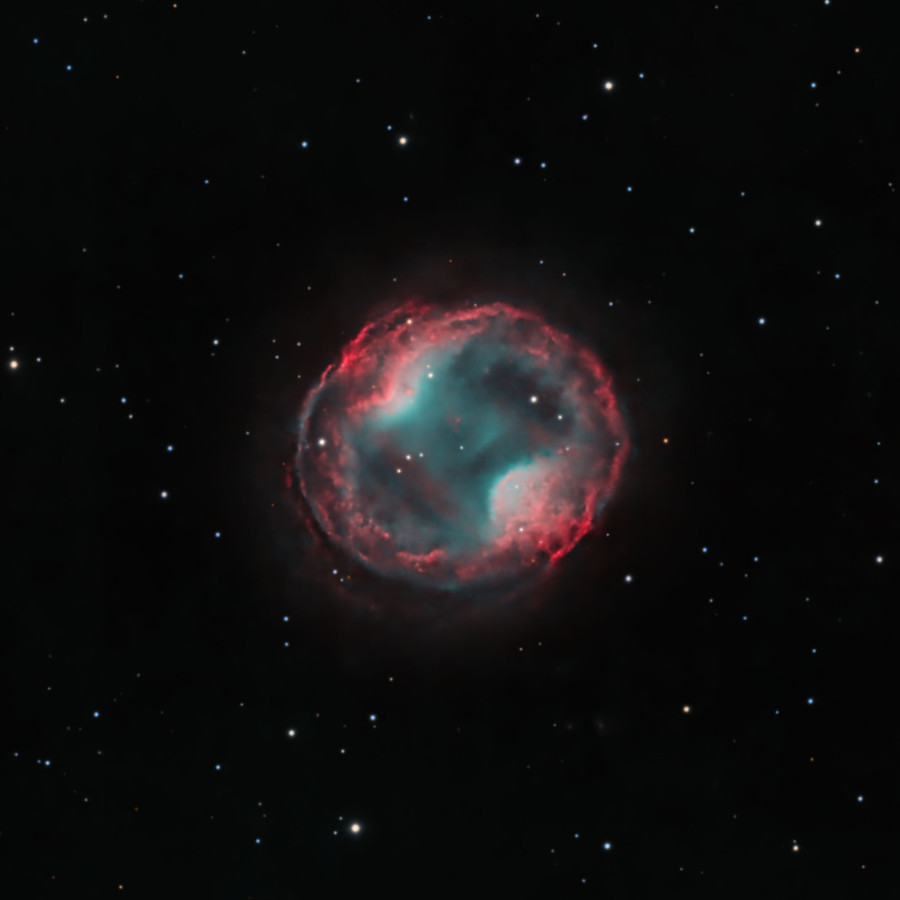

> What is a pair of headphones doing in the sky? Today’s image features the Headphone Nebula, also
> known as PK 164 +31.1 or Jones-Emberson 1. This planetary nebula, the remnant of a dying Sun-like
> star, faintly occupies an angular region of the Lynx constellation about 1/5th the diameter of the
> full moon. The red and blue-ish green colors trace hydrogen and oxygen atoms, respectively, that
> have been excited and ionized by the nebula's central white dwarf. The headphone shape, where two
> lobes of hydrogen puncture the inner region of oxygen, adds this object to a long list of oddly
> shaped nebulae. The morphology of such strange nebulae hint at the presence of a stellar or
> planetary companion, which can stir the material flowing out from the dying star. You can listen to
> Hubble and JWST sonifications of planetary nebulae through your very own headphones!

---

## 2026-05-26 — NGC 3660 and Burçin's Galaxy
**Copyright:** Adam Block,  El Sauce Obs.

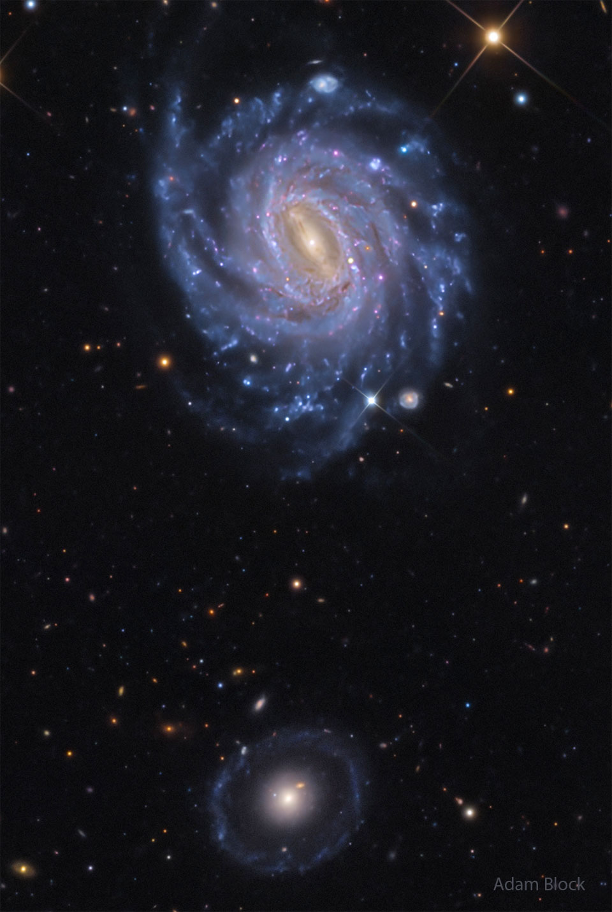

> The upper galaxy might be more photogenic, but the lower galaxy is more unusual.  The galaxy up top
> is NGC 3660, a spiral galaxy similar to our own Milky Way galaxy in that it has several bright blue
> spiral arms and a central bar of stars, dust, and gas. Captured by chance in the featured deep and
> colorful image, surprisingly, is SN 2026cff, a supernova found just to the right of the central bar.
> Farther in the distance is the bottom galaxy, known informally as Burçin’s galaxy, but formally
> cataloged as LEDA 1000714. The center of this galaxy appears to be an old elliptical galaxy, but it
> is strangely surrounded by not one but two rings of stars.  What created Burçin's galaxy is a
> mystery and remains a continuing topic of research, but it likely involves the accretion of one or
> more smaller galaxies.

---

## 2026-05-25 — Thackeray's Globules
**Copyright:** John Hayes

> What are these strange space globs?  Situated in rich star fields and glowing hydrogen gas, these
> opaque clouds of interstellar dust and gas are so large they might be able to form stars. Their home
> is known as IC 2944, a bright stellar nursery located about 7,600 light years away toward the
> constellation of the Centaur (Centaurus). The largest of these  dark globules, first spotted by A.
> D. Thackeray in 1950 using a telescope in South Africa, is likely two separate but overlapping
> clouds, each more than one light-year wide. Along with other data, the featured Hubble palette image
> from the El Sauce Observatory in Chile, indicates that Thackeray's globules are fractured and
> churning as a result of intense ultraviolet radiation from young, hot stars already energizing and
> heating the bright emission nebula. These and similar dark globules known to be associated with
> other star forming regions may ultimately be dissipated by their hostile environment -- like cosmic
> lumps of butter in a hot frying pan.   Interstellar Jigsaw: Astronomy Puzzle of the Day

---

## 2026-05-24 — A Martian Eclipse: Phobos Crosses the Sun
**Copyright:** Public Domain

> What's that passing in front of the Sun? It looks like a moon, but it can't be Earth's Moon, because
> it isn't round. It's the Martian moon Phobos.  The featured video was taken from the surface of Mars
> in 2022 by the Perseverance rover. Phobos, at 11.5 kilometers across, is 150 times smaller than Luna
> (our moon) in diameter, but also 50 times closer to its parent planet.  In fact, Phobos is so close
> to Mars that it is expected to break up and crash into Mars within the next 50 million years.  In
> the near term, the low orbit of Phobos results in more rapid solar eclipses than seen from Earth.
> The featured video is shown in real time -- the transit really took about 40 seconds, as shown. The
> videographer -- the robotic rover Perseverance (Percy) -- continues to explore Jezero Crater on
> Mars, searching not only for clues to the watery history of the now dry world, but evidence of
> ancient microbial life.

---

## 2026-05-23 — Messier 2
**Copyright:** Public Domain

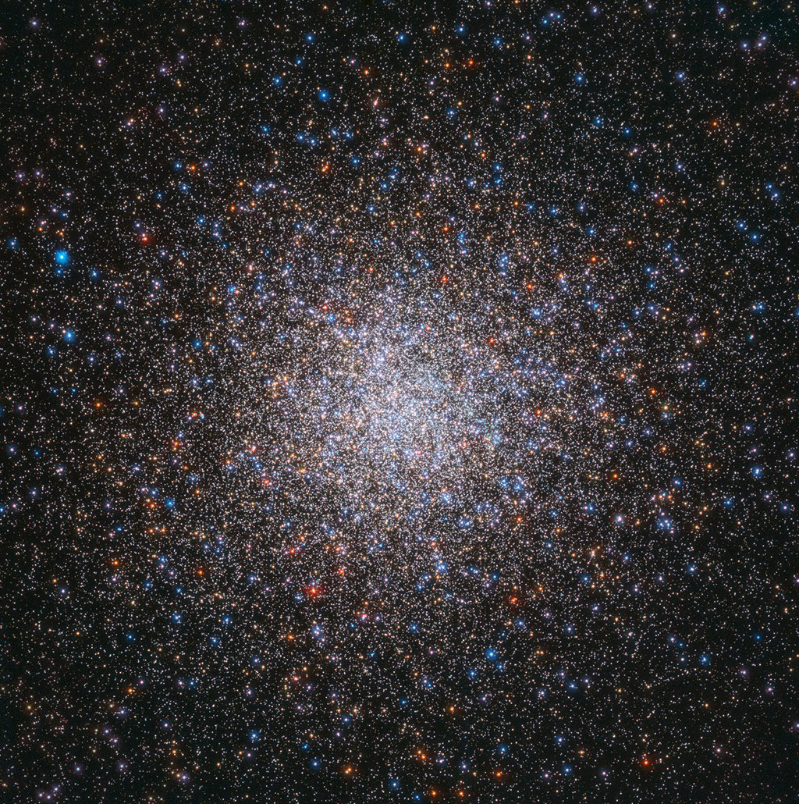

> After the Crab Nebula, this giant star cluster is the second entry in 18th century astronomer
> Charles Messier's famous list of things that are not comets. M2 is one of the largest globular star
> clusters now known to roam the halo of our Milky Way galaxy. Though Messier originally described it
> as a nebula without stars, this stunning Hubble image resolves stars across the cluster's central 40
> light-years. Its population of stars numbers close to 150,000, concentrated within a total diameter
> of around 175 light-years. About 55,000 light-years distant toward the constellation Aquarius, this
> ancient denizen of the Milky Way, also known as NGC 7089, is 13 billion years old. An extended
> stellar debris stream, a signature of past gravitational tidal disruption, was recently found to be
> associated with Messier 2.

---

## 2026-05-22 — The Nebulous Realm of WR 134
**Copyright:** Luigi Morrone

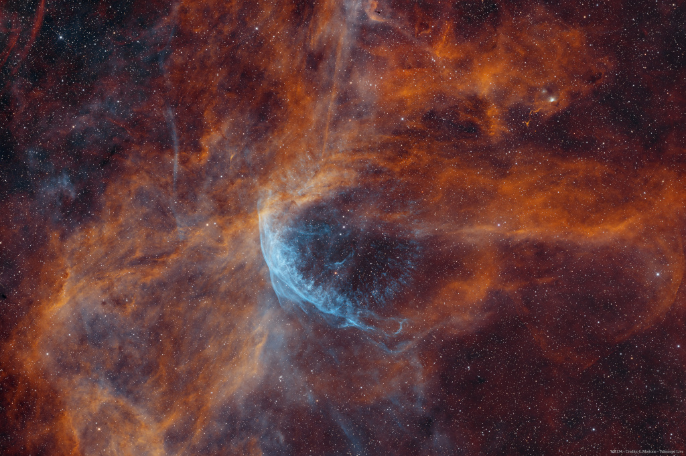

> This cosmic snapshot covers a field of view over twice as wide as the full Moon within the
> boundaries of the high-flying constellation Cygnus. Made using astronomical narrowband filters, the
> image highlights the bright edge of a ring-like nebula traced by the glow of ionized hydrogen and
> oxygen gas. Embedded in the region's expanse of interstellar clouds, the complex, glowing arcs are
> sections of shells of material swept up by the wind from Wolf-Rayet star WR 134, the brightest star
> near image center. Distance estimates put WR 134 about 6,000 light-years away, making this
> telescopic frame over 100 light-years across. Shedding their outer envelopes in powerful stellar
> winds, massive Wolf-Rayet stars have burned through their nuclear fuel at a prodigious rate and end
> their final phase of massive star evolution in a spectacular supernova. Their stellar winds and
> final supernova explosion enrich the interstellar material with heavy elements to be incorporated in
> future generations of stars.

---

## 2026-05-21 — A Collision of Galaxy Clusters
**Copyright:** Public Domain

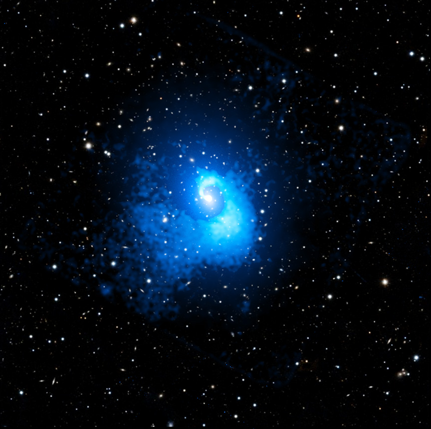

> This big beautiful spiral shines in X-ray light. It is about 20 times larger than our Galaxy.   It
> belongs to Abell 2029, a galaxy cluster one billion light-years away.   (To see only the galaxies,
> hover your cursor over the image, or follow this link.)      Galaxy clusters are the largest
> structures in the universe that are supported by gravity.     Abell 2029 is formed by thousands of
> galaxies, surrounded by a huge cloud of hot gas and the equivalent of hundreds of trillions times
> the mass of the Sun in dark matter.     The spiral is made of gas, mostly hydrogen and helium,
> heated to tens of millions of degrees.     It was found in a recent study that used data from NASA's
> Chandra X-ray Observatory to show that Abell 2029 had a collision with a smaller cluster four
> billion years ago.     The collision affected the gravitational field and caused the intracluster
> gas to slosh, like wine moving in a wine glass, shaping the spiral.

---

## 2026-05-20 — The Dark Wolf Nebula
**Copyright:** William Vrbasso  Text: Keighley Rockcliffe   (NASA GSFC,  UMBC CSST,  CRESST II)

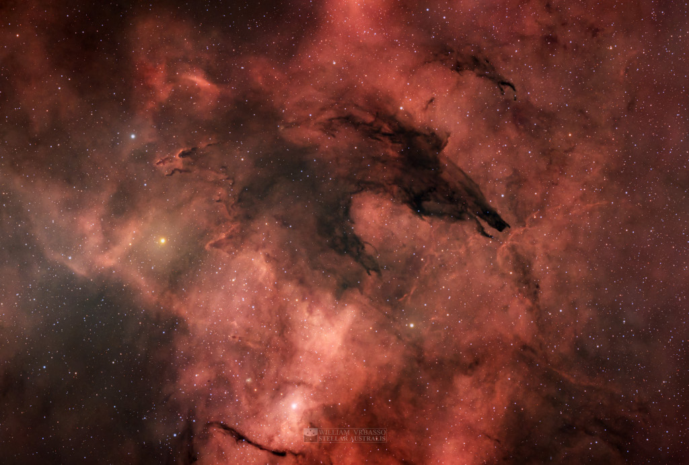

> A dark wolf lies in gum. No, this isn’t a riddle! Today's image features the Dark Wolf Nebula
> (Sandqvist–Lindroos 17), a spooky dust cloud embedded within the Gum 55 (RCW 113) Nebula in the
> Scorpius constellation. While dust is a pest to us, it serves a vital role in creating the necessary
> conditions for stars to be born. The Dark Wolf absorbs the intense ultraviolet and visible light
> emitted by young stars in Gum 55 and re-emits it at longer, mainly infrared, wavelengths. This
> prevents the higher energy light from heating up the gas in the region. When a region of gas is cool
> enough, gravity takes over and causes the gas to collapse into a star. Not only does dust act as an
> interstellar thermostat, but it is also the meet-cute for single hydrogen atoms forming molecular
> hydrogen, the building block for stars. The seemingly sinister Dark Wolf is actually a harbinger of
> cosmic life.

---

## 2026-05-19 — NGC 2170: The Angel Nebula
**Copyright:** Jason Marriott

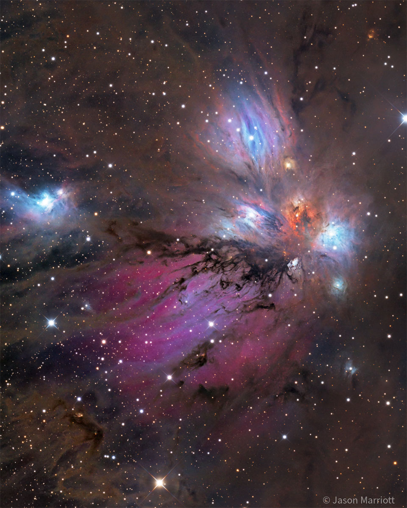

> Is this a painting or a photograph? In this celestial abstract art composed with a cosmic brush,
> dusty nebula NGC 2170, also known as the Angel Nebula, shines just above the image center.
> Reflecting the light of nearby hot stars, NGC 2170 is joined by other bluish reflection nebulae, a
> red emission region, many dark absorption nebulae, and a backdrop of colorful stars. Like the common
> household items that abstract painters often choose for their subjects, the clouds of gas, dust, and
> hot stars featured here are also commonly found in a setting like this one --  a massive, star-
> forming molecular cloud in the constellation of the Unicorn (Monoceros). The giant molecular cloud
> Mon R2, is impressively close, estimated to be only 2,400 light-years or so away. At that distance,
> this canvas would be over 60 light-years across.   Almost Hyperspace: Random APOD Generator

---

## 2026-05-18 — Unraveling NGC 3169
**Copyright:** Simone Curzi

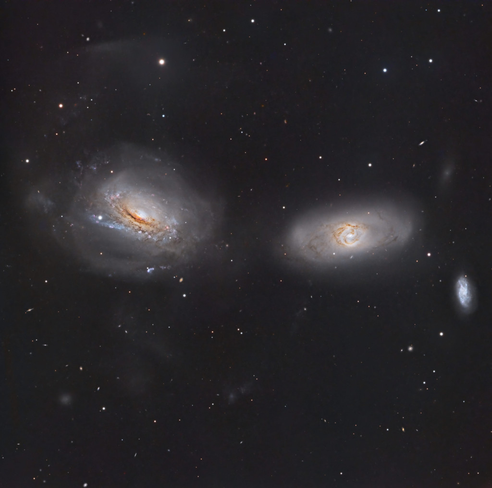

> Spiral galaxy NGC 3169 looks to be unraveling like a ball of cosmic yarn. It lies some 70 million
> light-years away, south of bright star Regulus toward the faint constellation Sextans. Wound up
> spiral arms are pulled out into sweeping tidal tails as NGC 3169 (left) and neighboring NGC 3166
> interact gravitationally. Eventually the galaxies will merge into one, a common fate even for bright
> galaxies in the local universe. Drawn out stellar arcs and plumes are clear indications of the
> ongoing gravitational interactions across the deep and colorful galaxy group photo. The telescopic
> frame spans about 20 arc minutes or about 400,000 light-years at the group's estimated distance, and
> includes smaller, bluish NGC 3165 to the right. NGC 3169 is also known to shine across the spectrum
> from radio to X-rays, harboring an active galactic nucleus that is the site of a supermassive black
> hole.

---

## 2026-05-17 — NGC 1300: Barred Spiral Galaxy
**Copyright:** Public Domain

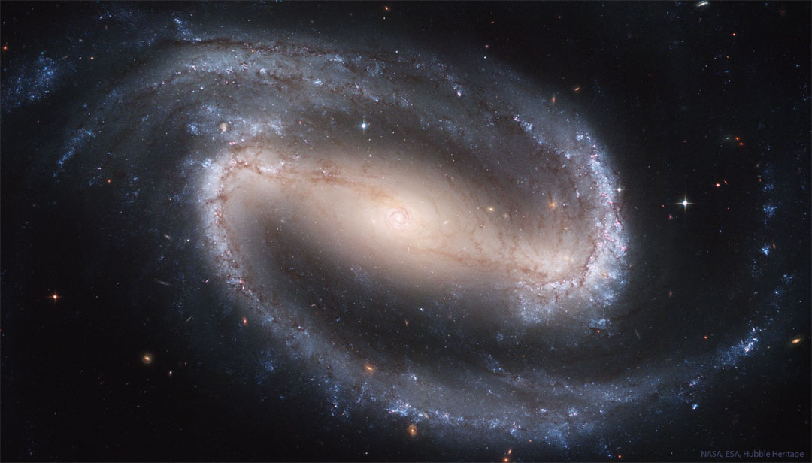

> Across the center of this spiral galaxy is a bar.  And at the center of this bar is smaller spiral.
> And at the center of that spiral is a supermassive black hole.  This all happens in the big,
> beautiful, barred spiral galaxy cataloged as NGC 1300, a galaxy that lies some 70 million light-
> years away toward the constellation of the river Eridanus. This Hubble Space Telescope composite
> view of the gorgeous island universe is one of the most detailed Hubble images ever made of a
> complete galaxy.  NGC 1300 spans over 100,000 light-years and the Hubble image reveals striking
> details of the galaxy's dominant central bar and majestic spiral arms. How the giant bar formed, how
> it remains, and how it affects star formation remains an active topic of research.   Jigsaw
> Universe: Astronomy Puzzle of the Day

---

## 2026-05-16 — Aurora Slathers Up the Sky
**Copyright:** Public Domain

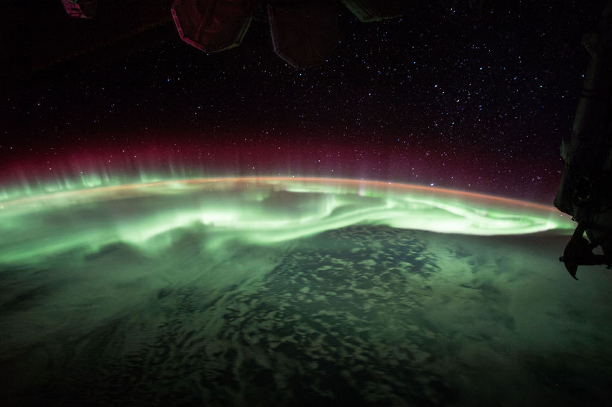

> Like salsa verde on your favorite burrito, a green aurora slathers up the sky in this 2017 June 25
> snapshot from the International Space Station. About 400 kilometers (250 miles) above Earth, the
> orbiting station is itself within the upper realm of the auroral displays. Aurorae have the
> signature colors of excited molecules and atoms at the low densities found at extreme altitudes.
> Emission from atomic oxygen dominates this view. The tantalizing glow is green at lower altitudes,
> but rarer reddish bands extend above the space station's horizon. The orbital scene was captured
> while passing over a point south and east of Australia, with stars above the horizon at the right
> belonging to the constellation Canis Major, Orion's big dog. Sirius, alpha star of Canis Major, is
> the brightest star near the Earth's limb.

---

## 2026-05-15 — R3 PanSTARRS: An Orion Comet
**Copyright:** Chester Hall-Fernandez

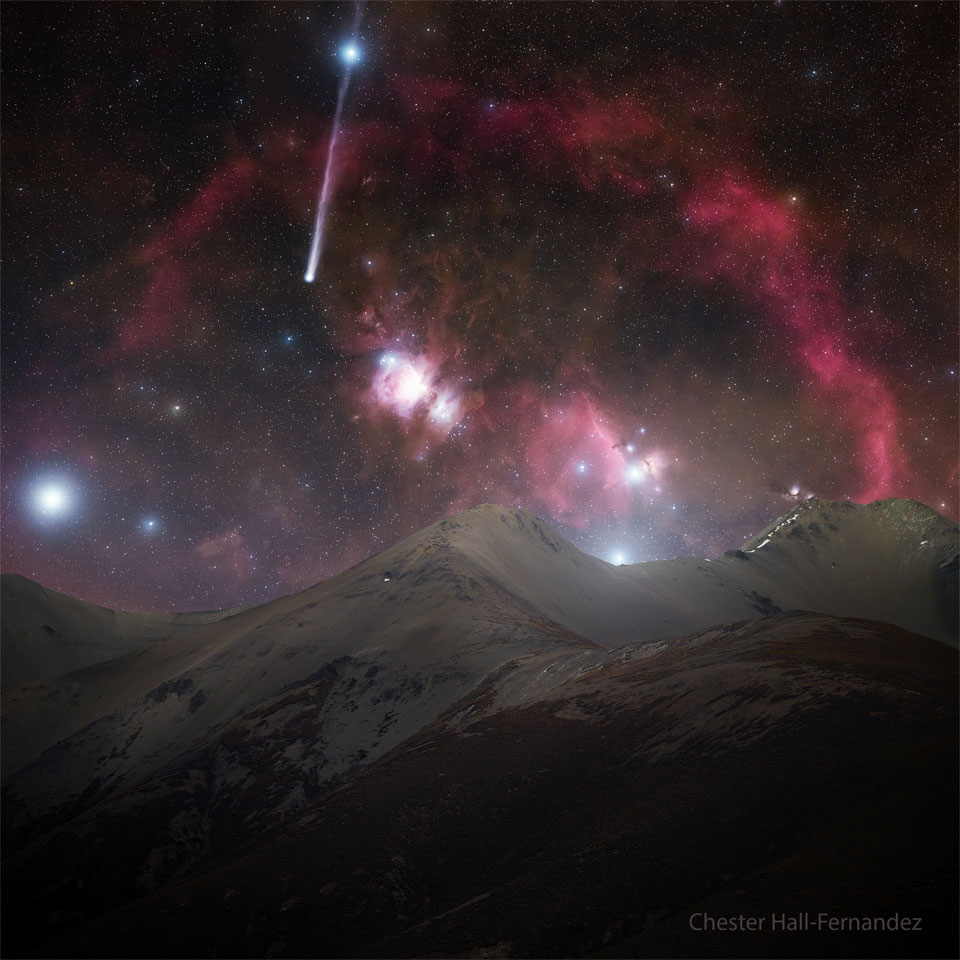

> Comet R3 PanSTARRS might be best remembered as an Orion comet.  A key reason is because Comet C/2025
> R3 (PanSTARRS) was near its most spectacular -- in terms of tail visibility -- when passing in front
> of the iconic constellation.  Although rare, other bright comets, too, have ventured across Orion,
> including  Lovejoy in 2015, Hale-Bopp in 1997, and the Great Comet of 1264.  Best visible in long
> duration exposures, the featured image was captured last week from the Craigieburn Mountain Range in
> New Zealand.  Visible in the deep background image are the Orion Nebula, Barnard's Loop, and through
> R3's tail, the bright star Saiph, the sixth brightest star in the constellation of Orion. Comet R3
> PanSTARRS continues to fade as it moves further south, passing into the constellation of the Unicorn
> (Monoceros) in the next few days.    Sky Surprise: What picture did APOD feature on your birthday?
> (after 1995)

---

## 2026-05-13 — NGC 188: Old Cluster in the New General Catalog
**Copyright:** Neven Krcmarek

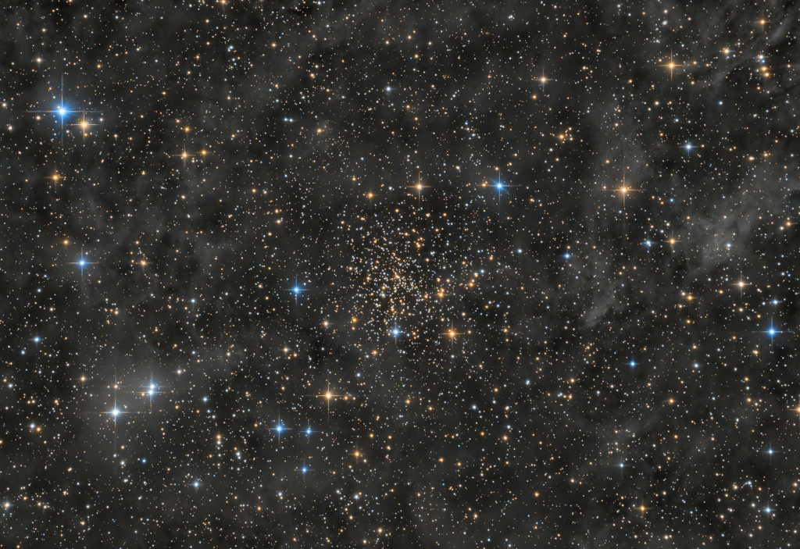

> The New General Catalog of star clusters and nebulae really isn't so new. In fact, it was published
> in 1888 - an effort by J. L. E. Dreyer to consolidate the work of astronomers William, Caroline, and
> John Herschel along with others into a useful single, complete catalog of astronomical discoveries
> and measurements. Dreyer's work was largely successful and is still important today, as this famous
> catalog continues to lend its "NGC" to bright clusters, galaxies, and nebulae. Take for example the
> star cluster known as NGC 188 (item number 188 in the NGC compilation). It lies about 6,000 light-
> years distant in the northern constellation Cepheus and represents a galactic or open star cluster.
> With an age of about 7 billion years, NGC 188 is old for an open cluster. Its old, evolved red giant
> stars have yellowish hues in this colorful, deep sky view. NGC 188 also enjoys the designation
> Caldwell 1 in a modern compilation of deep sky objects. Located well above the plane of the Milky
> Way and seen in the direction of planet Earth's north celestial pole, the ancient stellar group is
> known to some as the Polarissima Cluster.

---

## 2026-05-13 — NGC 188: Old Cluster in the New General Catalog
**Copyright:** Neven Krcmarek

> The New General Catalog of star clusters and nebulae really isn't so new. In fact, it was published
> in 1888 - an effort by J. L. E. Dreyer to consolidate the work of astronomers William, Caroline, and
> John Herschel along with others into a useful single, complete catalog of astronomical discoveries
> and measurements. Dreyer's work was largely successful and is still important today, as this famous
> catalog continues to lend its "NGC" to bright clusters, galaxies, and nebulae. Take for example the
> star cluster known as NGC 188 (item number 188 in the NGC compilation). It lies about 6,000 light-
> years distant in the northern constellation Cepheus and represents a galactic or open star cluster.
> With an age of about 7 billion years, NGC 188 is old for an open cluster. Its old, evolved red giant
> stars have yellowish hues in this colorful, deep sky view. NGC 188 also enjoys the designation
> Caldwell 1 in a modern compilation of deep sky objects. Located well above the plane of the Milky
> Way and seen in the direction of planet Earth's north celestial pole, the ancient stellar group is
> known to some as the Polarissima Cluster.

---

## 2026-05-12 — The Conjunction of Comet R3 PanSTARRS and the Orion Nebula
**Copyright:** Julien De Winter,  Sascha Ebeler  Text: Keighley Rockcliffe   (NASA GSFC,  UMBC CSST,  CRESST II)

> Today’s composite image features something old, something new, something borrowed, and something
> blue! Comet R3 PanSTARRS, streaking across the right of the image, likely originated from the Oort
> Cloud, meaning it is an old Solar System relic from billions of years ago. It’s bright extended ion
> tail glows blue  as the gas escaping the comet’s core is ionized by sunlight. Astronomers are
> fascinated by comets for all sorts of reasons: comet compositions are untouched time capsules
> containing the building blocks of Solar System planets; comets may have delivered water to the young
> Earth; the behavior of cometary tails shed light on solar wind and radiation interactions. The
> background mosaic, featuring the Orion Nebula (M42), was taken over two nights of observation with
> the comet captured on the third night. The Orion Nebula is our nearest stellar nursery and, at about
> 2 million years old, is our something (relatively) new! Now at around 127.5 million kilometers from
> Earth, we wave goodbye to the borrowed Comet R3 PanSTARRS as it leaves the Solar System.   Growing
> Gallery: Comet R3 in 2026

---

## 2026-05-11 — Moon Setting Behind Teide Volcano
**Copyright:** El Cielo de Canarias

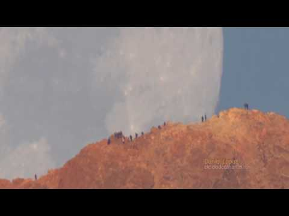

> These people are not in danger. What is coming down from the left is just the Moon, far in the
> distance. Luna appears so large here because she is being photographed through a telescopic lens.
> What is moving is mostly the Earth, whose spin causes the Moon to slowly disappear behind Mount
> Teide, a volcano in the Canary Islands of Spain  off the northwest coast of Africa. The people
> pictured are 16 kilometers away and  many are facing the camera because they are watching the Sun
> rise behind the photographer. It is not a coincidence that a full moon sets just when the Sun rises
> because the Sun is always on the opposite side of the sky from a full moon. The featured video was
> made in 2018 during a full Milk Moon.  The video is not time-lapse -- this was really how fast the
> Moon was setting.

---

## 2026-05-10 — Comet R3 PanSTARRS and Orion
**Copyright:** Luc Perrot (TWAN)

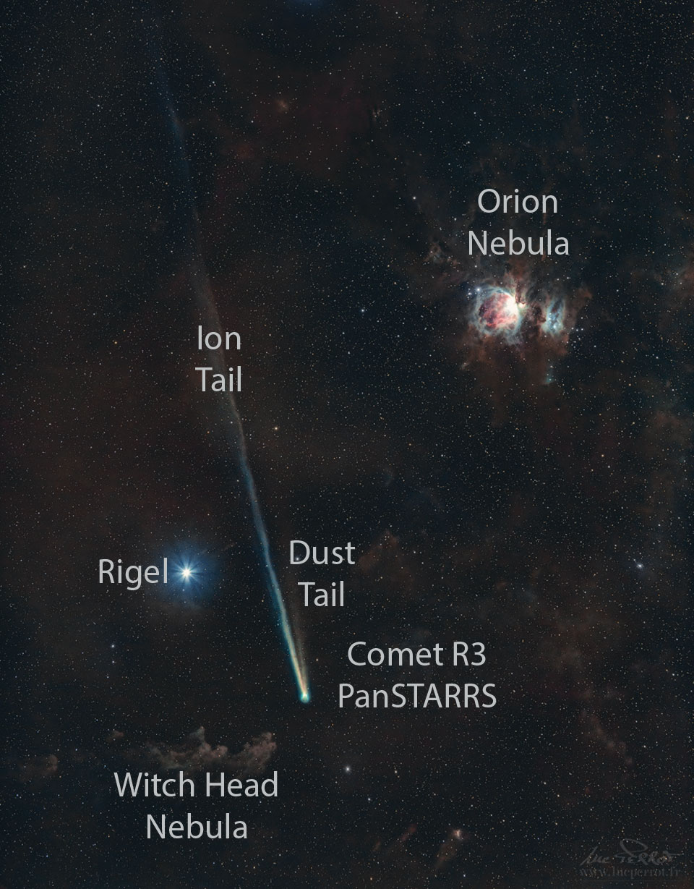

> Orion never had a sword like this. As Comet C/2025 R3 (PanSTARRS) heads out of the inner Solar
> System, it is putting on quite a show for long exposure cameras.  Currently seen toward the
> constellation of Orion the Hunter, the distant Orion Nebula is visible on the upper right. Comet R3
> PanSTARRS is now showing two distinct tails: a short dust tail pointing toward the top of the image
> and a long and wavy ion tail trailing off toward the upper left.  The ion tail points away from the
> Sun and glows blue from excited carbon monoxide.  Large particles in the dust tail somewhat resist
> the radiation pressure that push them away from the Sun and so retain a bit of the comet's orbit.
> The dust tail shines by reflected sunlight. The featured image was taken a few days ago from
> France's Reunion Island in the southern Indian Ocean.   Growing Gallery: Comet R3 PanSTARRS in 2026

---

## 2026-05-09 — Messier Craters in Stereo
**Copyright:** Public Domain

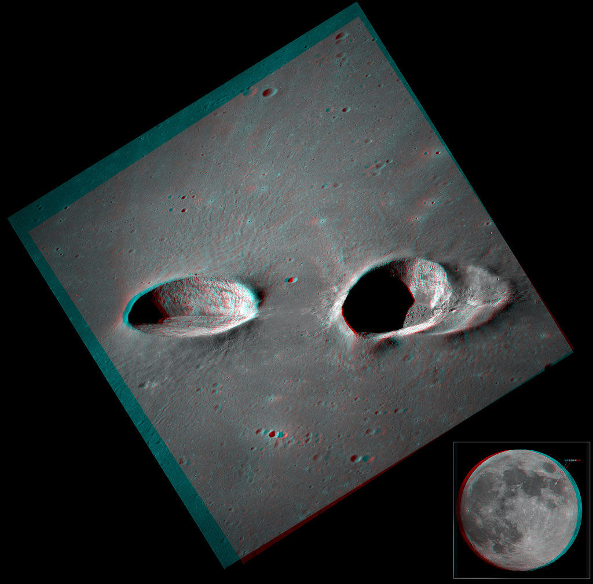

> Many bright nebulae and star clusters in planet Earth's sky are associated with the name of
> astronomer Charles Messier from his famous 18th century catalog. His name is also given to these two
> large and remarkable craters on the Moon. Standouts in the dark, smooth lunar Sea of Fertility or
> Mare Fecunditatis, Messier (left) and Messier A have dimensions of 15 by 8 and 16 by 11 kilometers
> respectively. Their elongated shapes are explained by the extremely shallow-angle trajectory
> followed by an impactor, moving left to right, that gouged out the craters. The shallow impact also
> resulted in two bright rays of material extending along the surface to the right, beyond the
> picture. Intended to be viewed with red/blue glasses (red for the left eye), this striking stereo
> picture of the crater pair was recently created from high resolution scans of two images
> (AS11-42-6304, AS11-42-6305) taken during the Apollo 11 mission to the Moon.

---

## 2026-05-08 — Comet R3 PanSTARRS Before Rigel
**Copyright:** Jakub Kuřák &  Martin Mašek  (FZU of the Czech Academy of Sciences)

> Which way is Comet R3 PanSTARRS going? Not towards the star at the top of the image, because that is
> Rigel, which, being far in the background, is unrelated to the comet. Not through the nebula in the
> image middle, because that is the Witch Head Nebula and it, too, is far in the distance -- but not
> far from Rigel.  Not into northern skies because over the past week Comet C/2025 R3 (PanSTARRS) has
> moved into southern skies and is now best visible in Earth's Southern Hemisphere toward the west
> after sunset.  Angularly, Comet R3 PanSTARRS is slowly moving toward the upper right, night by
> night, and will soon be in the constellation Orion. Spatially, the comet is now headed out of our
> Solar System but should remain visible to cameras in southern skies for about a week.  The featured
> image was captured last week near Cerro Paranal in Chile.   Growing Gallery: Comet R3 PanSTARRS in
> 2026

---

## 2026-05-07 — Supernova in a Sideways Spiral
**Copyright:** Public Domain

> A long time ago, in a distant galaxy, a massive star was destroyed in a supernova explosion. The
> light of this event travelled for tens of millions of years and reached Earth last week as Supernova
> 2026kid. The featured video shows a time-lapse over three nights of the host galaxy NGC 5907, an
> edge-on spiral also known as the Splinter or Knife Edge Galaxy, as the supernova appears and becomes
> brighter. (The occasional streaks are satellites in Earth orbit.) At its brightest, a supernova can
> outshine the sum of all other stars in its galaxy. Supernova 2026kid appears relatively dim,
> probably because we are seeing it through the edge-on disk of the galaxy. Such explosions typically
> happen about once per century in galaxies similar to the Milky Way, and their light can take months
> to fade away. The brightest supernova in recorded history was SN 1006; it is reported to have been
> brighter than Venus, and even visible in the sky during daytime.

---

## 2026-05-05 — Orion over Mount Teide
**Copyright:** Marcin Rosadziński

> Orion is rarely seen like this.  To achieve this majestic vista, you need a camera capable of taking
> such long duration exposures that faint features in the night sky become revealed.  Iconic nebulas
> that appear include the Orion Nebula, the Flame Nebula, and Barnard's Loop. For contrast, it also
> helps to have a volcano on the foreground, in this case the Teide volcano on Tenerife on the Canary
> Islands of Spain.  But if you want your Teide volcano snow-covered, you also need good timing --
> because that only happens, typically, for a few days each year.  Good timing also includes waiting
> for Orion to appear just behind Teide, which occurred late last year after sunset.  The featured
> image is the result of a series of images taken consecutively with the same camera from the same
> location.   Sky Surprise: What picture did APOD feature on your birthday? (after 1995)

---

## 2026-05-04 — Superplumes Inside Earth
**Copyright:** Public Domain

> Why are there huge, unusual masses inside the Earth? No one is sure.  By noting how earthquakes
> rumble through our planet's interior, humanity has discovered two deep structures that appear to
> have unusual temperatures and/or chemical compositions. One hypothesis holds that the superplumes
> are sunken debris left over from the Earth-shattering collision that created Earth's Moon about 4.5
> billion years ago.  A competing hypothesis is that they are graveyards for old tectonic plates that
> slowly slid under each other over the past few billion years. No matter their origin, the
> superplumes are thought to affect Earth’s surface volcanism, possibly creating, for example, island
> chains such as Hawaii.  Also known as large low-shear-velocity provinces (LLSVPs), Earth's
> superplumes are visualized in the featured animation.

---

## 2026-05-03 — Trifid Pillars and Jets
**Copyright:** Public Domain

> Dust pillars are like interstellar mountains.  They survive because they are more dense than their
> surroundings, but they are slowly being  eroded away by a hostile environment.  Visible in the
> featured picture by the Hubble Space Telescope is the end of a huge gas and dust pillar in the
> Trifid Nebula (M20), punctuated by a smaller pillar pointing up and an unusual jet pointing to the
> upper left.  Many of the bright dots are newly formed stars. A star near the small pillar's end is
> slowly being stripped of its accreting gas by radiation from a tremendously brighter star situated
> off the top of the image.  The jet extends nearly a light-year and would not be visible without
> external illumination.  As gas and dust evaporate from the pillars, the hidden stellar source of
> this jet will likely be uncovered, possibly over the next 20,000 years.   Explore the Universe:
> Random APOD Generator

---

## 2026-05-02 — Seeing Titan
**Copyright:** Public Domain

> Shrouded in a thick atmosphere, the surface of Saturn's largest moon, Titan, is really hard to see.
> Small particles suspended in Titan's upper atmosphere cause an almost impenetrable haze, strongly
> scattering light at visible wavelengths and hiding surface features from prying eyes. Still, Titan's
> surface is better imaged at infrared wavelengths, where scattering is weaker and atmospheric
> absorption is reduced. Arrayed around this visible light image (center) of Titan are some of the
> clearest global infrared views of the tantalizing moon so far. In false color, the six panels
> present a consistent processing of 13 years of infrared image data from the Visual and Infrared
> Mapping Spectrometer (VIMS) on board the Cassini spacecraft orbiting Saturn from 2004 to 2017. They
> offer a stunning comparison with Cassini's visible light view. NASA's revolutionary rotorcraft
> mission to Titan's surface is due to launch no earlier than July, 2028.

---

## 2026-05-01 — Markarian's Chain
**Copyright:** Chuck Ayoub

> Near the heart of the Virgo Galaxy Cluster, a string of galaxies known as Markarian's Chain
> stretches across this telescopic field of view. Anchored in the frame at bottom right by prominent
> lenticular galaxies, M84 (bottom) and M86, you can follow the chain's gentle arc up and toward the
> left. Near center you'll spot the pair of interacting galaxies NGC 4438 and NGC 4435, known to some
> as Markarian's Eyes. An estimated 50 million light-years distant, the Virgo Cluster itself is the
> nearest galaxy cluster. With up to about 2,000 member galaxies, it has a noticeable gravitational
> influence on our own Local Group of Galaxies. Within the Virgo Cluster at least seven galaxies in
> Markarian's Chain  appear to move coherently, while others may appear to be part of the chain by
> chance.

---

