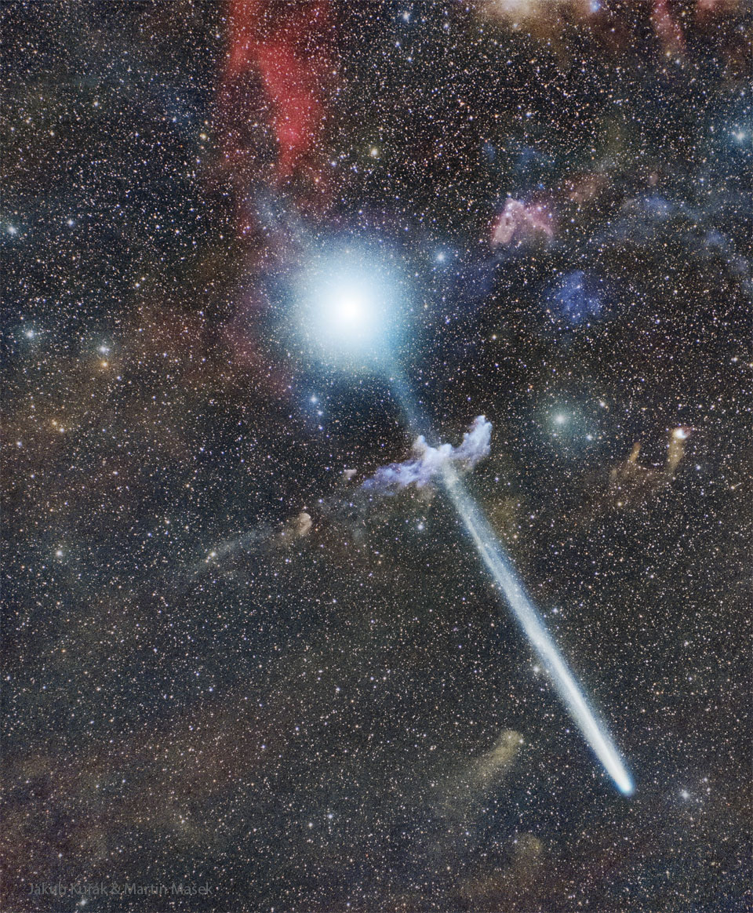
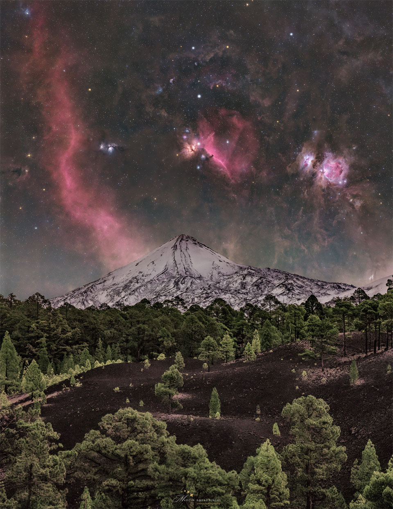
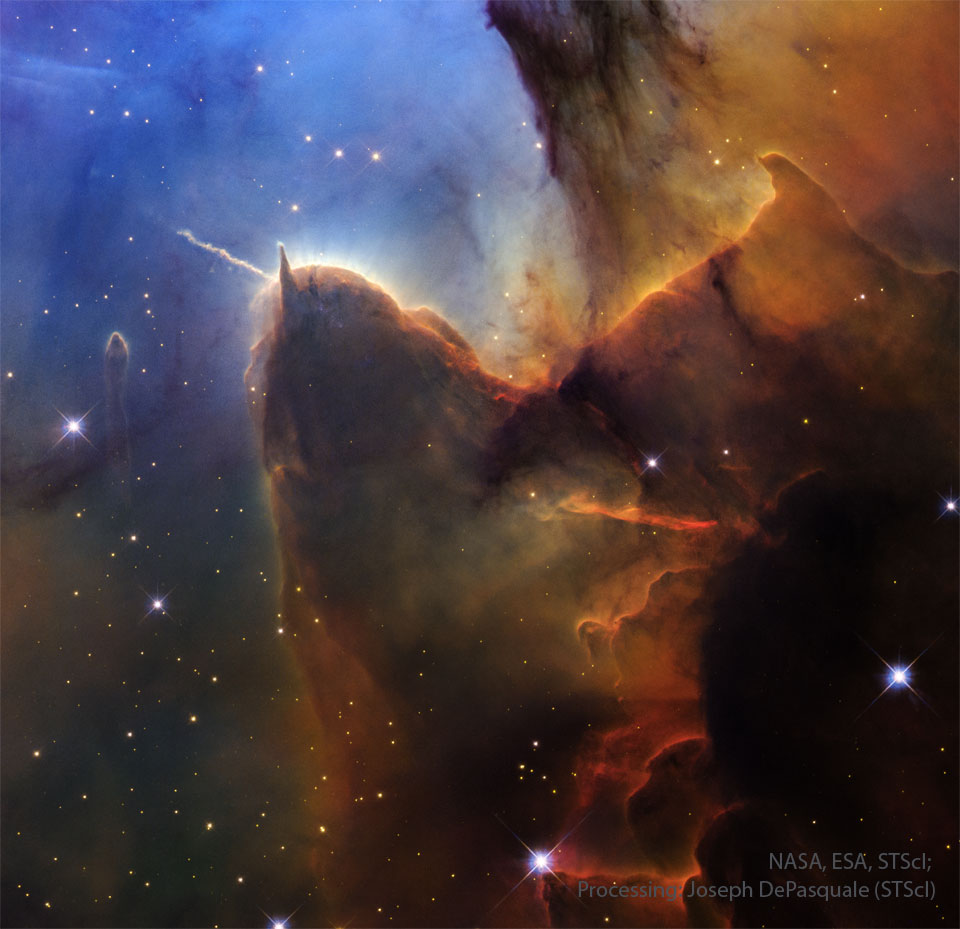
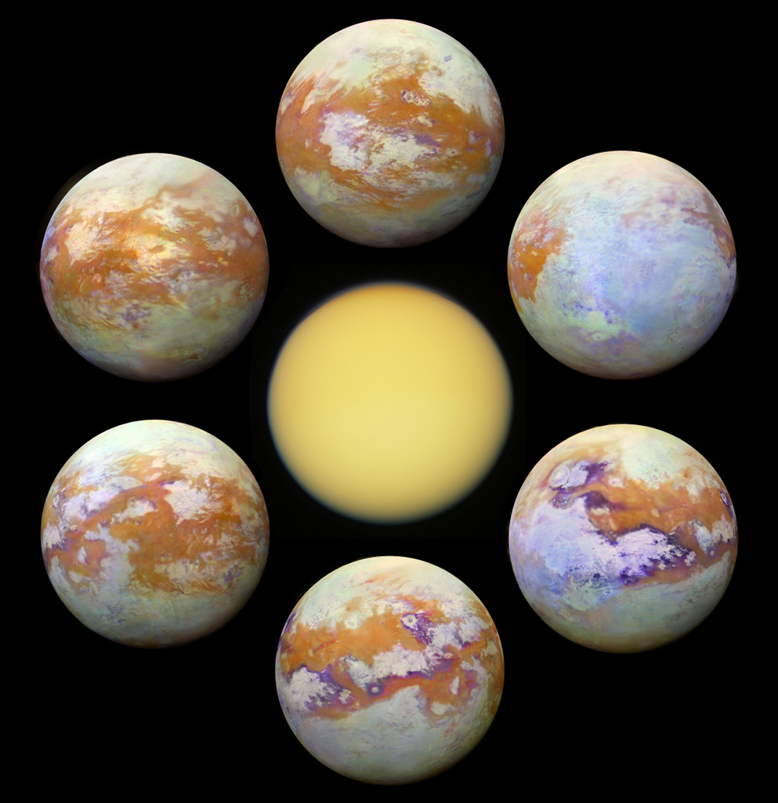
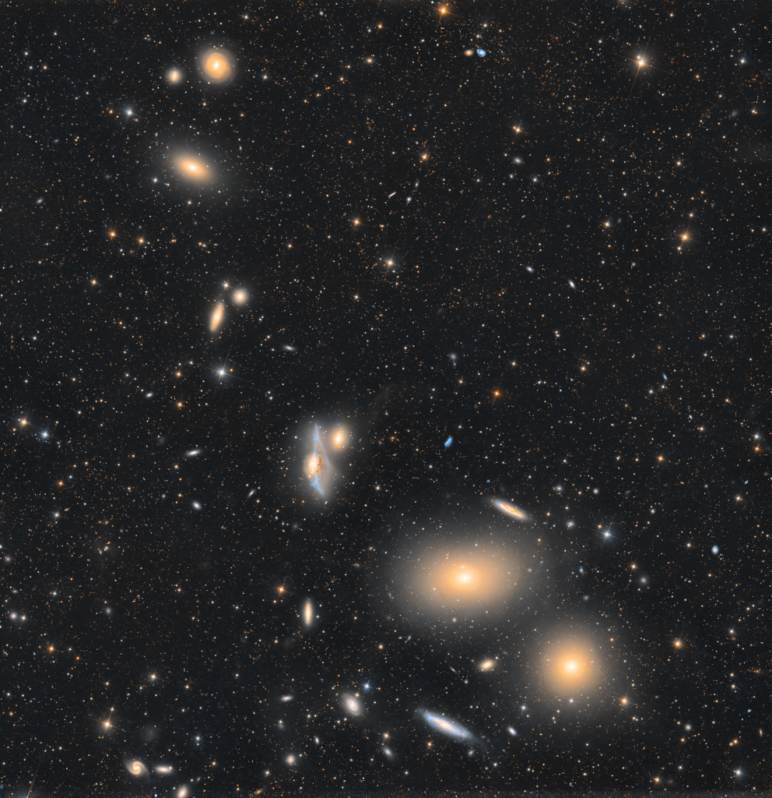

# Cosmos Log — Month 2026-05

## 2026-05-08 — Comet R3 PanSTARRS Before Rigel
**Copyright:** Jakub Kuřák &  Martin Mašek  (FZU of the Czech Academy of Sciences)

> Which way is Comet R3 PanSTARRS going? Not towards the star at the top of the image, because that is
> Rigel, which, being far in the background, is unrelated to the comet. Not through the nebula in the
> image middle, because that is the Witch Head Nebula and it, too, is far in the distance -- but not
> far from Rigel.  Not into northern skies because over the past week Comet C/2025 R3 (PanSTARRS) has
> moved into southern skies and is now best visible in Earth's Southern Hemisphere toward the west
> after sunset.  Angularly, Comet R3 PanSTARRS is slowly moving toward the upper right, night by
> night, and will soon be in the constellation Orion. Spatially, the comet is now headed out of our
> Solar System but should remain visible to cameras in southern skies for about a week.  The featured
> image was captured last week near Cerro Paranal in Chile.   Growing Gallery: Comet R3 PanSTARRS in
> 2026

---

## 2026-05-07 — Supernova in a Sideways Spiral
**Copyright:** Public Domain

> A long time ago, in a distant galaxy, a massive star was destroyed in a supernova explosion. The
> light of this event travelled for tens of millions of years and reached Earth last week as Supernova
> 2026kid. The featured video shows a time-lapse over three nights of the host galaxy NGC 5907, an
> edge-on spiral also known as the Splinter or Knife Edge Galaxy, as the supernova appears and becomes
> brighter. (The occasional streaks are satellites in Earth orbit.) At its brightest, a supernova can
> outshine the sum of all other stars in its galaxy. Supernova 2026kid appears relatively dim,
> probably because we are seeing it through the edge-on disk of the galaxy. Such explosions typically
> happen about once per century in galaxies similar to the Milky Way, and their light can take months
> to fade away. The brightest supernova in recorded history was SN 1006; it is reported to have been
> brighter than Venus, and even visible in the sky during daytime.

---

## 2026-05-05 — Orion over Mount Teide
**Copyright:** Marcin Rosadziński

> Orion is rarely seen like this.  To achieve this majestic vista, you need a camera capable of taking
> such long duration exposures that faint features in the night sky become revealed.  Iconic nebulas
> that appear include the Orion Nebula, the Flame Nebula, and Barnard's Loop. For contrast, it also
> helps to have a volcano on the foreground, in this case the Teide volcano on Tenerife on the Canary
> Islands of Spain.  But if you want your Teide volcano snow-covered, you also need good timing --
> because that only happens, typically, for a few days each year.  Good timing also includes waiting
> for Orion to appear just behind Teide, which occurred late last year after sunset.  The featured
> image is the result of a series of images taken consecutively with the same camera from the same
> location.   Sky Surprise: What picture did APOD feature on your birthday? (after 1995)

---

## 2026-05-04 — Superplumes Inside Earth
**Copyright:** Public Domain

> Why are there huge, unusual masses inside the Earth? No one is sure.  By noting how earthquakes
> rumble through our planet's interior, humanity has discovered two deep structures that appear to
> have unusual temperatures and/or chemical compositions. One hypothesis holds that the superplumes
> are sunken debris left over from the Earth-shattering collision that created Earth's Moon about 4.5
> billion years ago.  A competing hypothesis is that they are graveyards for old tectonic plates that
> slowly slid under each other over the past few billion years. No matter their origin, the
> superplumes are thought to affect Earth’s surface volcanism, possibly creating, for example, island
> chains such as Hawaii.  Also known as large low-shear-velocity provinces (LLSVPs), Earth's
> superplumes are visualized in the featured animation.

---

## 2026-05-03 — Trifid Pillars and Jets
**Copyright:** Public Domain

> Dust pillars are like interstellar mountains.  They survive because they are more dense than their
> surroundings, but they are slowly being  eroded away by a hostile environment.  Visible in the
> featured picture by the Hubble Space Telescope is the end of a huge gas and dust pillar in the
> Trifid Nebula (M20), punctuated by a smaller pillar pointing up and an unusual jet pointing to the
> upper left.  Many of the bright dots are newly formed stars. A star near the small pillar's end is
> slowly being stripped of its accreting gas by radiation from a tremendously brighter star situated
> off the top of the image.  The jet extends nearly a light-year and would not be visible without
> external illumination.  As gas and dust evaporate from the pillars, the hidden stellar source of
> this jet will likely be uncovered, possibly over the next 20,000 years.   Explore the Universe:
> Random APOD Generator

---

## 2026-05-02 — Seeing Titan
**Copyright:** Public Domain

> Shrouded in a thick atmosphere, the surface of Saturn's largest moon, Titan, is really hard to see.
> Small particles suspended in Titan's upper atmosphere cause an almost impenetrable haze, strongly
> scattering light at visible wavelengths and hiding surface features from prying eyes. Still, Titan's
> surface is better imaged at infrared wavelengths, where scattering is weaker and atmospheric
> absorption is reduced. Arrayed around this visible light image (center) of Titan are some of the
> clearest global infrared views of the tantalizing moon so far. In false color, the six panels
> present a consistent processing of 13 years of infrared image data from the Visual and Infrared
> Mapping Spectrometer (VIMS) on board the Cassini spacecraft orbiting Saturn from 2004 to 2017. They
> offer a stunning comparison with Cassini's visible light view. NASA's revolutionary rotorcraft
> mission to Titan's surface is due to launch no earlier than July, 2028.

---

## 2026-05-01 — Markarian's Chain
**Copyright:** Chuck Ayoub

> Near the heart of the Virgo Galaxy Cluster, a string of galaxies known as Markarian's Chain
> stretches across this telescopic field of view. Anchored in the frame at bottom right by prominent
> lenticular galaxies, M84 (bottom) and M86, you can follow the chain's gentle arc up and toward the
> left. Near center you'll spot the pair of interacting galaxies NGC 4438 and NGC 4435, known to some
> as Markarian's Eyes. An estimated 50 million light-years distant, the Virgo Cluster itself is the
> nearest galaxy cluster. With up to about 2,000 member galaxies, it has a noticeable gravitational
> influence on our own Local Group of Galaxies. Within the Virgo Cluster at least seven galaxies in
> Markarian's Chain  appear to move coherently, while others may appear to be part of the chain by
> chance.

---

