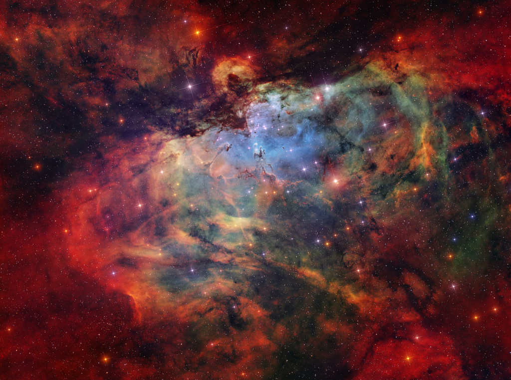
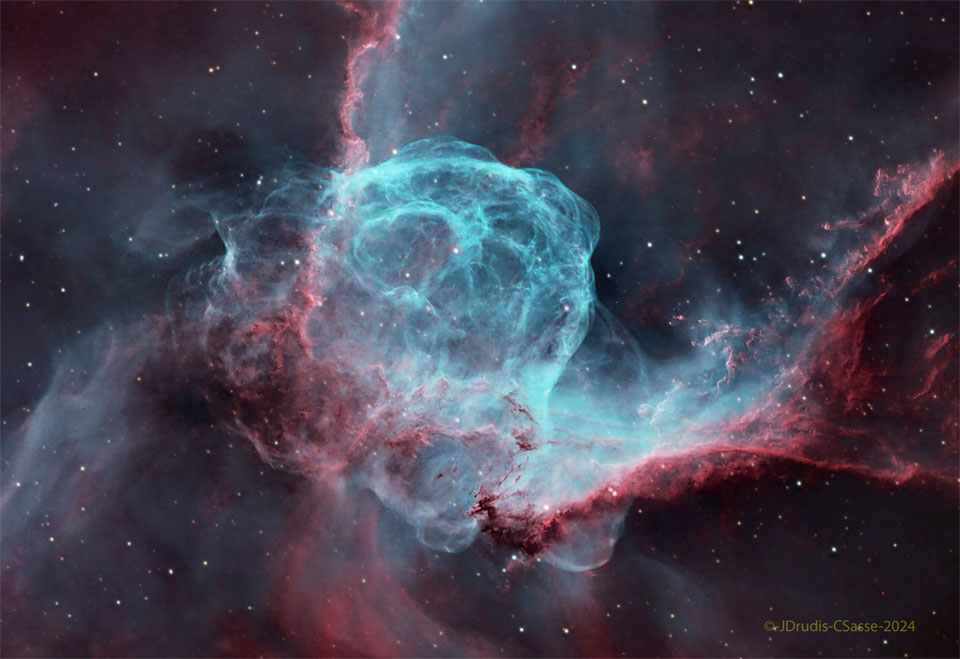
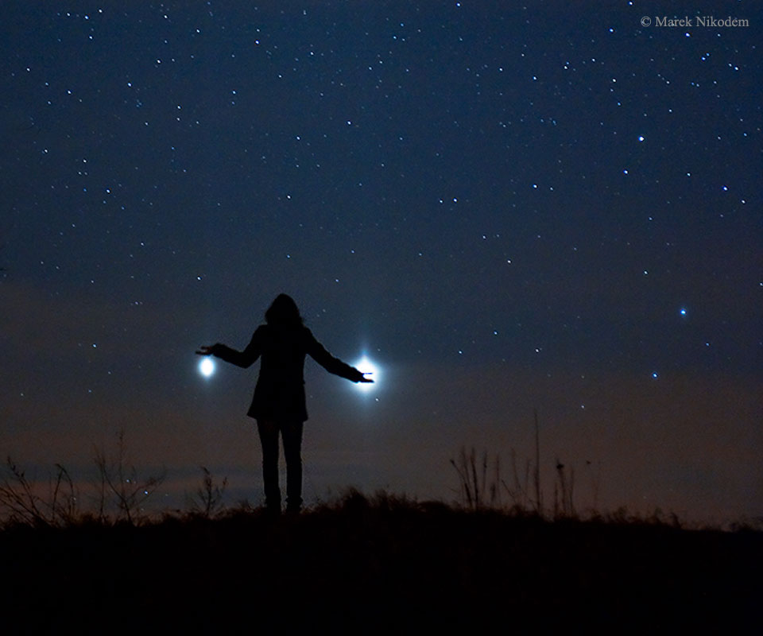
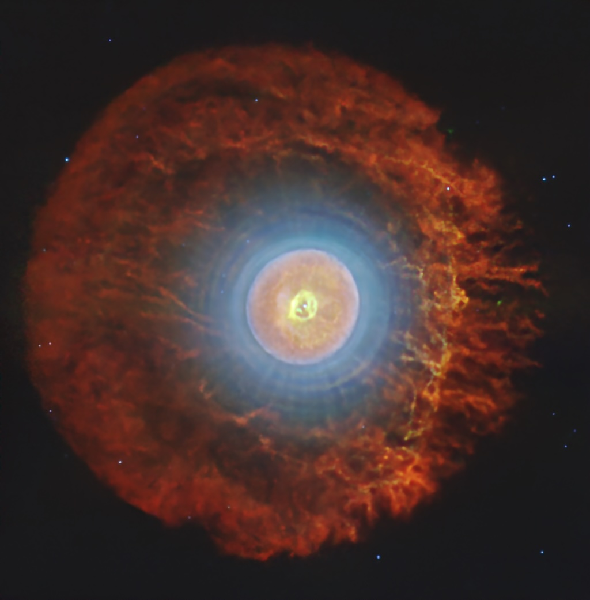
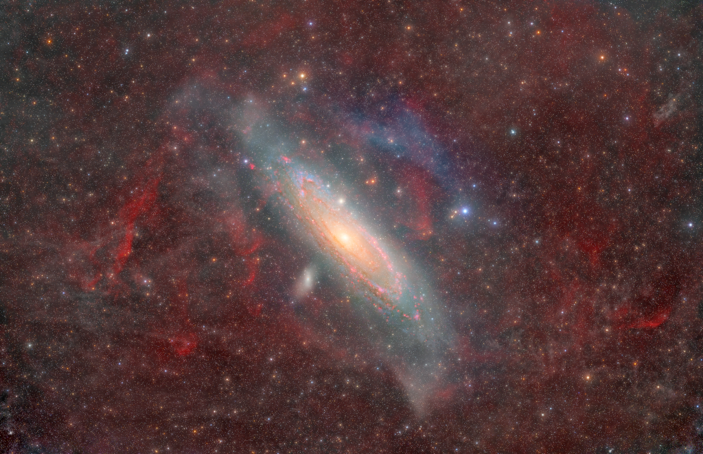
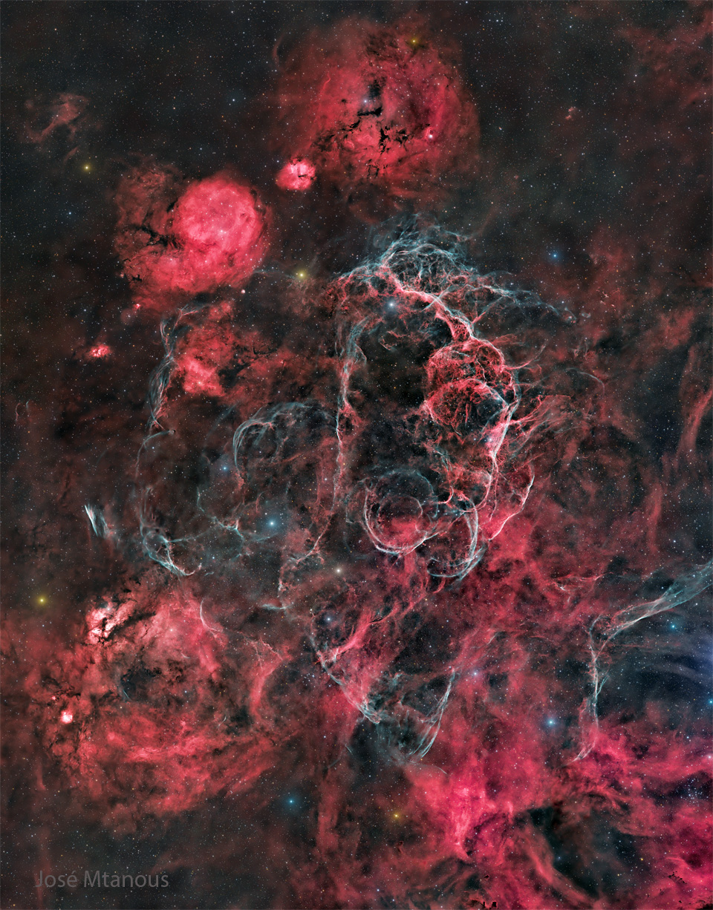
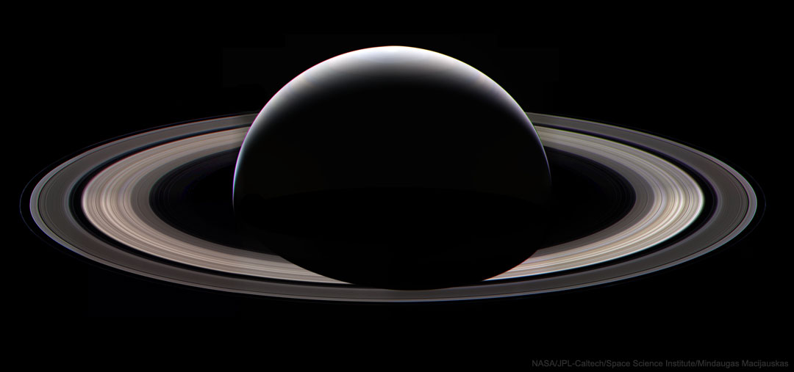

# Cosmos Log — Month 2026-06

## 2026-06-12 — Venus and Jupiter: Conjunction from Avebury
**Copyright:** Josh Dury

> To see Venus and Jupiter together this month, you won't need binoculars or even a telescope. Just
> look up after sunset and you'll find them emerging as the sky grows dark near the western horizon.
> In fact, on June 9 the two brightest planets were in close conjunction, separated on the sky by less
> than 2 degrees from our perspective. Since (brighter) inner planet Venus orbits the Sun faster than
> outer planet Jupiter, it catches up with and passes the outer planet along the ecliptic roughly
> every 13 months. But every three years or so their resulting conjunction can be viewed far enough
> from the Sun to be easily seen in Earth's twilight skies. On June 9, the two celestial beacon's
> close "cosmic kiss" was captured here next to the two large standing stones at the cove within a
> 4,000 year old stone circle at Avebury, UK. Larger than Stonehenge, the Avebury henge and stone
> circle complex is also recognized as one of the most significant neolithic ceremonial sites on
> planet Earth.

---

## 2026-06-10 — The Eagle Nebula and Friends
**Copyright:** Emmanuel Delgadillo  Text: Keighley Rockcliffe   (NASA GSFC,  UMBC CSST,  CRESST II)

> What looks as if it is going to swallow the great Pillars of Creation? The Eagle Nebula (M16) is not
> a bird, a plane, or Superman. M16 is actually a combination of several celestial objects. NGC 6611
> is the young star cluster that appears to peak out beneath the Eagle’s “wings”. The ultraviolet
> light from these stars ionizes the surrounding gas, creating the emission nebula IC 4703. The
> Stellar Spire is seen reaching towards the Pillars of Creation from the left. Both are structures of
> cold gas and dust that are optimal for star formation. Some astronomers previously thought the
> Pillars of Creation had been evaporated away by a supernova. Because M16 is 6,000 light years away,
> we would not be able to see the Pillars’ destruction for thousands more years. However, there is no
> conclusive evidence of the theorized supernova, so the Pillars of Creation will likely continue to
> create stars for millions of years.

---

## 2026-06-09 — Thor's Helmet
**Copyright:** Josep Drudis, Christian Sasse

> Thor not only has his own day (Thursday), but a helmet in the heavens.  Popularly called Thor's
> Helmet, NGC 2359 is a hat-shaped cosmic cloud with wing-like appendages. Heroically sized even for a
> Norse god, Thor's Helmet is about 30 light-years across. In fact, the cosmic head-covering is more
> like an interstellar bubble, blown by a fast wind from the bright, massive star near the bubble's
> center. Known as a Wolf-Rayet star, the central star is an extremely hot giant thought to be in a
> brief, pre-supernova stage of evolution. NGC 2359 is located about 15,000 light-years away toward
> the constellation of the Great Overdog. This sharp image is a combination of deep images taken in
> light emitted by hydrogen (red) and oxygen (blue).  The star in the center of Thor's Helmet is
> expected to explode in a spectacular supernova sometime within the next few thousand years.   Sky
> Surprise: What picture did APOD feature on your birthday? (after 1995)

---

## 2026-06-07 — Jupiter and Venus from Earth
**Copyright:** Marek Nikodem  (PPSAE)

> It was visible around the world. The sunset conjunction of Jupiter (left) and Venus (right) in 2012
> was visible almost no matter where you lived on Earth.  Anyone on our planet with a clear western
> horizon at sunset could see them. That year, a creative photographer traveled away from the town
> lights of Szubin, Poland to photograph  a near closest approach of the two planets. The bright
> planets were then separated by only  three degrees and his daughter struck a humorous pose. A faint
> red sunset still glowed in the background. Jupiter and Venus are together again this week after
> sunset, passing within a degree of each other about two days from today.

---

## 2026-06-06 — Charon: Moon of Pluto
**Copyright:** Public Domain

> A darkened and mysterious north polar region known to some as Mordor Macula caps this premier view
> of Charon, Pluto's largest moon. The high-resolution image was captured by the interplanetary space
> probe New Horizons near its closest approach to distant Pluto on July 14, 2015. The combined blue,
> red, and infrared image data was processed to enhance colors and follow variations in Charon's
> surface properties with a resolution of about 2.9 kilometers (1.8 miles). A stunning image of
> Charon's Pluto-facing hemisphere, it also features a clear view of an apparently moon-girdling belt
> of fractures and canyons that seems to separate smooth southern plains from varied northern terrain.
> Charon is 1,214 kilometers (754 miles) across. That's about 1/10th the size of planet Earth but a
> whopping 1/2 the diameter of Pluto itself, and makes it the largest satellite relative to its parent
> body in the Solar System. Still, the moon appears as a small bump at about the 1 o'clock position on
> Pluto's disk in the grainy, negative, telescopic picture inset at upper left. That image was used by
> James Christy and Robert Harrington at the U.S. Naval Observatory in Flagstaff to discover Charon in
> June of 1978.

---

## 2026-06-05 — The Hydra Cluster of Galaxies
**Copyright:** Rafael Sampaio

> Within our own Milky Way galaxy, two bright, spiky stars stand like sentinels in the foreground of
> this cosmic snapshot. Far beyond them are the galaxies of the Hydra Cluster. In fact, while the
> spiky foreground stars are hundreds of light-years distant, the Hydra Cluster galaxies are well over
> 100 million light-years away. Three large galaxies near the cluster center, two yellow ellipticals
> (NGC 3311, NGC 3309) and one prominent blue spiral (NGC 3312), are the dominant galaxies, each about
> 150,000 light-years in diameter. An intriguing overlapping galaxy pair cataloged as NGC 3314 lies
> above and left of NGC 3312. Also known as Abell 1060, the Hydra galaxy cluster is one of three large
> galaxy clusters within 200 million light-years of the Milky Way. In the nearby universe, galaxies
> are gravitationally bound into clusters which themselves are loosely bound into superclusters.
> Superclusters in turn are seen to align over even larger scales.

---

## 2026-06-04 — A Planetary Nebula with Cosmic Buckyballs
**Copyright:** Public Domain

> What is happening inside this unusual nebula?   Planetary nebula Tc 1, captured here in exquisite
> detail by the James Webb Space Telescope, is the celestial site where buckyballs were first
> identified in 2010.     Buckminsterfullerene — as buckyballs are officially called — is a molecule
> with 60 carbon atoms (C60) arranged in the shape of a soccer ball.   The molecule is named for
> architect Buckminster Fuller because of its resemblance to the geodesic dome he helped popularize.
> Webb’s new data reveal where the C60 molecules live in this nebula, and the geometry is striking:
> they populate a thin spherical shell around the central star, visible here as the bright edge of the
> nebula’s glowing orange central region.   Look closely near the nebula’s heart and a more perplexing
> feature emerges: a delicate structure shaped uncannily like an upside-down question mark, fitting
> punctuation for the many questions this nebula still poses.

---

## 2026-06-03 — Andromeda Through Gas and Dust
**Copyright:** Nick Fritz  Text: Keighley Rockcliffe   (NASA GSFC,  UMBC CSST,  CRESST II)

> Over 1000 years ago, Persian astronomer Abd al-Rahman al-Sufi published humanity’s oldest known
> record of the Andromeda Galaxy in "The Book of Fixed Stars" (Bodleian Library MS. Marsh 144 p. 167).
> 800 years later, Andromeda became the 31st entry in Charles Messier’s "Catalogue of Nebulae and Star
> Clusters". From “a small cloud” to “nebula” and now known to be our nearest major galaxy, Andromeda
> has remained a fundamental astronomical object. Today’s image, taken over 202 hours, shows how far
> we have come in our ability to observe our neighbor. The diffuse red and blue clouds are mostly
> foreground ionized hydrogen and oxygen well within our Milky Way. Pink-red clouds of hydrogen
> ionized by the energetic light of young stars trace the galaxy’s dusty spiral arms. M32 and M110 are
> satellite galaxies pictured orbiting the larger Andromeda. Despite its long history of observation
> through ancient unaided eyes to modern telescopes, Andromeda still holds countless secrets that
> astronomers will continue to search for, including how galaxies merge and evolve, as well as the
> nature of the dark matter that galaxies reside in.   Teachers! the NASA/IPAC Teacher Archive
> Research Program is officially open for applications!

---

## 2026-06-02 — The Vela Supernova Remnant
**Copyright:** José Mtanous

> The explosion is over, but the consequences continue.  About twelve thousand years ago, a relatively
> normal star in the constellation Vela suddenly exploded, creating a strange point of light briefly
> visible to humans living near the beginning of recorded history.  The outer layers of the star
> crashed into the interstellar medium, driving a shock wave that is still visible today.  The
> featured image, taken piecemeal over 60 hours from the Khomas Region of Namibia, captures some of
> that filamentary and gigantic shock in visible light, with details highlighted by hydrogen (red) and
> oxygen (blue) emissions. As gas flies away from the detonated star, it decays and reacts with the
> interstellar medium, producing light in many different colors and energy bands. Remaining at the
> center of the Vela Supernova Remnant is a pulsar, a star as dense as nuclear matter that spins
> around more than ten times in a single second.   Explore the Universe: Random APOD Generator

---

## 2026-06-01 — Saturn at Night
**Copyright:** Public Domain

> Telescopic views of Saturn and its beautiful rings often make it the star of star parties. But this
> stunning view of the outer gas gaint planet's rings and night side just isn't possible from
> telescopes in the vicinity of planet Earth. Peering out from the inner Solar System they can only
> bring Saturn's day side into view. In fact, this image of Saturn's slender sunlit crescent with the
> planet's night shadow cast across its broad and complex ring system was captured by the robot
> spacecraft Cassini. After a seven year long journey from planet Earth, Cassini called Saturn orbit
> home for 13 years (from 2004 - 2017) before it was directed to dive into the atmosphere of the gas
> giant on September 15, 2017. This magnificent mosaic is composed of frames recorded by Cassini's
> wide-angle camera only two days before its grand final plunge. And Saturn's night will not be seen
> again until another spaceship from Earth calls.

---

