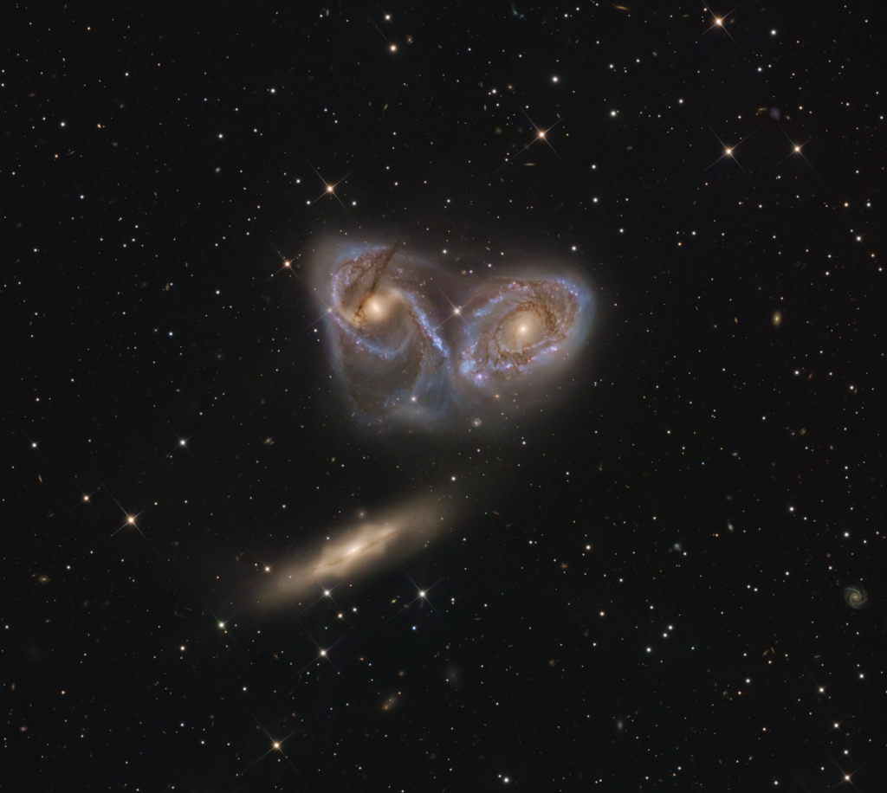
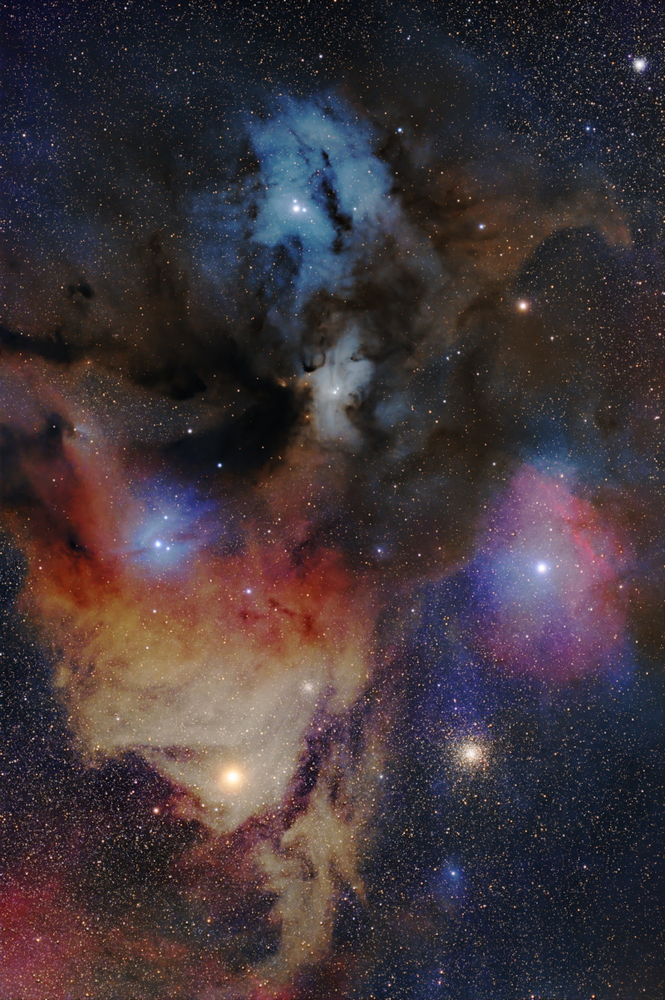

# Cosmos Log — Month 2026-07

## 2026-07-03 — Three Galaxies in Pavo
**Copyright:** Mike Selby

> Some 190 million light-years away, far beyond the bright stars and nebulae of the Milky Way, these
> three galaxies are drawn together by gravity in a mesmerizing cosmic dance. Clearly distorted by
> galactic-scale gravitational interactions, large spiral galaxies NGC6769 and NGC6770 are seen face-
> on, with luminous galactic disks scarred by obscuring interstellar dust lanes. Their young blue star
> clusters along drawn out spiral arms are spawned in star forming regions that result from collisions
> of massive molecular clouds. Below, spiral NGC6771 presents a more edge-on perspective, its boxy
> central bulge due to tidal star streams. Of course, in the distant future a merger of the three
> galaxies is inevitable. At the estimated distance of this galaxy trio, known to some as the Devil's
> Mask, the sharp telescopic frame spans over 300 thousand light-years within the boundaries of the
> far southern constellation Pavo.

---

## 2026-07-01 — The Cotton Candy Clouds of Rho Ophiuchi
**Copyright:** Ángel Molina  Text: Keighley Rockcliffe   (NASA GSFC,  UMBC CSST,  CRESST II)

> Although they look like cotton candy, you cannot eat these clouds! Taken in Cádiz, Spain, today's
> image features the Rho Ophiuchi complex, a rich tapestry of young and old astronomical phenomena.
> This colorful cloud complex is a nearby star-forming region containing hundreds of young stellar
> objects, including protostars and T Tauri stars. Light from the triple star system at its center
> reflects off of small dust grains to create the blue reflection nebula. Ultraviolet light from hot
> stars ionizes the surrounding hydrogen gas, creating the red emission nebula. Antares, a red
> supergiant big enough to engulf the Solar System’s asteroid belt, lights up the yellow region. Dark
> interstellar dust blocks some of the complex’s color. Recent JWST observations exhibit shadows cast
> by hidden circumstellar disks, the beginning stages of planet formation. Messier 4, a globular
> cluster almost as old as the universe, sits in the bottom right and witnesses yet another chaotic
> burst of youth in the Milky Way.

---

