# Cosmos Log — Month 2026-07

## 2026-07-21 — Turtle Rock on Mars
**Copyright:** Public Domain

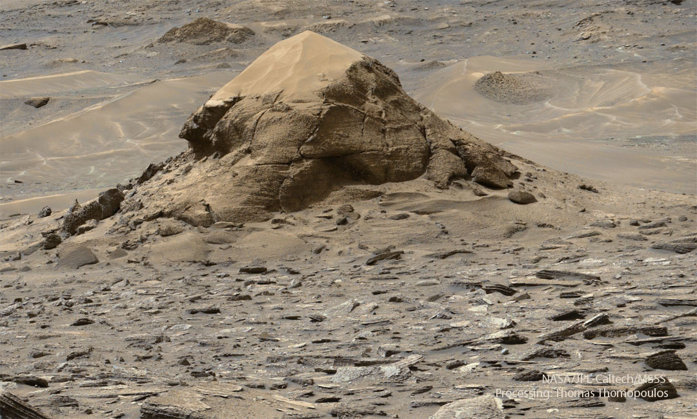

> Is this a fossilized turtle on Mars?  No.  Although resembling a large Earth tortoise, this is a
> layered rock outcrop on Mars that is estimated to span about 15 meters, making it much larger than
> turtles on Earth. NASA’s robotic Curiosity rover came across this unusual mound, dubbed Miraflores,
> last month during its 4922nd Martian day exploring Mars.  The small butte may survive because it was
> somehow more resistant to erosion than surrounding rock.  More recent wind has now covered its top
> with orange Martian sand.  Below the top shell, many layers of stratified rock are visible, possibly
> indicating a long history of intermittent wind-blown sand being deposited and then hardened by
> ground water.  Similar wind-eroded layered landforms, such as yardangs in the Qaidam Desert of
> China, exist here on Earth. Curiosity and its companion rover Perseverance continue to investigate
> the ancient history of Mars as well as searching for signs of primeval life.

---

## 2026-07-20 — NGC 3576: The Statue of Liberty Nebula
**Copyright:** Logan Carpenter

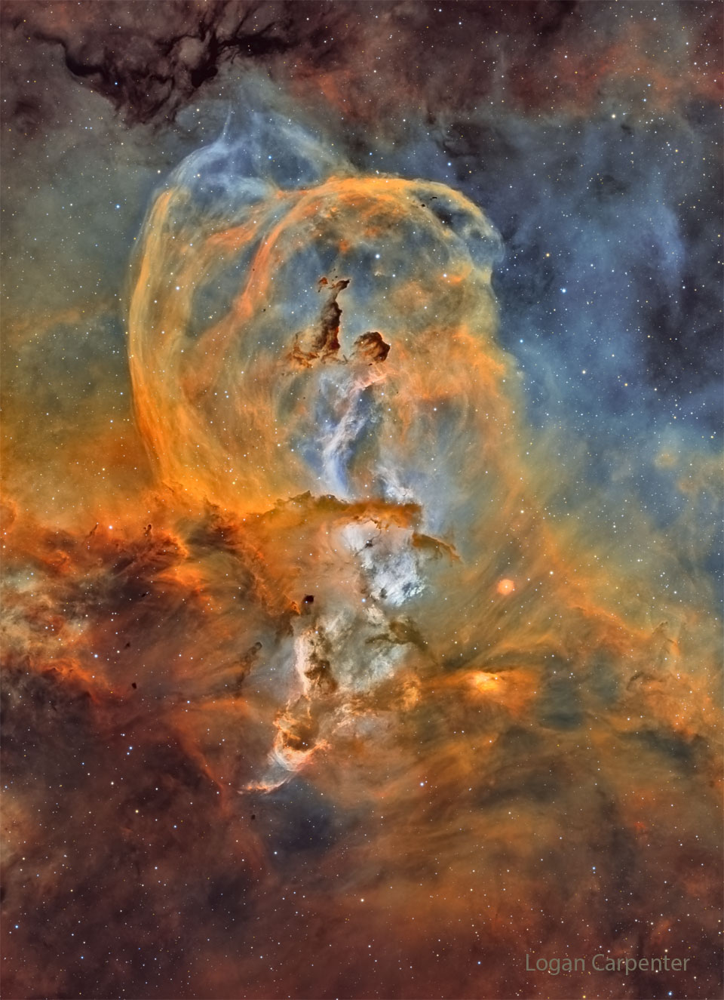

> What's happening in the Statue of Liberty nebula?  Bright stars and interesting molecules are
> forming and being liberated. The complex nebula resides in the star forming region called RCW 57,
> and besides the iconic monument, to some looks like a flying superhero or a weeping angel.  This re-
> assigned color image showcases dense knots of dark interstellar dust, fields of glowing hydrogen gas
> ionized by these stars, and great loops of gas expelled by dying stars. A detailed study of NGC
> 3576, also known as NGC 3582 and NGC 3584, uncovered at least 33 massive stars in the end stages of
> formation, and the clear presence of the complex carbon molecules known as polycyclic aromatic
> hydrocarbons (PAHs). PAHs are thought to be created in the cooling gas of star forming regions, and
> their development in the Sun's formation nebula five billion years ago may have been an important
> step in the development of life on Earth.   Jigsaw Star Statue: Astronomy Puzzle of the Day

---

## 2026-07-19 — Flying Saucer Crash Lands in Utah Desert
**Copyright:** Public Domain

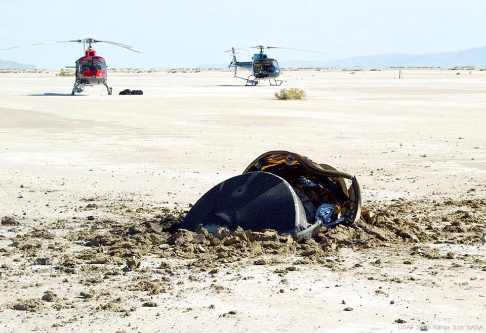

> A flying saucer from outer space crash-landed in the Utah desert after being tracked by radar and
> chased by helicopters.  The year was 2004, and no space aliens were involved.  The saucer, pictured
> here, was the Genesis sample return capsule, part of a human-made robot Genesis spaceship launched
> in 2001 by NASA itself to study the Sun.  The unexpectedly hard landing at over 300 kilometers per
> hour occurred because the parachutes did not open as planned.  The Genesis mission had been orbiting
> the Sun collecting solar wind particles that are usually deflected away by Earth's magnetic field.
> Despite the crash landing, many return samples remained in good enough condition to analyze.
> Genesis-related discoveries included new details about the composition of the Sun and how the
> abundance of some types of elements differ across the Solar System. These results have provided
> intriguing clues into details of how the Sun and planets formed billions of years ago.    Almost
> Hyperspace: Random APOD Generator

---

## 2026-07-18 — Shadow and Rainbow
**Copyright:** Public Domain

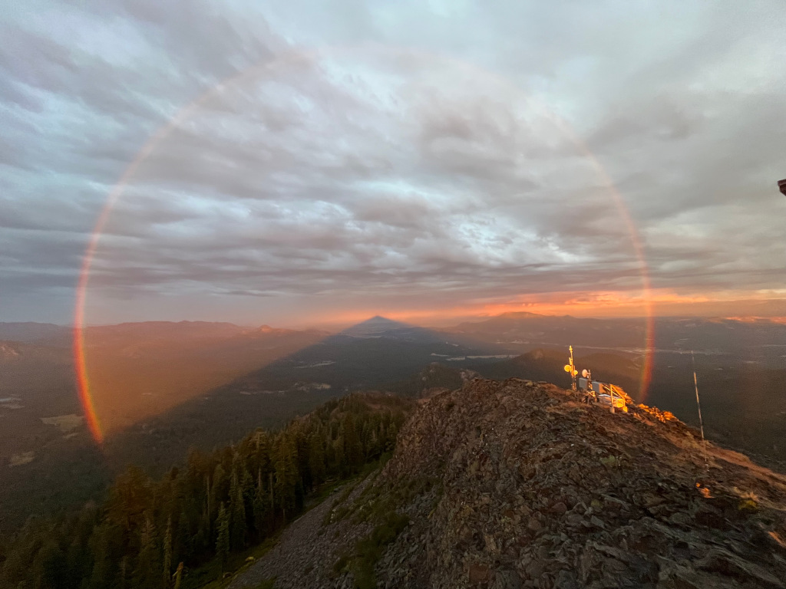

> At sunset, an alignment of rainbow and mountain shadow was captured in this remarkable snapshot. The
> stunning view was recorded from a fire lookout on Smith Peak in the Plumas National Forest near
> Portola, California on July 13.  Still, near sunset it's no accident that the majestic mountain
> shadow seems to point to the center of the graceful rainbow arc. Due to perspective and the long
> line of sight the mountain shadow naturally forms a tapering triangular shape, its apex positioned
> at the point opposite the Sun on the horizon. Following thunderstorms across the region, the rainbow
> arcs across the early evening sky, with its colorful and characteristic 42 degree arc formed as
> sunlight is refracted and reflected by the atmospheric water droplets. The geometric center of a
> rainbow arc lies at the antisolar point. And in this scene from the golden hour on planet Earth,
> that's also oposite the setting Sun along the distant horizon.

---

## 2026-07-17 — The Dust Trail of Comet Tempel 2
**Copyright:** Dan Bartlett

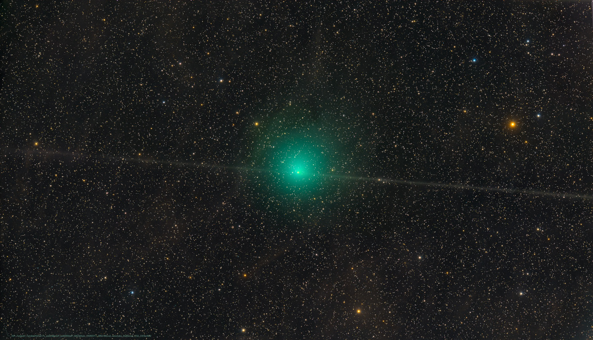

> Comet 10P/Tempel 2 orbits the Sun once every 5.4 years. Currently visible in binoculars or small
> telescopes toward the constellation Capricornus, the periodic comet is captured in this sharp
> telescopic image from July 11 sporting a bright nuclear region and pretty greenish coma. Remarkably,
> a thin dust trail, not a typical dust tail, is also seen extending both east and west of the Tempel
> 2 nucleus. Unlike a comet dust tail, which tends to temporarily fan out in a direction away from the
> Sun, this dust trail is due to the residual dust shed during many past orbits along this ancient
> periodic comet's orbital plane. In fact, Tempel 2's dust trail may get a little narrower and
> brighter from our perspective as Earth crosses through the comet's orbital plane on July 20. Comet
> 10P/Tempel 2 will reach a perihelion on August 2, and make its closest approach to Earth on August
> 3.

---

## 2026-07-16 — NGC 300: A Cosmic Gemstone with Stars and Gas Clouds
**Copyright:** Team Ciel Austral  Text:  Cecilia Chirenti  (NASA GSFC,  UMCP,  CRESST II)

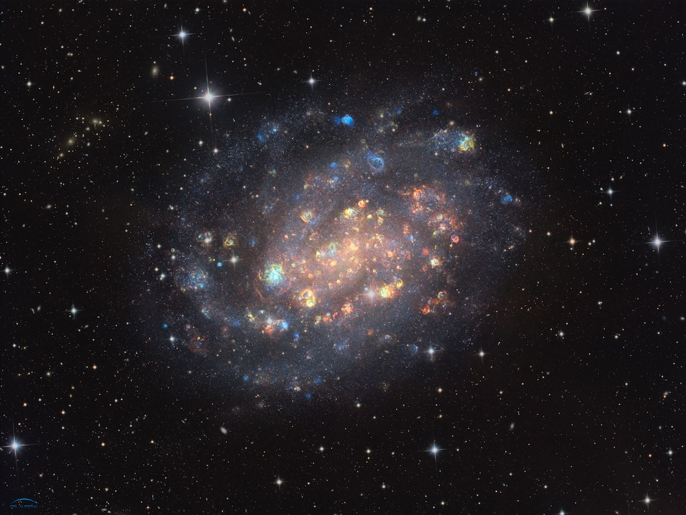

> This sparkling, colorful gemstone is a spiral galaxy, NGC 300.   It is one of the closest spiral
> galaxies to Earth, only about 6 million light-years away.     But does it really look like this?
> Here is a more standard portrait of it.   This unusual image combines the light from the stars and
> dust within the galaxy with the light from ionized clouds of interstellar gas shown in red
> (Sulphur), green (Hydrogen) and blue (Oxygen).   Combining red and green light in different
> proportions makes yellow or orange light, most visible in the image.   Light from other ionized
> gases is also at work in neon signs, fluorescent tubes and street lights.   These massive clouds of
> ionized gas are typically created by young, massive stars that produce high-energy ultraviolet
> radiation capable of ionizing the gas.   Massive stars are short-lived, compared with lighter stars
> like our sun, and explode as supernovas at the end of their lives.   Some of the colorful clouds in
> the image could be hiding supernova remnants.

---

## 2026-07-15 — Red Sprites in the Tatacoa Desert
**Copyright:** Mario Vargas  Text: Keighley Rockcliffe   (NASA GSFC,  UMBC CSST,  CRESST II)

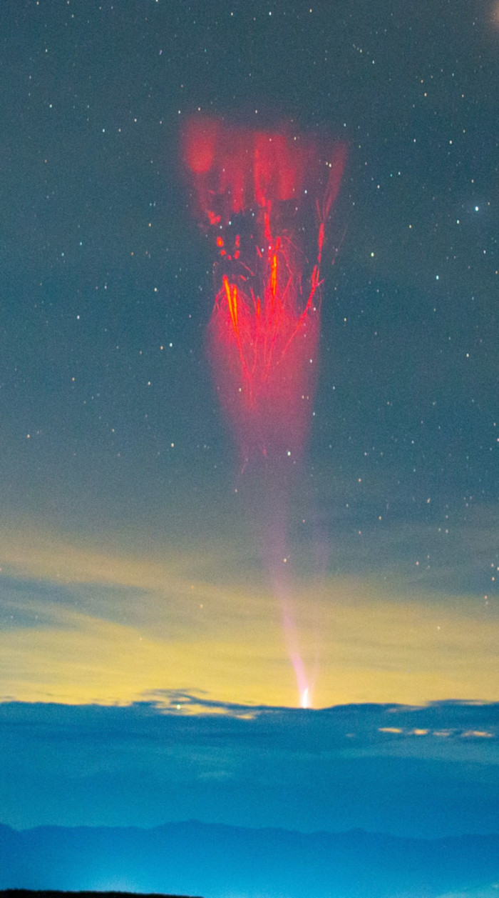

> Is there an angry Sith using force lightning in the Tatacoa Desert? This is not science fiction, but
> a red sprite with multiple streamers! Ordinary lightning occurs when thundercloud particles collide,
> lose their electrons, and build up negative charge at the cloud bottom. The cloud’s negative charge
> repels negative charge deeper into the Earth, leaving Earth’s surface positively charged. The
> opposite charges attract, reaching towards each other and superheating the air into a white strike
> of plasma. Red sprites are millisecond events triggered by positive cloud-to-ground lightning. They
> extend up into the mesosphere where the air is too thin for thunder. Their red glow comes from
> heated molecular nitrogen. There are several potential causes for red sprites, including that the
> preceding positive lightning exposes the negatively charged cloud core to the positively charged
> upper atmosphere, allowing those charges to connect. NASA’s Juno has observed sprites on Jupiter,
> indicating that sprites occur on other planets!

---

## 2026-07-14 — Double Lobed Asteroid Torifune
**Copyright:** JAXA,  U. of Tokyo,  Chiba Tech,  Tokyo U. of Science,  AIST,  Paris Obs.,  IAC

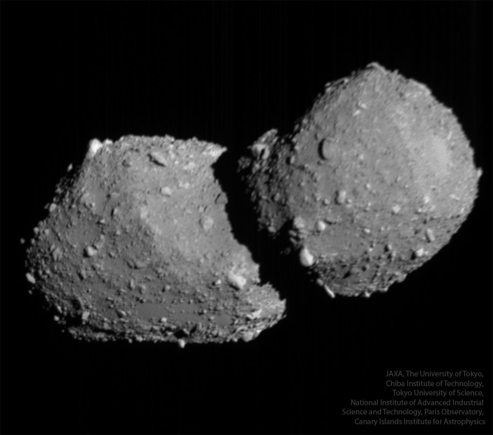

> Why is this asteroid a double?  Earlier this month the Japanese robotic spacecraft Hayabusa2 shot
> past asteroid 98943 Torifune and captured pictures. Although previous observations from distant
> Earth indicated that Torifune was oblong, Hayabusa2 found that Torifune actually has two joined
> lobes.  With a length of about four soccer fields, this space rock frequently comes near the Earth
> as it orbits the Sun, although it is not a threat.  Besides the two lobes, Torifune shows many large
> boulders, but, surprisingly, no obvious craters, likely because its surface is a pile of rubble.
> Like asteroid Arrokoth, it appears that each lobe formed separately before colliding and becoming
> stuck together.  Hayabusa2 famously encountered asteroid Ryugu in 2018, and now heads for an
> encounter in 2031 with 1998 KY26, a smaller asteroid that rotates unusually fast and might have
> reservoirs of ice.

---

## 2026-07-12 — Galaxy NGC 474: Shells and Star Streams
**Copyright:** Public Domain

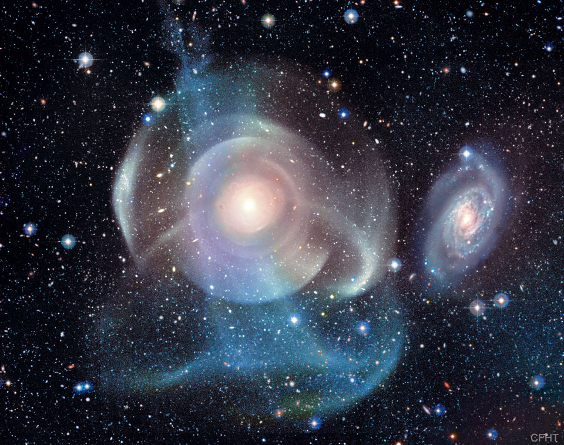

> What's happening to galaxy NGC 474?  The multiple layers of emission appear strangely complex given
> the relatively featureless appearance of the elliptical galaxy in less deep images.  The cause of
> the shells is a topic of research, but they are possibly tidal tails related to debris left over
> from absorbing numerous small galaxies in the past billion years.  Alternatively, the shells may be
> like ripples in a pond, where the ongoing collision with the spiral galaxy just to the right of NGC
> 474 is causing density waves to ripple through the galactic giant.  Regardless of the actual cause,
> the featured image dramatically highlights the increasing evidence that the halos of some elliptical
> galaxies are surprisingly complicated.  Similarly, the halo of our own Milky Way Galaxy is one
> example of such unexpected intricacies.  NGC 474 spans about 250,000 light years and lies about 100
> million light years distant toward the constellation of the Fish (Pisces).

---

## 2026-07-12 — Galaxy NGC 474: Shells and Star Streams
**Copyright:** Public Domain

> What's happening to galaxy NGC 474?  The multiple layers of emission appear strangely complex given
> the relatively featureless appearance of the elliptical galaxy in less deep images.  The cause of
> the shells is a topic of research, but they are possibly tidal tails related to debris left over
> from absorbing numerous small galaxies in the past billion years.  Alternatively, the shells may be
> like ripples in a pond, where the ongoing collision with the spiral galaxy just to the right of NGC
> 474 is causing density waves to ripple through the galactic giant.  Regardless of the actual cause,
> the featured image dramatically highlights the increasing evidence that the halos of some elliptical
> galaxies are surprisingly complicated.  Similarly, the halo of our own Milky Way Galaxy is one
> example of such unexpected intricacies.  NGC 474 spans about 250,000 light years and lies about 100
> million light years distant toward the constellation of the Fish (Pisces).

---

## 2026-07-11 — Messier 24: Sagittarius Star Cloud
**Copyright:** Chuck Ayoub

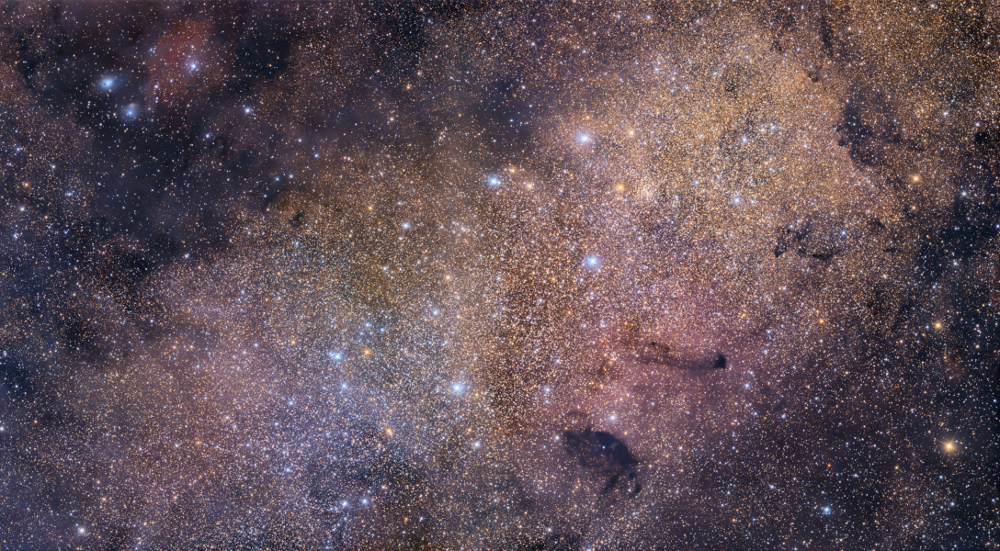

> Unlike most entries in Charles Messier's famous catalog of deep sky objects, M24 is not a bright
> galaxy, star cluster, or nebula. It's a gap in nearby, obscuring interstellar dust clouds that
> allows a view of the distant stars in the Sagittarius spiral arm of our Milky Way galaxy. Direct
> your gaze through this gap with binoculars or a small telescope and you are looking through a window
> over 300 light-years wide at stars some 10,000 light-years or more from Earth. Sometimes called the
> Small Sagittarius Star Cloud, M24's luminous stars stretch across this gorgeous interstellar scene.
> Spanning over four full moons on the sky toward the constellation Sagittarius, the telescopic field
> of view includes dark markings B92 and B93 near the center of M24, along with other clouds of dust
> and glowing nebulae toward the center of the Milky Way.

---

## 2026-07-10 — Western Moon, Eastern Sea
**Copyright:** The Mare Orientale

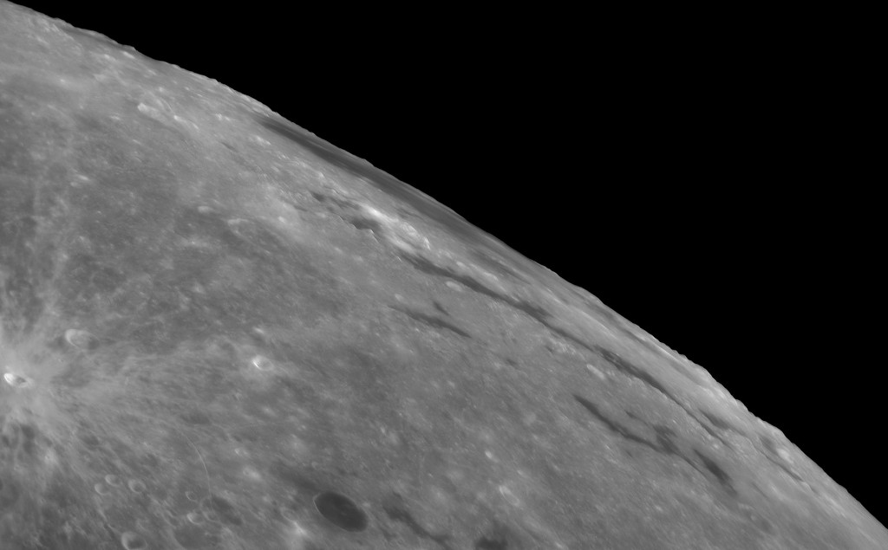

> The Mare Orientale, Latin for Eastern Sea, is one of the most striking large scale lunar features.
> The youngest of the large lunar impact basins it's very difficult to see from an earthbound
> perspective. Still, captured on July 7 during a period of favorable tilt, or libration of the lunar
> nearside, the Eastern Sea can be found at the upper right in this sharp telescopic view. In the
> image, the large lunar mare is extremely foreshortened and stretches along the Moon's western edge.
> Formed by the impact of an asteroid over 3 billion years ago and nearly 1000 kilometers across, the
> impact basin's concentric circular features are ripples in the lunar crust. But they are a little
> easier to spot in more direct images of the region taken from lunar orbit. So why is the Eastern Sea
> at the Moon's western edge? The Mare Orientale lunar feature was named before 1961. That's when the
> convention labeling east and west on lunar maps was reversed.

---

## 2026-07-09 — The Red Glow of the Cosmic Bat Nebula
**Copyright:** Humbert Cédric  Text: Keighley Rockcliffe   (NASA GSFC,  UMBC CSST,  CRESST II)

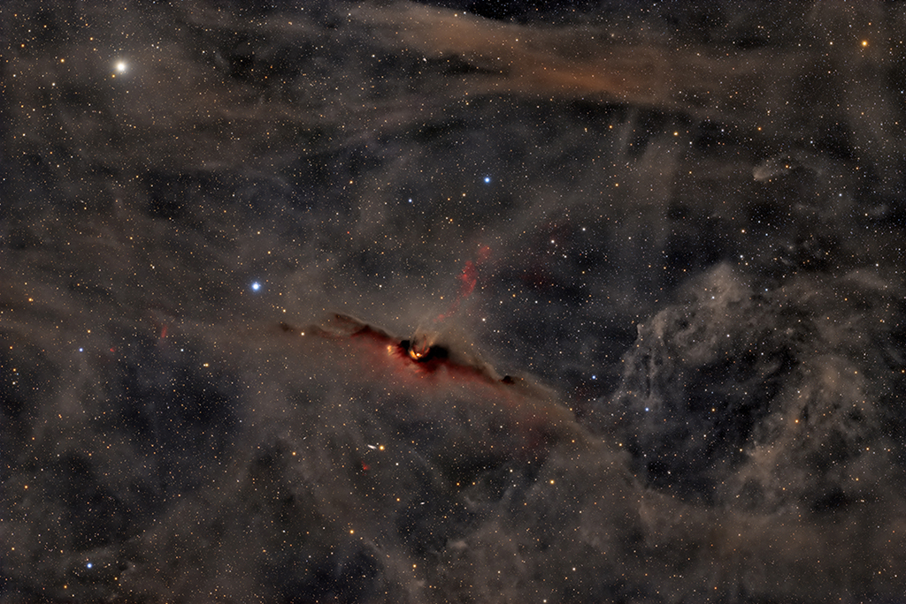

> This Cosmic Bat wishes you a happy Summerween! This mid-year celebration of Halloween transcends
> hemispheres, even though summer in the Northern hemisphere is winter in the South. Contrary to its
> eery aura, the Cosmic Bat Nebula (LDN 43), not to be confused with the Bat Nebula (NGC 6995), is a
> vibrant birthplace for stars. A bit of young starlight peeks through the dense clouds of gas and
> dust that make up the Cosmic Bat’s 12 lightyear wingspan. The ultraviolet light from the young stars
> energizes the nebula’s hydrogen gas, causing it to glow an ominous red. The jet of glowing hydrogen
> gas emerging from the bat’s head hints at the star formation hidden within.

---

## 2026-07-08 — Swift Boost Mission
**Copyright:** Public Domain

> Sometimes we can all use a little help from a friend.    NASA's Neil Gehrels Swift Observatory needs
> a boost to stay in orbit after almost 22 years of service.   This video shows an artist's
> visualization of the Swift Boost Mission: The Katalyst's LINK spacecraft was launched aboard a
> Northrop Grumman Pegasus XL rocket on July 3 and it is now en route to rendezvous with Swift and
> boost it to a higher orbit over the course of the next several months.   This type of maneuver has
> never been attempted before.   If successful, it will be the technology demonstration of a new key
> capability to extended the lifetime of spacecraft in low Earth orbit, whose orbits decay over time.
> Swift has an array of instruments that observe the most energetic explosions in the Universe in
> gamma-rays, X-rays and ultraviolet, and the unique ability to repoint in their direction within tens
> of seconds.   Astronomers around the world, and indeed all fans of cosmic explosions, are anxiously
> hoping for a successful mission!

---

## 2026-07-07 — NGC 6188: Dragons of Ara
**Copyright:** Rod Prazeres

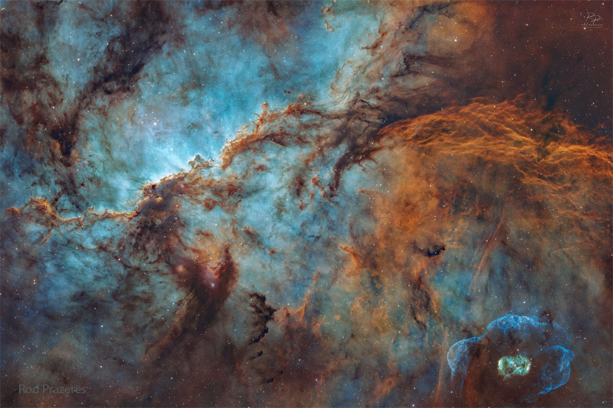

> Where can you find dragons fighting in the night sky?  In the southern constellation of the Altar:
> Ara. The dragons are, of course, actually made of suggestively shaped gas and dust.  The celestial
> home of the mythological battling beasts is cataloged as NGC 6188 and located about 4,000 light
> years away near the edge of a large molecular cloud.  Massive, young stars of the embedded Ara OB1
> association were formed there only a few million years ago, sculpting the dark shapes and powering
> the nebular glow with stellar winds and intense ultraviolet radiation.  Joining NGC 6188 on this
> cosmic canvas, visible toward the lower right, is unusual emission nebula NGC 6164, also created by
> one of the region's massive stars.  This impressively wide field picture, captured from Queensland,
> Australia, spans over 2 degrees (four full Moons).

---

## 2026-07-06 — Dueling Bands over the Atacama Desert
**Copyright:** Julien Looten

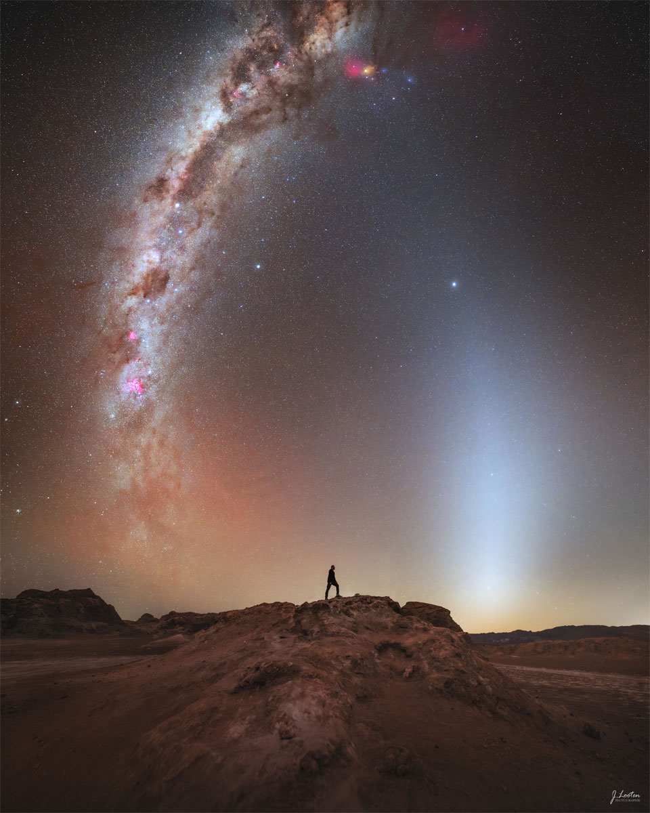

> What are these two bands in the sky?  The more commonly seen band is on the left and is the central
> band of our Milky Way galaxy.  Our Sun orbits in the disk of this spiral galaxy so that from inside,
> it appears as a band of comparable brightness all the way around the sky.  The less commonly seen
> band, on the right, is zodiacal light -- sunlight reflected from dust orbiting the Sun in our Solar
> System.  Zodiacal light is brightest near the Sun and so is best seen just before sunrise or just
> after sunset.  On some evenings, this ribbon of zodiacal light can appear quite prominent.  It was
> discovered only in this century that zodiacal dust was mostly expelled by comets that have passed
> near Jupiter.  The featured image was captured about a year ago from the Atacama Desert in Chile.

---

## 2026-07-05 — Saturn's Iapetus: Painted Moon
**Copyright:** Public Domain

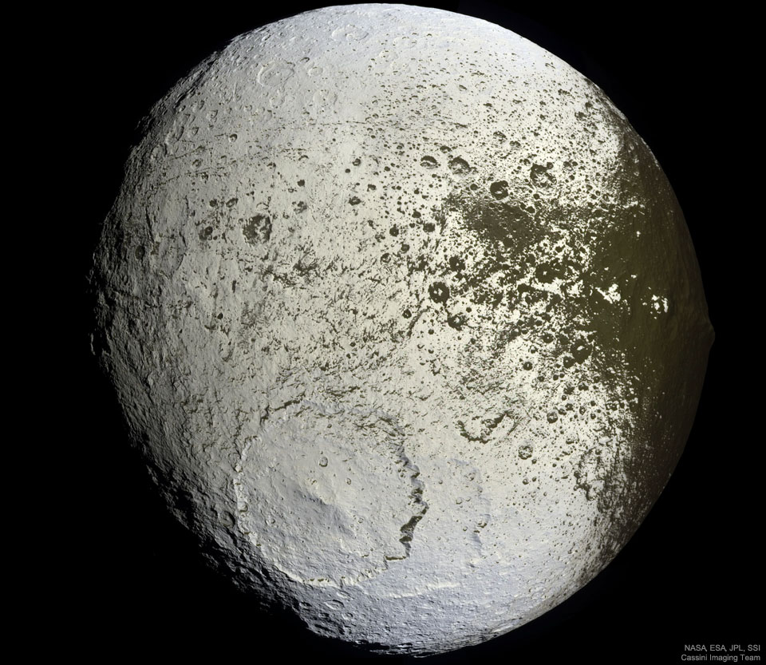

> What has happened to Saturn's moon Iapetus?  Vast sections of this strange world are dark as coal,
> while others are as bright as snow.  To help better understand this unusually tinted moon, in 2007
> NASA directed the robotic Cassini spacecraft then orbiting Saturn to swoop within 2,000 kilometers.
> Pictured here, from about 75,000 kilometers out, is the hemisphere of Iapetus that is always
> trailing.  A large impact crater seen in the south spans 500 kilometers and appears superposed on an
> older crater of similar size.  The dark material is seen increasingly coating the easternmost part
> of Iapetus, darkening craters and highlands alike.  A leading hypothesis is that the dark material
> is mostly a form of carbon-rich soil leftover from when relatively warm but dirty ice sublimates.
> An initial coating of this dark material may have been effectively painted on by the accretion of
> meteor-liberated debris from other moons.   Jigsaw Moon: Astronomy Puzzle of the Day

---

## 2026-07-04 — Pathfinder on Mars
**Copyright:** Public Domain

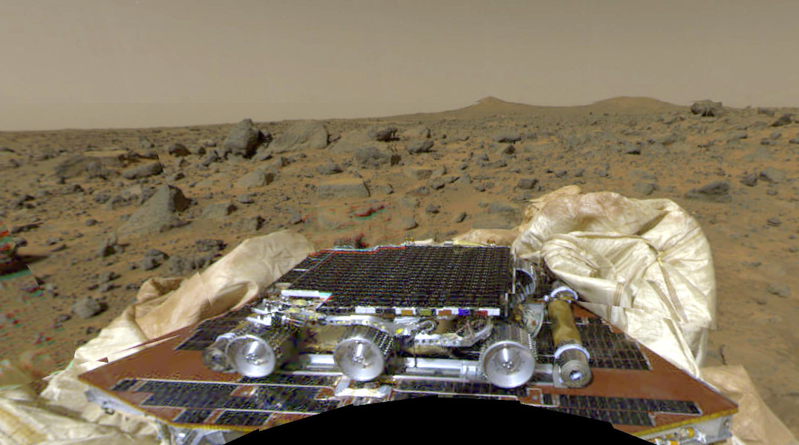

> On July 4th, 1997, using its own array of fireworks, a parachute, and a cocoon of airbags, the Mars
> Pathfinder spacecraft bounced like a giant beach ball at least 15 times before it came to rest on
> the surface of Mars at 10:07 AM Pacific Daylight Time. After its then novel airbag-assisted landing
> sequence was completed, Pathfinder transmitted this color mosaic to mission operators on Earth. In
> the scene from another world, the Mars Sojourner robot rover is visible in the foreground, crouched
> on top of the unfolded Pathfinder.  About the size of a large house cat, the six-wheeled, solar-
> powered Sojourner became the first successful Martian rover. Surrounding Pathfinder are deflated
> airbags and the rock-strewn terrain of the Ares Vallis floodplain. In the distance Martian hills
> appear against a dusty brownish sky. The Pathfinder lander was subsequently renamed the Carl Sagan
> Memorial Station.

---

## 2026-07-03 — Three Galaxies in Pavo
**Copyright:** Mike Selby

> Some 190 million light-years away, far beyond the bright stars and nebulae of the Milky Way, these
> three galaxies are drawn together by gravity in a mesmerizing cosmic dance. Clearly distorted by
> galactic-scale gravitational interactions, large spiral galaxies NGC6769 and NGC6770 are seen face-
> on, with luminous galactic disks scarred by obscuring interstellar dust lanes. Their young blue star
> clusters along drawn out spiral arms are spawned in star forming regions that result from collisions
> of massive molecular clouds. Below, spiral NGC6771 presents a more edge-on perspective, its boxy
> central bulge due to tidal star streams. Of course, in the distant future a merger of the three
> galaxies is inevitable. At the estimated distance of this galaxy trio, known to some as the Devil's
> Mask, the sharp telescopic frame spans over 300 thousand light-years within the boundaries of the
> far southern constellation Pavo.

---

## 2026-07-01 — The Cotton Candy Clouds of Rho Ophiuchi
**Copyright:** Ángel Molina  Text: Keighley Rockcliffe   (NASA GSFC,  UMBC CSST,  CRESST II)

> Although they look like cotton candy, you cannot eat these clouds! Taken in Cádiz, Spain, today's
> image features the Rho Ophiuchi complex, a rich tapestry of young and old astronomical phenomena.
> This colorful cloud complex is a nearby star-forming region containing hundreds of young stellar
> objects, including protostars and T Tauri stars. Light from the triple star system at its center
> reflects off of small dust grains to create the blue reflection nebula. Ultraviolet light from hot
> stars ionizes the surrounding hydrogen gas, creating the red emission nebula. Antares, a red
> supergiant big enough to engulf the Solar System’s asteroid belt, lights up the yellow region. Dark
> interstellar dust blocks some of the complex’s color. Recent JWST observations exhibit shadows cast
> by hidden circumstellar disks, the beginning stages of planet formation. Messier 4, a globular
> cluster almost as old as the universe, sits in the bottom right and witnesses yet another chaotic
> burst of youth in the Milky Way.

---

