# Cosmos Log — Month 2026-08

## 2026-08-16 — Milky Way over Yellowstone
**Copyright:** Dave Lane

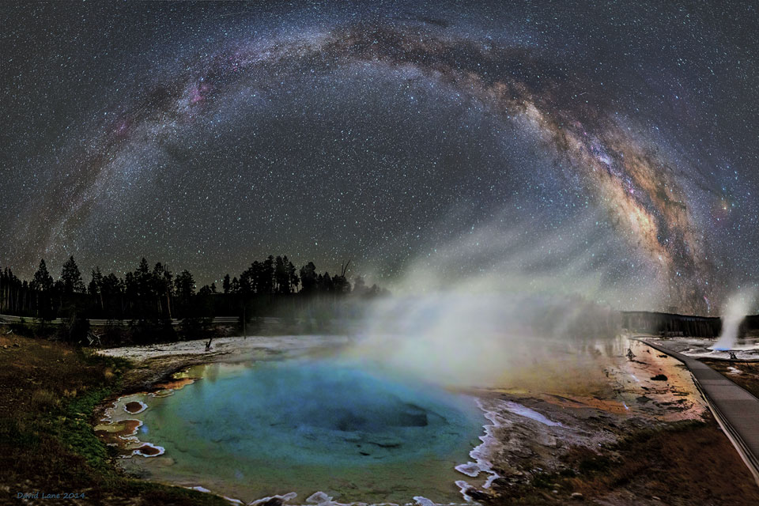

> The Milky Way was not created by an evaporating lake.  The colorful pool of water, about 10 meters
> across, is known as Silex Spring and is located in Yellowstone National Park in Wyoming, USA.
> Illuminated artificially, the colors are caused by layers of bacteria that grow in the hot spring.
> Steam rises off the spring, heated by underground magma associated with the Yellowstone Hotspot.
> Unrelated and far in the distance, the central band of our Milky Way Galaxy arches high overhead, a
> band lit by billions of stars.  The picture features a 16-image panorama taken in 2014.  If the
> Yellowstone Hotspot causes another supervolcanic eruption as it did about 640,000 years ago, a large
> part of North America would be affected.

---

## 2026-08-15 — Bright Perseids from Sweden
**Copyright:** Clear Skies

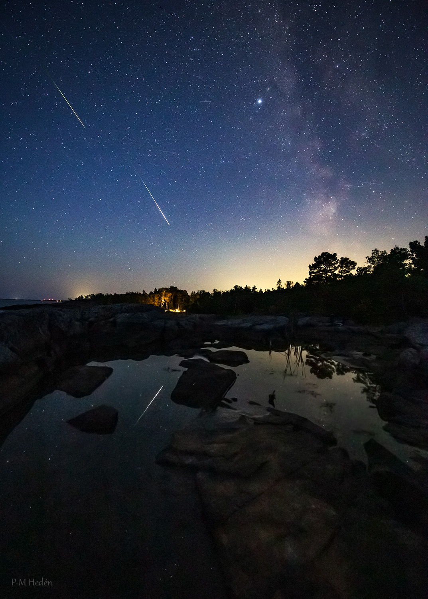

> Known for its bright and fast meteors, the annual Perseid Meteor Shower comes to planet Earth's
> skies from a radiant in the heroic constellation Perseus. The popular northern summer celestial
> spectacle is created as grains of dust cast off along the orbit of periodic comet 109P/Swift-Tuttle
> vaporize in Earth's dense atmosphere, tracing brief, but beautiful streaks through the night. Taken
> near the shower's peak of activity on August 12, this composite image recorded two bright perseid
> meteors and one meteor's watery reflection from a location near the coastal village of Grisslehamn,
> Sweden.  Almost as bright as Altair, brightest star on the scene, the meteors appear along with the
> faint, diffuse background of the Milky Way. This year, the shower's peak activity coincided with a
> New Moon, so perseid meteor flashes were undiminished by bright moonlight. And for many skywatchers,
> this night of bright perseid meteors followed their viewing of the silhouette of the New Moon in a
> much anticipated solar eclipse.  Growing Gallery: Solar Eclipse of 2026 August 12

---

## 2026-08-14 — Total Solar Eclipse from Greenland
**Copyright:** On August 12

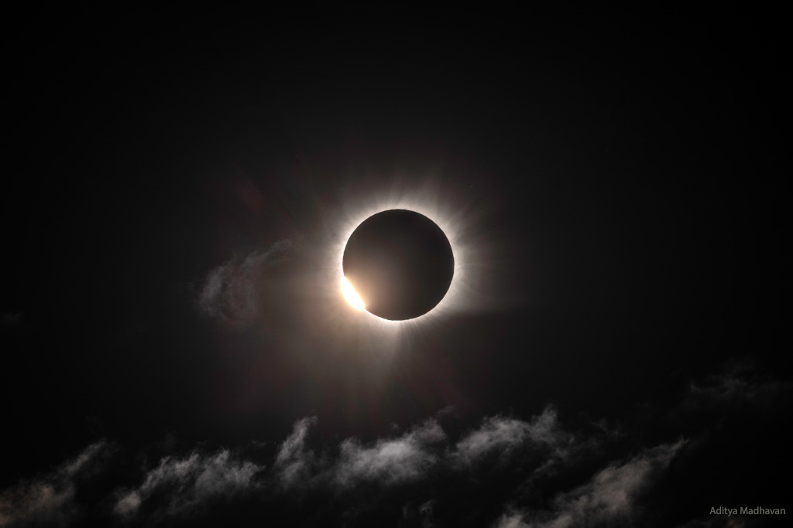

> On August 12, the Moon's shadow reached out to touch our fair planet. Beginning in the Arctic Ocean,
> it swept along a narrow track that led the dark lunar umbra across parts of Greenland, Iceland, the
> Atlantic, Portugal, and northern Spain. And for a moment, denizens of Earth who found themselves
> with clear skies under the shadow of the Moon could witness a total solar eclipse. After dodging the
> weather by sea and making a landing along Rype Fjord on the Greenland east coast (at 71.07055N,
> 27.71252W), this hard-won snapshot was captured at 17:33:26 UTC. That's near the initial reach of
> clearing skies along the path of totality, so the image is likely one of the first unobstructed
> views of the totally eclipsed Sun. Through a break in the clouds, the stunning photo also records
> one of this eclipse's transient diamond rings and the magnificent solar corona emerging near the
> moment totality began.  More spectacular eclipse images: Solar Eclipse of 2026 August 12

---

## 2026-08-13 — Total Solar Eclipse Over Spain
**Copyright:** Ruiyu Zhang  Text: Keighley Rockcliffe   (NASA GSFC,  UMBC CSST,  CRESST II)

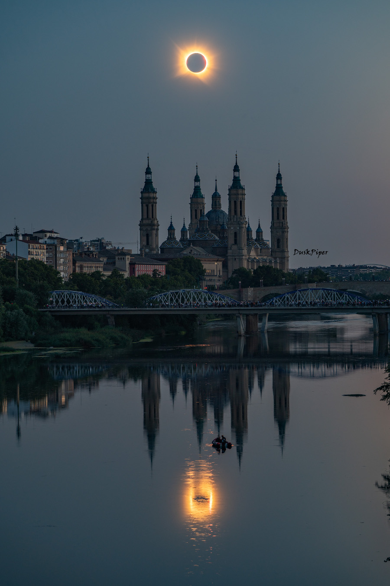

> On August 12th, 2026, the Moon totally eclipsed the Sun and cast its shadow across Siberia,
> Greenland, Iceland, Spain, and Portugal. Today’s image features two total solar eclipses viewed from
> Zaragoza, Spain, one over the Cathedral-Basilica of Our Lady of the Pillar and the other reflecting
> in the Ebro River. For a few moments, Spain saw its first major total solar eclipse since 1905.
> Those witnessing totality may experience a chill in the air, the quieting of birds, the confused
> chirps of insects, and the shared awe of many. It’s the corona’s time to shine as the Sun’s bright
> disk is blocked by the Moon. Among other reasons to study eclipses, they help scientists understand
> why the corona is millions of degrees hotter than the Sun’s surface. Enthusiastic citizens can
> contribute to these studies by recording how wildlife responds, imaging the corona, and monitoring
> air temperature and clouds.  More spectacular eclipse images: Solar Eclipse of 2026 August 12

---

## 2026-08-12 — Perseids Over a little Planet
**Copyright:** Marcin Rosadziński  Text:  Cecilia Chirenti  (NASA GSFC,  UMCP,  CRESST II)

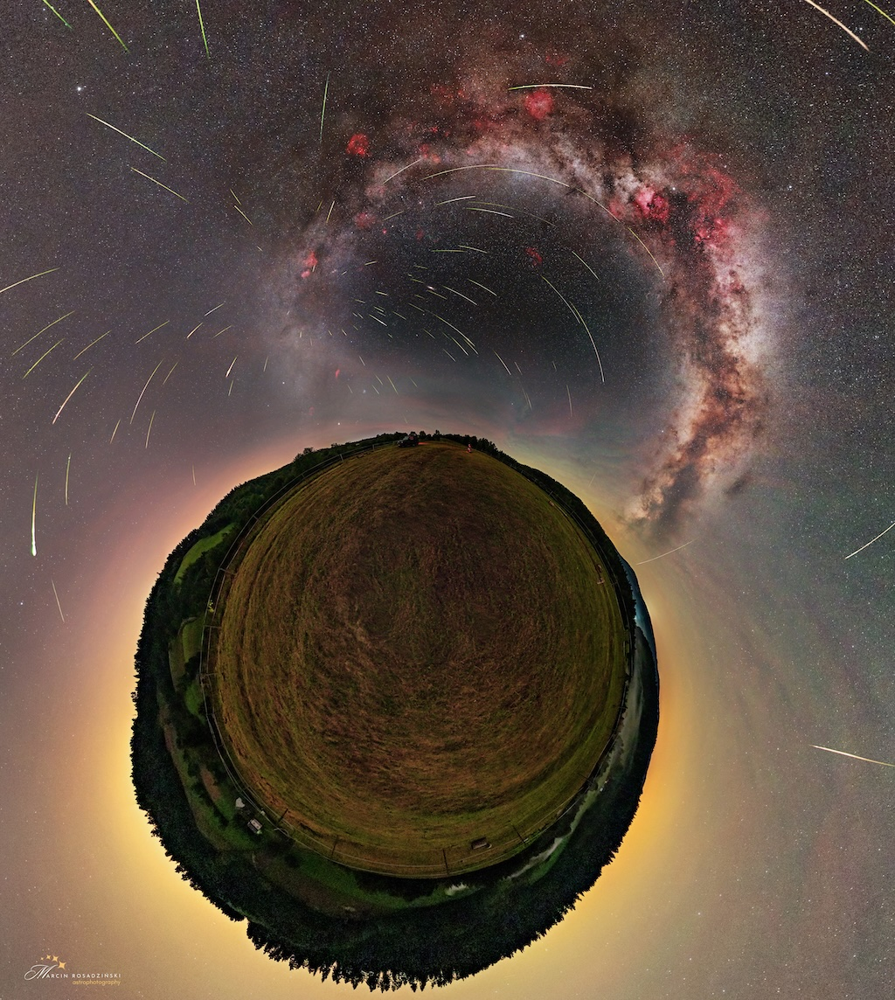

> It looks like a view from the Little Prince's planet.   The featured image is a throwback to the
> 2024 Perseid meteor shower, surrounded in this projection by the Bieszczady Mountains in Poland.
> Visible in the sky is the arch of the Milky Way, along with several nebulas in red and over a
> hundred meteors pointing to the radiant.     The Perseids are easily visible and quite popular in
> the Northern Hemisphere summer. (Watching meteor showers in the winter is less convenient for a good
> reason).     This year they are expected to offer an even more dazzling spectacle than usual,
> because the peak coincides with a new moon.   The 2026 Perseid meteor shower will peak tonight with
> as many as 50-100 meteors per hour, when the Earth's path crosses through debris left behind by
> Comet Swift-Tuttle.   Typically, the best times for seeing the meteors are between midnight and pre-
> dawn.   You won't need binoculars to see the meteors, but a lawn chair and a dark sky location help.
> There is total solar eclipse happening today! See here if you are in the path of totality.

---

## 2026-08-11 — Six Moons of Saturn
**Copyright:** Alexandre Trentini

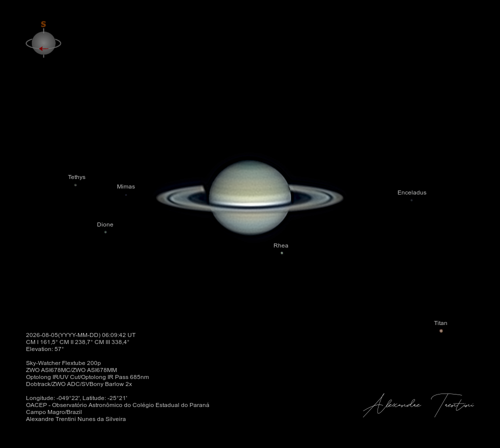

> How many moons does Saturn have? While the total will likely continue to grow, as of June 2026 the
> ringed gas giant had 293 confirmed moons. That's easily more than any other planet of the Solar
> System, including ruling gas giant Jupiter with a mere 115 confirmed moons. Most of Saturn's known
> moons are small, irregular satellites. Many are only few kilometers to a fraction of a kilometer
> across and grouped in tilted outer orbits. Six of its largest satellites can be seen here, though,
> in this sharp telescopic Saturnian family portrait taken on August 5. Larger than Earth's Moon and
> even slightly larger than inner planet Mercury, Titan, with a diameter of 5,150 kilometers, is at
> lower right. You can also spot icy major moons Mimas, Tethys, Enceladus, Dione, and Rhea in the
> frame. Saturn's first known natural satellite, Titan was discovered in 1655 by Dutch astronomer
> Christiaan Huygens. During the space age Voyager and Cassini discoveries have added to the swelling
> ranks of Saturnian moons.  NASA Stream: August 12 Total Solar Eclipse.

---

## 2026-08-10 — Three Galaxy Pairs
**Copyright:** Rafael Sampaio

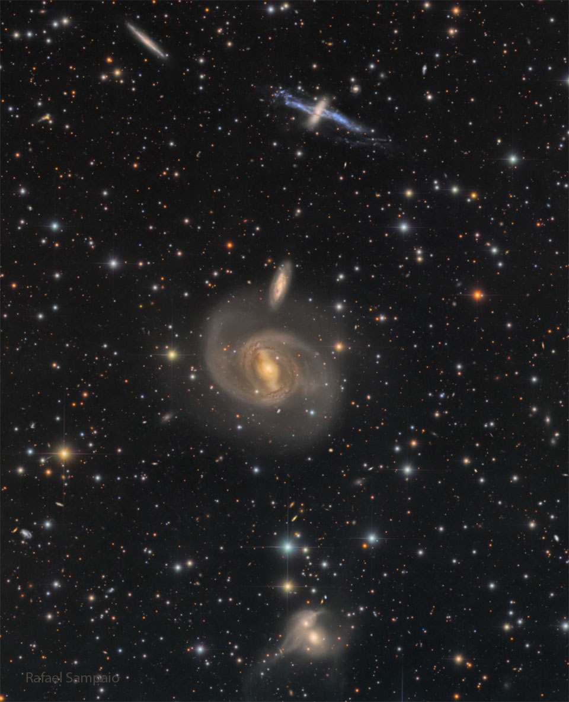

> ch of these pairs of galaxies is different.  The two galaxies at the top are likely not interacting,
> at least presently.  However, the top galaxy with the blue stripe, NGC 4650A, is a polar ring galaxy
> and may be the result of a past galaxy collision. The two galaxies in the middle of the featured
> image appear like they could be interacting gravitationally -- but their relative speeds make this
> unlikely.  Of these two, the larger galaxy, NGC 4650, is a spiral galaxy with a bright bar of stars
> across its center.  The two galaxies at the bottom are actively interacting.  Possibly in a billion
> years or so, NGC 4622A and NGC 4622B will merge and become one single galaxy. All of these galaxies
> are likely members of the larger Centaurus Galaxy Cluster.    Explore the Universe: Random APOD
> Generator

---

## 2026-08-09 — Contemplating the Sun
**Copyright:** Steven Gilbert

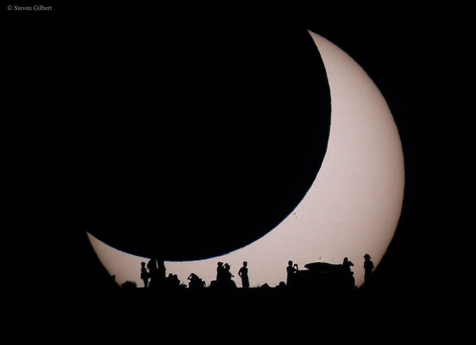

> Have you contemplated your home star recently?  Featured here, a Sun partially eclipsed on the top
> left by the Moon is also seen eclipsed by earthlings contemplating the eclipse below.  This
> spectacular menagerie of silhouettes was taken in 2012 from the Glen Canyon National Recreation Area
> near Page, Arizona, USA, where park rangers and astronomers expounded on the unusual event to
> interested gatherers.  Also, faintly visible on the Sun's disk, just to the lower right of the dark
> Moon's disk, is a group of sunspots.  A new solar eclipse will occur this week and give many people
> in northern North America, Europe, and northwestern Africa a new chance to contemplate a partially
> eclipsed Sun. A thin swath of Earth from Greenland to Portugal will further experience a total solar
> eclipse. An open question is whether any meteors from the peaking Perseids will be visible during
> totality.

---

## 2026-08-07 — Rubin's COSMOS field
**Copyright:** NSF–DOE Vera C. Rubin Observatory/NOIRLab/SLAC/AURA  Text:  Cecilia Chirenti  (NASA GSFC,  UMCP,  CRESST II)

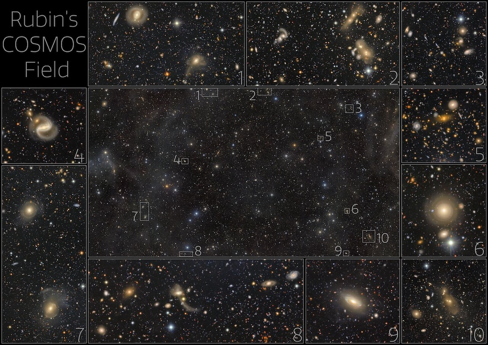

> There are more than half a million galaxies in the central panel of this image from the NSF-DOE Vera
> C. Rubin Observatory in Chile.   This is the COSMOS field, a patch of sky several times larger than
> the full moon, first observed by Hubble.   It has also been observed by Webb and other telescopes
> because it contains comparatively few bright stars from our own galaxy, offering a relatively
> unimpeded view of other galaxies outside the Milky Way.   The outer panels, numbered 1-10, show
> zoomed-in views of the corresponding small regions highlighted in the central panel.   The variety
> of galaxy shapes and sizes is astonishing.   Some of them are so far away that their light has
> traveled for billions of years before reaching Earth.   Rubin will come back every couple of days to
> the COSMOS field as part of its ten-year Legacy Survey of Space and Time.   It will allow a dynamic
> view of the COSMOS field and how the sky changes over time.

---

## 2026-08-06 — New Sharpest Image of the Sun Uncovers Instability
**Copyright:** Public Domain

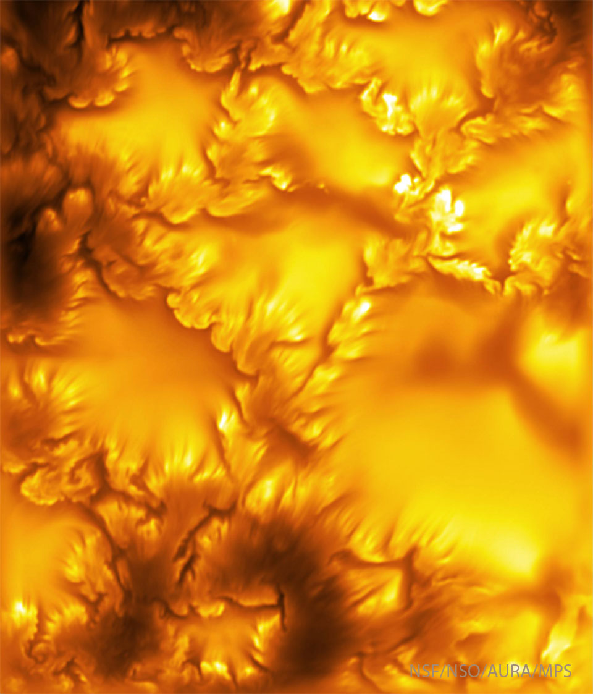

> What does the new sharpest image of our Sun show? Instability. To be clear, a certain kind of
> interactive process called the Kelvin-Helmholtz instability (KHI). This instability can create waves
> and swirls when two streams flow past each other -- in this case variable streams of solar magnetic
> plasma. Long hypothesized to occur on the Sun's surface, KHI streaks and swirls were confirmed in
> just-released dramatic high-resolution images taken recently by the Inouye Solar Telescope in
> Hawaii, USA.  The featured false-yellow image, actually taken in deep blue, is the highest
> resolution image yet of the Sun in visible light. It spans about the radius of the Earth, but its
> finest details are city sized.  Visible are several smooth tops of changing solar granules, while
> the edges of the flower-like structures have been found to harbor multiple KHI swirls.  Future
> research may investigate how the KHI helps move energy, magnetic fields, and may even heat the
> surrounding solar corona.

---

## 2026-08-05 — Spokes on Saturn's B Ring
**Copyright:** Brad Croslin  Text: Keighley Rockcliffe   (NASA GSFC,  UMBC CSST,  CRESST II)

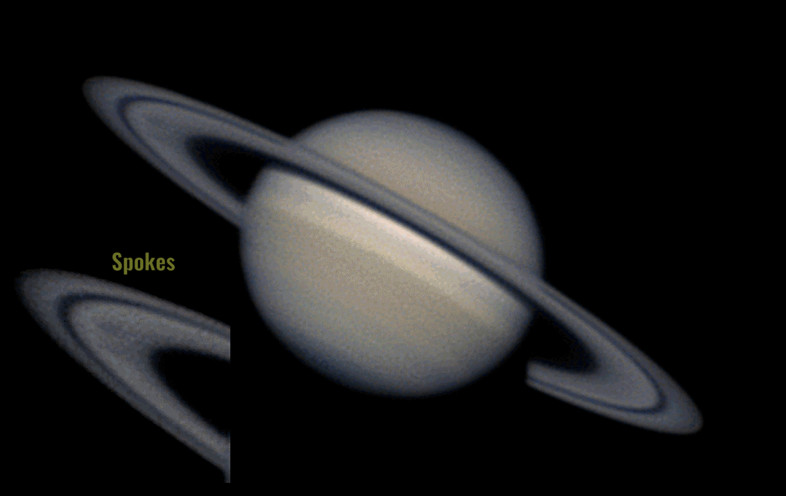

> Don’t get spooked by Saturn’s ghostly spokes! Today we feature a nearly two-hour timelapse of Saturn
> and its rings looping forwards and backwards. A day on Saturn is only 10 hours long, so two hours of
> observation covers quite a bit of its rotation. If you look closely, a ghoulish shadow appears and
> disappears as Saturn’s B ring rotates. Decades of observation with Voyager 2, Cassini, and Hubble
> show the appearance of Saturn’s spokes varies with the planet’s seasons. Like Earth, Saturn’s spin
> axis is tilted compared to the plane of its orbit around the Sun. During Saturn’s equinox, the rings
> are less tilted away from the Sun and the planet receives more evenly distributed sunlight and solar
> wind. Although their origin is still uncertain, Saturn’s spokes may be shadows of and reflections
> off of dust and ice levitating above the rings caused by electromagnetic interactions between the
> solar wind and the planet’s magnetic field.   Find dark skies and look up this August to witness the
> Perseid meteor shower uninhibited by the Moon!

---

## 2026-08-04 — Curious Cometary Knots in the Helix Nebula
**Copyright:** Public Domain

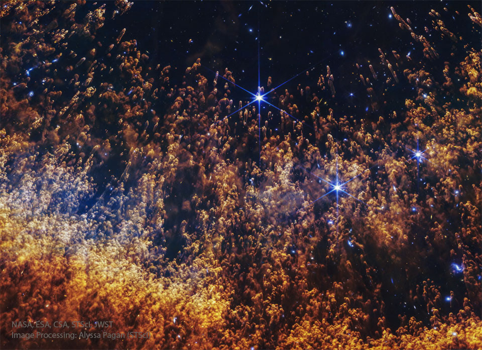

> What causes unusual knots of gas and dust in planetary nebulas?  Seen also in the Ring Nebula, the
> Dumbbell Nebula and NGC 2392, the knots' existence was not initially predicted, and their origins
> are still not well understood.  Pictured here is a fascinating image of part of the Helix Nebula by
> the James Webb Space Telescope showing tremendous detail in infrared light. The cometary knots have
> masses similar to the Earth but have sizes typically several times the orbit of Pluto.  One
> hypothesis for the fragmentation and evolution of the knots includes existing gas being driven out
> by a less dense but highly energetic stellar wind of the central evolving star.  The Helix Nebula is
> one of the closest examples of a planetary nebula created at the end of the life of a Sun-like star.
> Given a technical designation of NGC 7293, the Helix Nebula lies about 650 light-years away towards
> the constellation of Water Carrier (Aquarius).   Open Science: Browse 4,000+ codes in the
> Astrophysics Source Code Library

---

## 2026-08-03 — Vaporizing Meteor Photobombs the Lacerta Nebula
**Copyright:** Tom Burnett

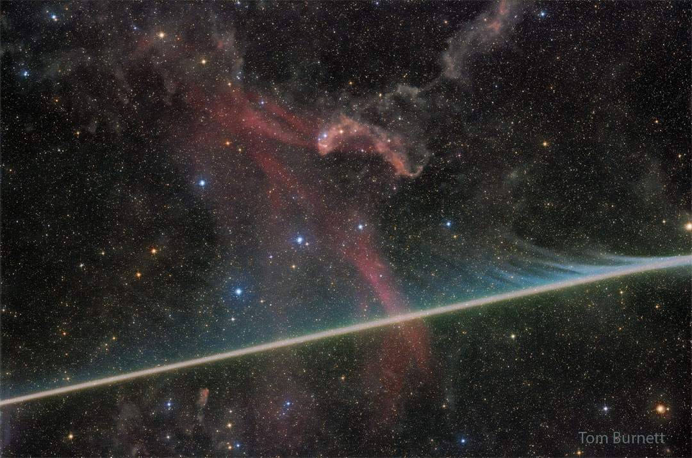

> What's happening to this meteor? This bright meteor streak appeared and disappeared quickly during a
> long exposure of the Great Lacerta Nebula, seen faintly in red toward the center of the image. The
> meteoroid, likely a small pebble, creates its glow partly by heating and exciting surrounding air in
> Earth's atmosphere, but itself vaporizes and leaves wind-blown gas and dust with colors that give
> clues to its composition.  The featured image was captured last month from Death Valley
> Observatories in Nevada, USA.  This month, though, is particularly good for seeing meteors.
> Presently there are three meteor showers ongoing, although they are currently competing for
> visibility with the glow of a bright gibbous Moon.  The most active of these showers, the Perseids,
> will be busiest in about 10 days -- after the Moon has dimmed considerably.  This year, the Perseids
> peak nearly coincides with not only a new Moon, but, from some locations, one that totally eclipses
> the Sun.    Sky Surprise: What picture did APOD feature on your birthday? (after 1995)

---

## 2026-08-02 — A Fire Rainbow over West Virginia
**Copyright:** Christa Harbig

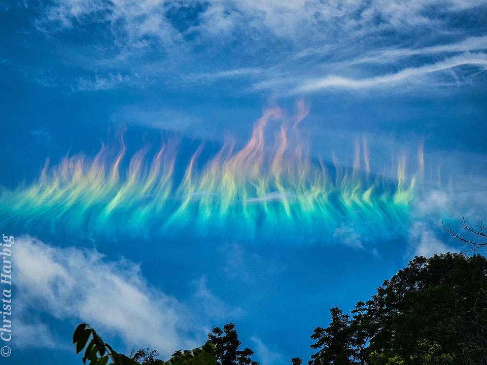

> What's happening to this cloud? Ice crystals in a distant cirrus cloud are acting like little
> floating prisms.  Known informally as a fire rainbow for its flame-like appearance, a circumhorizon
> arc appears parallel to the horizon. For a circumhorizontal arc to be visible, the Sun must be at
> least 58 degrees high in a sky where cirrus clouds present below --  in this case cirrus fibratus.
> The numerous, flat, hexagonal ice-crystals that compose the cirrus cloud must be aligned
> horizontally to properly refract sunlight in a collectively similar manner.  Therefore,
> circumhorizontal arcs are somewhat unusual to see.  The featured fire rainbow was photographed in
> 2021 near North Fork Mountain in West Virginia, USA.    Sky Surprise: What picture did APOD feature
> on your birthday? (after 1995)

---

## 2026-08-01 — Buck Moon and Belt of Venus
**Copyright:** Branko Nadj

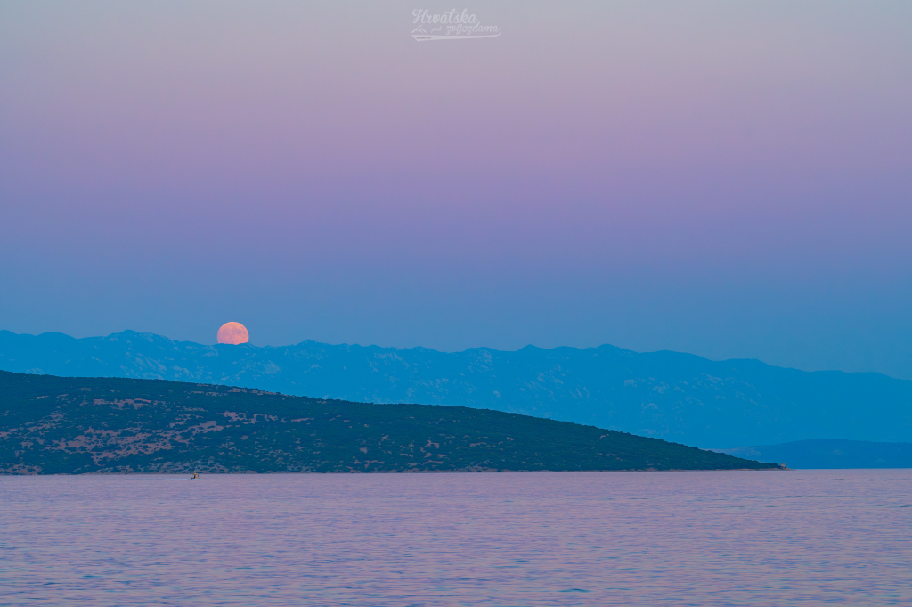

> The Buck Moon is a traditional name for the full moon of July. In this colorful Adriatic sea and
> skyscape captured on July 28 from Krk Island along the coast of Croatia, a full Buck Moon is just
> rising over distant mountains. Since a full moon rises as the Sun sets, Earth's shadow also rises in
> the twilight scene, a diffuse gray band extending above the mountainous southeastern horizon. Above
> Earth's shadow band is the pinkish antitwilight arch. That subtly tinted band of backscattered
> sunlight is more widely known as the Belt of Venus. But as it shares the eastern horizon with the
> atmospheric shadow of Earth and Belt of Venus, this full Buck Moon seems to set the stage for the
> New Moon to come. The New Moon of August 12 will cast its shadow on planet Earth in a much
> anticipated total solar eclipse.

---

