# Cosmos Log — Month 2026-09

## 2026-09-24 — The Ghosts of Five Supernovas
**Copyright:** Stephane Vetter, Yann Sainty  Text:  Cecilia Chirenti  (NASA GSFC,  UMCP,  CRESST II)

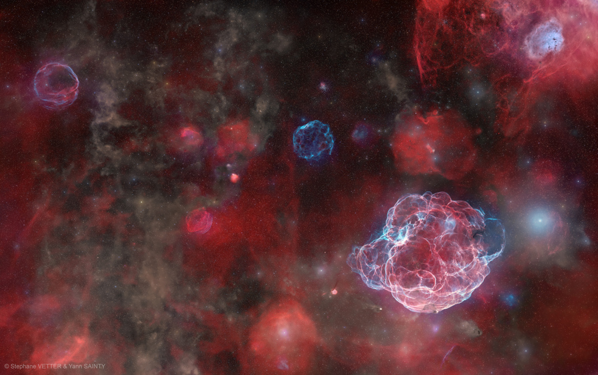

> The ghosts of five supernovas haunt this extraordinary image.   It was acquired at Oukaïmeden
> Observatory in Morocco with approximately 200 hours of observations and shows a large patch of the
> sky, equivalent to the area of one thousand full moons tiled together, in the constellation of
> Auriga (the charioteer).   From left to right, the five supernova remnants visible across the field
> are G181.1+9.5, G182.4+4.3, G179.0+2.6, G180.0−1.7 (Sh2-240, the Spaghetti Nebula), and G178.2−4.2.
> They are highlighted in the annotated image, together with open cluster M37 and the Tadpole Nebula.
> As each explosion expanded into space, it created a growing shell of shocked gas and delicate
> filamentary structures shown in red (hydrogen) and blue (oxygen), respectively.    These ancient
> stellar explosions happened independently; they are at various distances up to about several
> thousands of light-years away from Earth and have estimated ages up to tens of thousands of years
> old.   Early humans may have witnessed them as bright new stars, fading over weeks or months.
> APOD's email for image submissions has changed. Please see: APOD Submissions.    APOD's main NASA
> site is moving : From apod.nasa.gov to science.nasa.gov/apod

---

## 2026-09-23 — A New Lunar Crater: McGetchin
**Copyright:** Public Domain

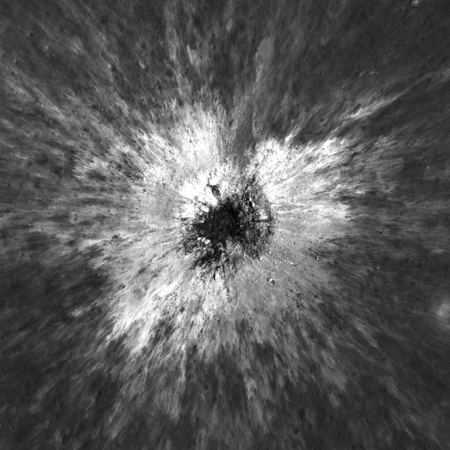

> A once-in-a-lifetime crater has appeared on the Moon! A comet or asteroid roughly the size of a
> humpback whale (approximately 10-20 meters, 30-60 feet) crashed into the Moon sometime between April
> and May of 2024. The Lunar Reconnaissance Orbiter (LRO), with its monthly monitoring of the Moon,
> captured today’s images of the lunar surface before and after the event. The resulting crater, named
> after Apollo-era lunar scientist McGetchin, is two soccer fields across. Craters of this size are
> only expected once every 132 years! Follow up thermal imaging revealed a large cold spot that
> surrounds the warm crater. Surface impacts will puff up the loose lunar sediment, or regolith,
> making it less dense and harder to retain heat. This event affected an area much larger than the
> visible crater, which will inform humanity’s understanding of surface impacts and the evolution of
> the Moon’s surface. It also reminds us all to be thankful for Earth's atmosphere.   APOD's email for
> image submissions has changed. Please see: APOD Submissions.  APOD's main NASA site is moving: From
> apod.nasa.gov to science.nasa.gov/apod

---

## 2026-09-22 — Chance Triple Alignment: Plane, Space Station, Sun
**Copyright:** Petr Horalek / Inst. Physics Opava

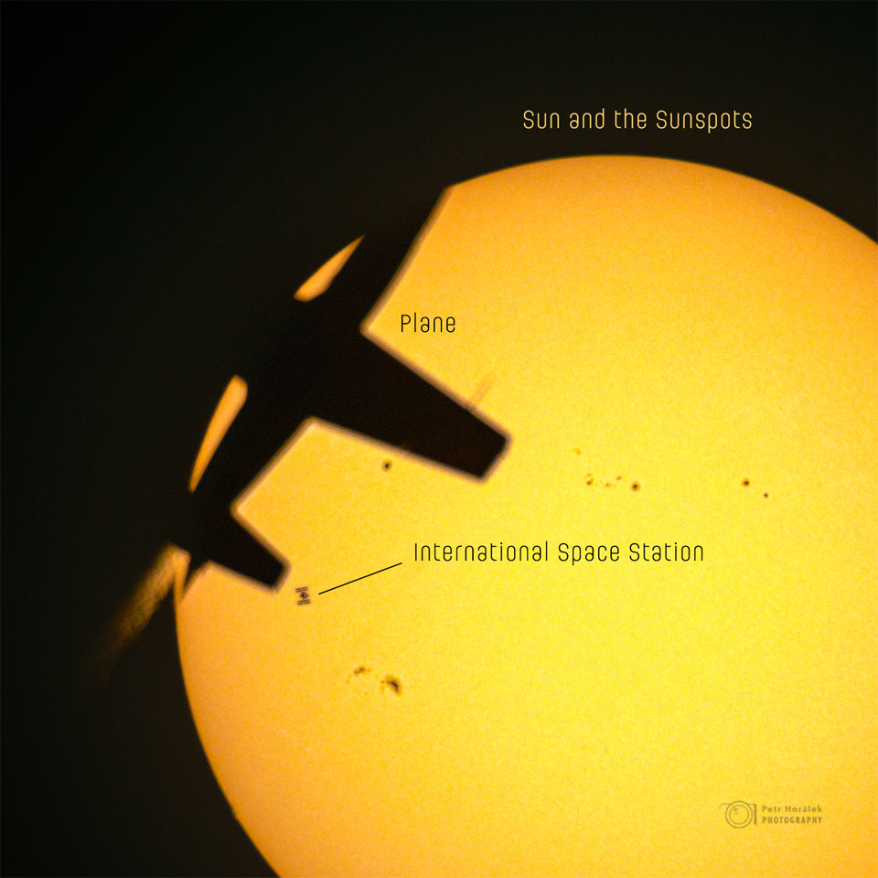

> This shot captured an unexpected silhouette. Which is it?  It isn't the sunspots, the small dark
> regions caused by concentrated magnetic fields visible around the Sun's bright disk. Sunspots
> typically last for weeks and were expected, since these spots were seen previously.  It isn’t the
> International Space Station (ISS), the small dark structure on the middle left.  This is because the
> featured picture was planned with sub-second timing to record the iconic structure passing before
> the Sun.  It is the airplane.  Just as this exposure was taking place in June, from Prasek in the
> Czech Republic, an airplane began its own miniature partial eclipse.  The result is this triply
> aligned image of our Sun.  The photographer estimates that the chance of any random Sun image
> containing silhouettes of both a space station and an airplane, from that location, is about 30
> million to one.    APOD's main NASA site is moving: From apod.nasa.gov to science.nasa.gov/apod

---

## 2026-09-21 — Cocoon Nebula Wide Field
**Copyright:** Piotr Czerski

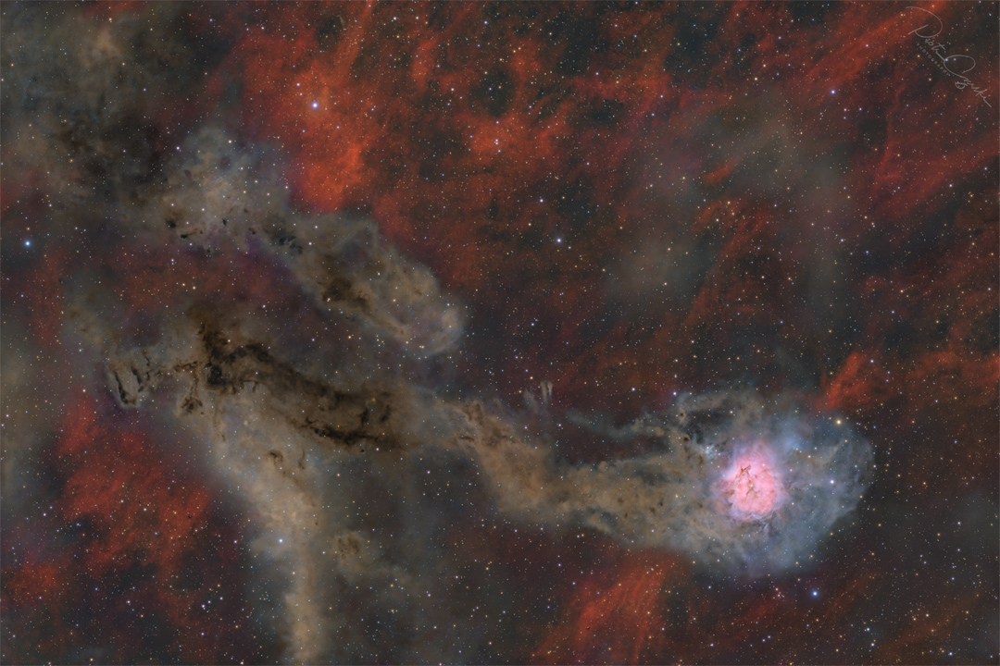

> When does a nebula look like a comet?  In this crowded starfield covering over two degrees within
> the high-flying constellation of the Swan (Cygnus), the eye is drawn to the Cocoon Nebula.  A
> compact star forming region, the cosmic Cocoon punctuates a nebula bright in emission and reflection
> on the lower right, with a long trail of interstellar dust clouds to the left, making the entire
> complex appear a bit like a comet.  Cataloged as IC 5146, the central bright head of the nebula
> spans about 10 light years, while the dark dusty tail spans nearly 100 light years.  Both are
> located about 2,500 light years away.  A bright star near the colorful nebula's center likely
> supplies power and helps clear out a cavity.  The long dusty filaments of the tail, although dark in
> this visible light image, hide stars in the process of formation. The featured image was captured in
> July from Death Valley, California, USA.   APOD's main NASA site is moving: From apod.nasa.gov to
> science.nasa.gov/apod

---

## 2026-09-20 — Analemma over the Callanish Stones
**Copyright:** Giuseppe Petricca

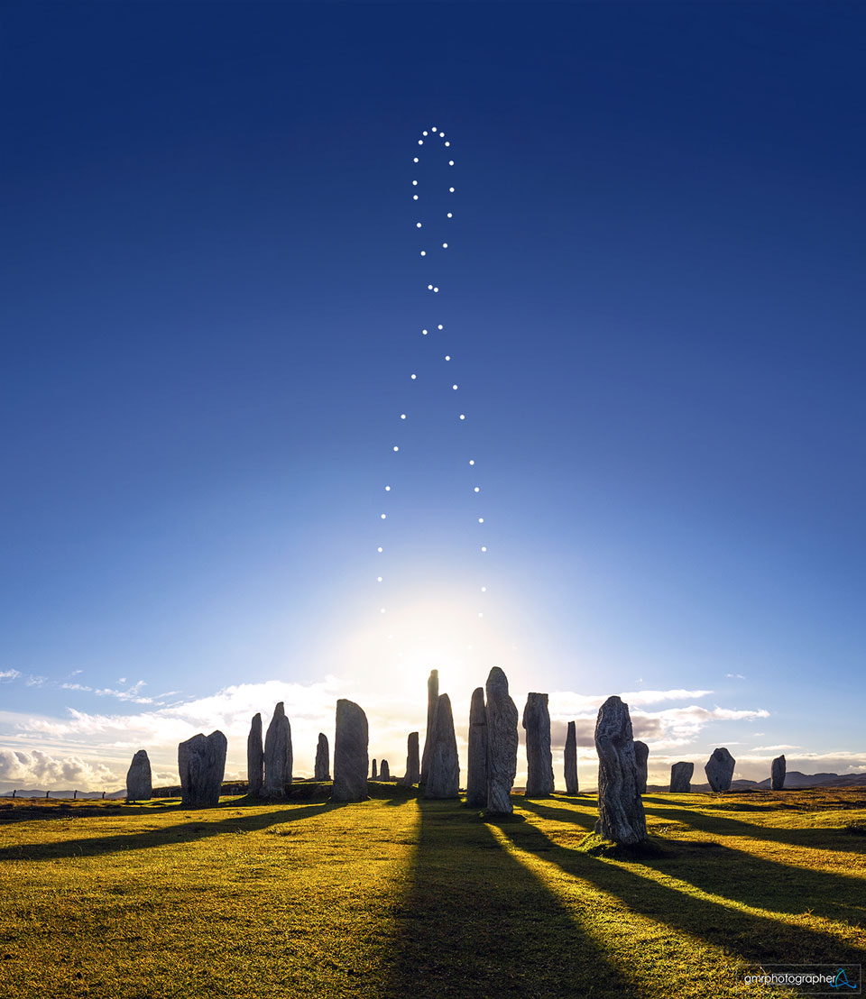

> If you went outside at the same time every day and took a picture that included the Sun, how would
> the Sun's position change?  A visual answer to that question is an analemma, a composite image taken
> from the same spot at the same time over the course of a year.  The featured analemma was composed
> from images taken every few days at noon near the village of Callanish in the Outer Hebrides in
> Scotland, UK.  In the foreground are the Callanish Stones, a stone circle built around 2700 BC
> during humanity's Bronze Age.  It is not known if the placement of the Callanish Stones has or had
> astronomical significance.  The ultimate causes for the figure-8 shape of this and all analemmas are
> the tilt of the Earth axis and the ellipticity of the Earth's orbit around the Sun.  At the
> solstices, the Sun will appear at the top or bottom of an analemma. The featured image was taken
> near the December solstice and so the Sun appears near the bottom.  Equinoxes, however, correspond
> to analemma middle points -- not the intersection point. In two days there will be an equinox
> ("equal night"), when day and night are equal over all of planet Earth. Many cultures celebrate a
> change of season at an equinox.   APOD's main NASA site is moving: From apod.nasa.gov to
> science.nasa.gov/apod

---

## 2026-09-19 — A Zodiacal Night
**Copyright:** Neelam and Ajay Talwar

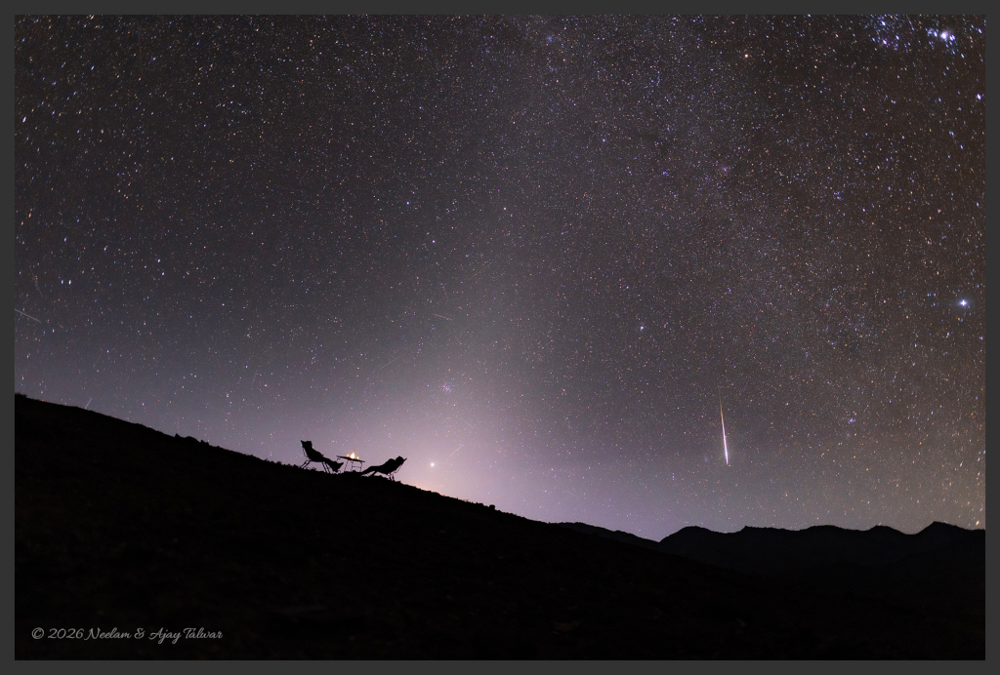

> Also known as the false dawn, a luminous band of zodiacal light is captured in this dark night
> skyscape. The serene view was recorded just before the beginning of astronomical twilight during
> September's star party at the remote Hanle Dark Sky Reserve, Ladakh, India, planet Earth. At about
> 4,500 meters altitude, the dark sky reserve presents a haven for hardy stargazing and
> astrophotography enthusiasts. While meteors streak through the night, bright planet Jupiter appears
> immersed in the faint zodiacal glow near the eastern horizon. Follow the zodiacal band toward the
> zenith to find open star cluster M44 and a yellowish tinged planet Mars near the center of the
> frame. In fact, serendipitous detections of interplanetary dust by NASA's Juno spacecraft suggest
> Mars itself is the source of dust that back scatters sunlight and creates zodiacal light in planet
> Earth's night.  APOD's main NASA site is moving: From apod.nasa.gov to science.nasa.gov/apod

---

## 2026-09-18 — Messier 33: The Triangulum Galaxy
**Copyright:** George Chatzifrantzis

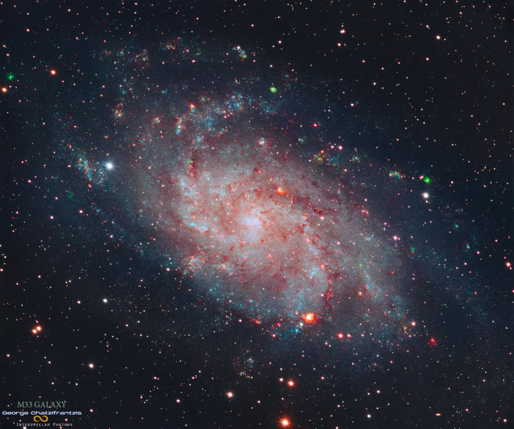

> The small, northern constellation Triangulum harbors this magnificent face-on spiral galaxy, Messier
> 33. Its popular names include the Pinwheel Galaxy or just the Triangulum Galaxy. M33 is over 50,000
> light-years in diameter, third largest in the Local Group of galaxies after the Andromeda Galaxy
> (M31), and our own Milky Way. About 3 million light-years from the Milky Way, M33 is itself thought
> to be a satellite of the Andromeda Galaxy and astronomers in these two galaxies would likely have
> spectacular views of each other's grand spiral star systems. As for the view from the Milky Way,
> this sharp telescopic image shows off M33's blue star clusters and pinkish star forming regions
> along the galaxy's loosely wound spiral arms. In fact, the cavernous NGC 604 is the brightest star
> forming region, seen here at about the 5 o'clock position from the galaxy center. Like M31, M33's
> population of well-measured variable stars have helped make this nearby spiral a cosmic yardstick
> for establishing the distance scale of the Universe.  APOD's main NASA site is moving: From
> apod.nasa.gov to science.nasa.gov/apod

---

## 2026-09-17 — A Treasure Chest in the Carina Nebula
**Copyright:** ESA/Webb, NASA & CSA, M. Reiter; Acknowledgement: M. H. Özsaraç  Text:  Cecilia Chirenti  (NASA GSFC,  UMCP,  CRESST II)

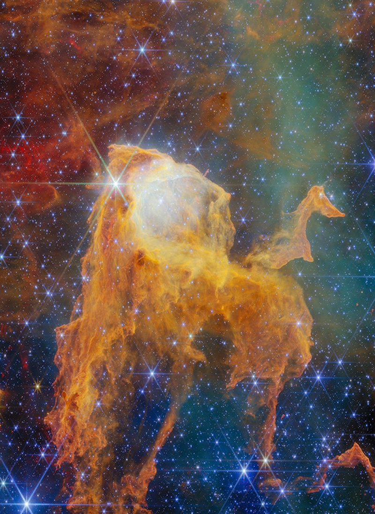

> This treasure chest is full of stars.   The featured image was obtained with NASA's James Webb Space
> Telescope and shows a dust pilar in the Carina Nebula inside our Galaxy, roughly 7500 light-years
> away.   It is formed by interstellar gas and dust, and shaped by powerful stellar winds and
> radiation form neighboring stars like the nearby Eta Carinae stellar system which is more luminous
> than 5 million suns.   The star formation inside the pillar is excavating its head, creating the
> open lid of the chest.     Astronomers estimate that there are about 70 stars in a compact cluster
> inside the pillar.   This cluster is now thought to be only around 1.3 million years old.   Its
> bounty of young stars includes a massive star approximately 19 times as massive as the Sun.   More
> massive stars are rarer, shine brighter and evolve faster than less massive stars.   They are the
> shiniest jewels in the treasure chest.     APOD's main NASA site is moving : From apod.nasa.gov to
> science.nasa.gov/apod

---

## 2026-09-16 — Webb's View of M64
**Copyright:** Public Domain

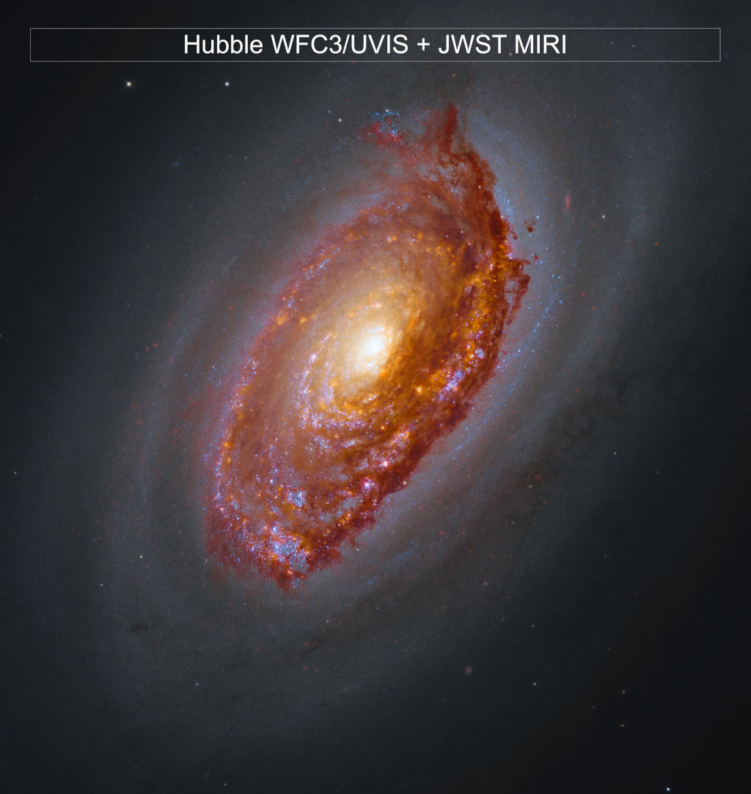

> Sometimes where Hubble finds darkness, Webb sees light. An example is today’s composite images of
> Messier 64 (M64), a nearby spiral galaxy of many names. The dark band of dust partially blocking its
> bright core earned it the moniker “the Black Eye Galaxy.” Webb’s Mid-InfraRed Instrument (MIRI) sees
> that dust, shown in red, as it absorbs and re-emits light from surrounding newborn stars. These
> young stars are embedded in pink star-forming regions in the secondary Hubble-only image. M64’s
> inner and outer gas regions counter-rotate, creating regions of increased star formation where the
> two gas “currents” meet and compress. A merger between M64 and a smaller galaxy was likely the cause
> of the opposing motion of the outer gas. Spiral galaxies were once thought to have peaceful
> histories. M64 was key evidence that spiral galaxies, including the Milky Way, can and do experience
> mergers. Webb’s view of M64 will tell astronomers about the structure, motion, and composition of
> the galaxy’s dust and add context to the galaxy’s merger history and evolution.   APOD's main NASA
> site is moving: From apod.nasa.gov to science.nasa.gov/apod

---

## 2026-09-15 — A Daytime Eclipse: Moon Occults Venus
**Copyright:** Arnaud Mariat

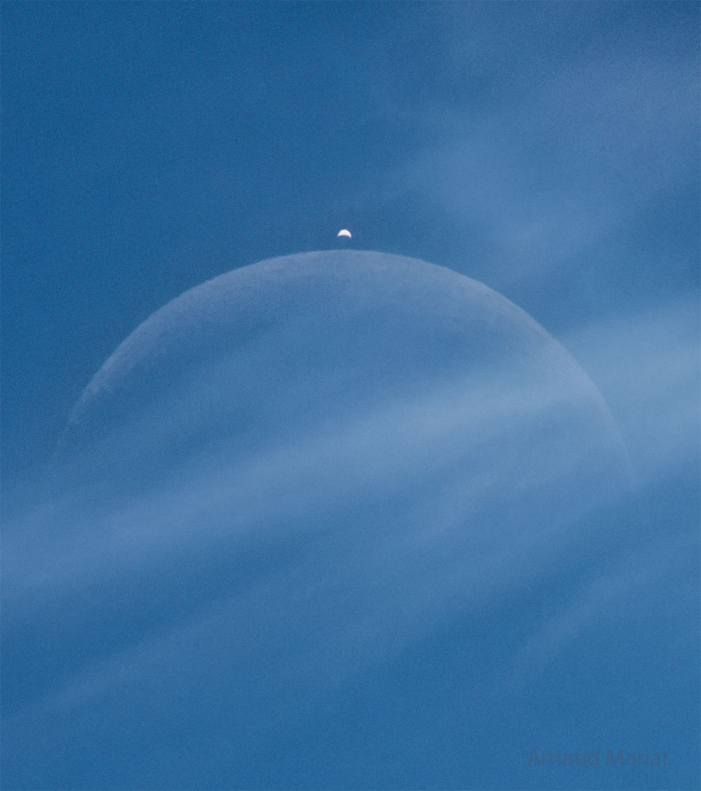

> There was something behind the clouds.  Upon close inspection, it was the Moon, which was hard to
> see yesterday around noon above the small village of Cessy, France.  But soon, it was not only the
> Moon. As expected, a bright dot suddenly appeared from behind the Moon -- the planet Venus far in
> the distance.  Captured in the single featured exposure, both appeared to show a crescent phase.
> The Moon's crescent was quite slight -- with only about 10 percent of its face illuminated by the
> Sun. In contrast, Venus's crescent was more full -- showing about 25 percent illumination. Venus
> appeared brighter because it is nearer the Sun and because its clouds are more reflective than the
> dark lunar surface. An occultation of Venus by the Moon is visible to only about 10 percent of the
> Earth, but in yesterday's event even most of that was experiencing daytime.   APOD's main NASA site
> is moving: From apod.nasa.gov to science.nasa.gov/apod

---

## 2026-09-14 — Where Your Elements Came From
**Copyright:** Public Domain

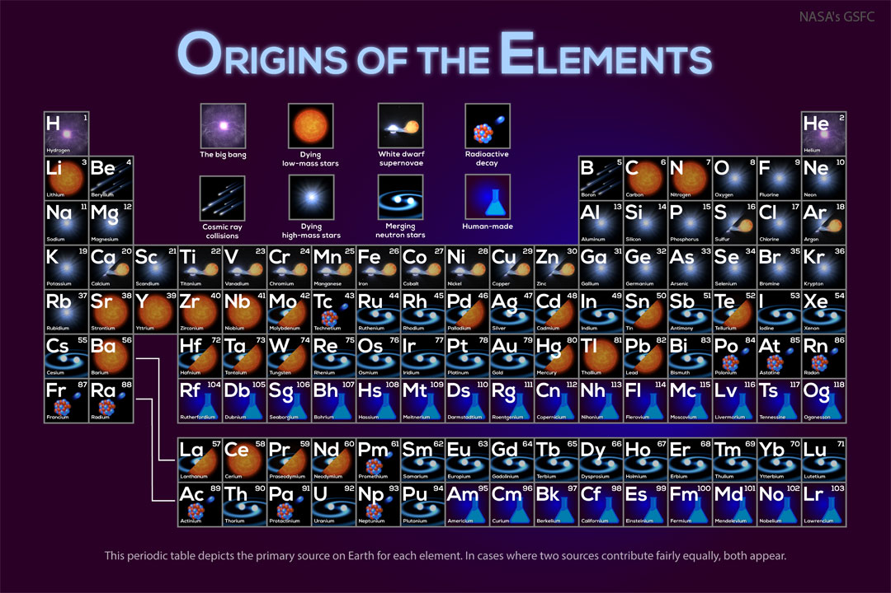

> The hydrogen in your body and present in every molecule of water came from the Big Bang.  There are
> no other appreciable sources of hydrogen in the universe.  The carbon in your body was made by
> nuclear fusion in the interior of stars, as was the oxygen.  Much of the iron in your body was made
> during supernovas of stars that occurred long ago and far away.  The gold in your jewelry was likely
> made from neutron stars during collisions that may have been visible as short-duration gamma-ray
> bursts or gravitational wave events. Elements like phosphorus and copper are present in our bodies
> in only small amounts but are essential to the functioning of all known life.  The featured periodic
> table is color coded to indicate humanity's best guess as to the nuclear origin of all known
> elements.  The sites of nuclear creation of some elements, such as copper, are not really well known
> and are continuing topics of observational and computational research.   APOD's main NASA site is
> moving: From apod.nasa.gov to science.nasa.gov/apod

---

## 2026-09-13 — Comet NEOWISE Rising over the Adriatic Sea
**Copyright:** Paolo Girotti

> This sight was worth getting out of bed early.  Just over four years ago, Comet C/2020 F3 (NEOWISE)
> rose before dawn to the delight of northern sky enthusiasts awake that early. Up before sunrise on
> July 8th, the featured photographer was able to capture in dramatic fashion one of the few comets
> visible to the unaided eye this century, an inner-Solar System intruder that has become known as the
> Great Comet of 2020.  The resulting video detailed Comet NEOWISE from Italy rising over the Adriatic
> Sea. The featured time-lapse video combines over 240 images taken over 30 minutes.  The comet was
> seen rising through a foreground of bright and undulating noctilucent clouds, and before a
> background of distant stars.  Comet NEOWISE remained unexpectedly bright for over a month, with its
> ion and dust tails found to emanate from a nucleus spanning about five kilometers across.   APOD's
> main NASA site is moving: From apod.nasa.gov to science.nasa.gov/apod

---

## 2026-09-12 — Apollo 11: Catching Some Sun
**Copyright:** Public Domain

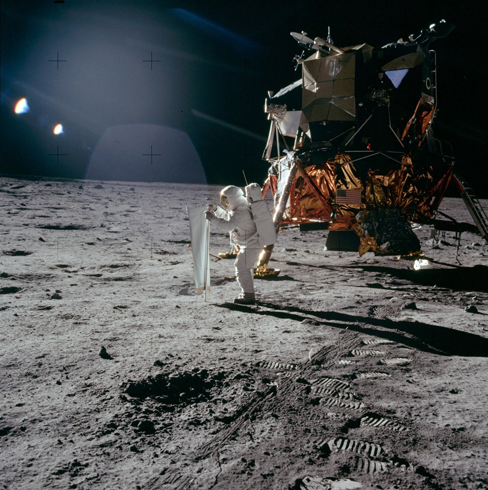

> Bright sunlight glints as long dark shadows mark this image of the surface of the Moon. It was taken
> on July 20, 1969, by Apollo 11 astronaut Neil Armstrong, the first to walk on the lunar surface.
> Pictured is the mission's lunar module, the Eagle, and spacesuited lunar module pilot Buzz Aldrin.
> Aldrin is unfurling a long sheet of foil also known as the Solar Wind Composition Experiment.
> Exposed facing the Sun, the foil trapped particles streaming outward in the solar wind, catching a
> sample of material from the Sun itself. Along with 22 kilograms of moon rocks and lunar soil
> samples, the solar wind collector was returned for analysis in earthbound laboratories.  APOD's main
> NASA site is moving: From apod.nasa.gov to science.nasa.gov/apod

---

## 2026-09-11 — M83: The Southern Pinwheel
**Copyright:** Aldo Zanetti

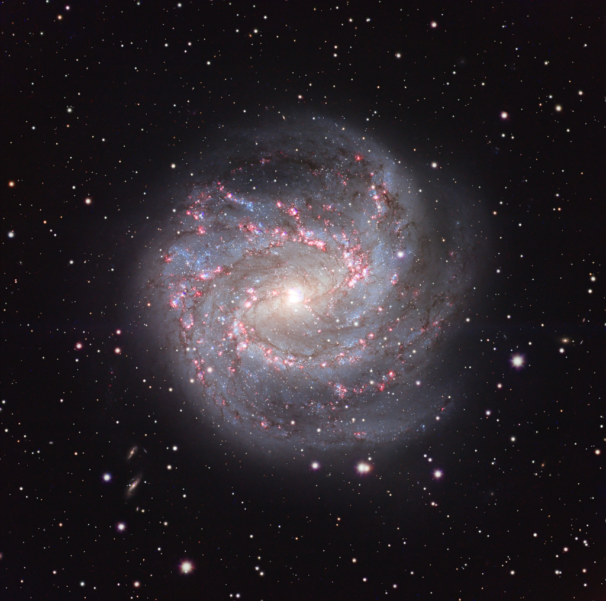

> Beautiful and bright spiral galaxy M83 lies some twelve million light-years away, near the
> southeastern tip of the very long constellation Hydra. Prominent spiral arms traced by dark dust
> lanes and blue star clusters lend this galaxy its popular name, the Southern Pinwheel.  Still,
> reddish star forming regions that dot this cosmic pinwheel's spiral arms have suggested another
> nickname, the Thousand-Ruby Galaxy. A mere 40,000 light-years across, smaller than the Milky Way,
> M83 is a member of a group of galaxies that includes active galaxy Centaurus A. In fact, the core of
> M83 itself is bright at x-ray energies, showing a high concentration of neutron stars and black
> holes left from an intense burst of star formation. This sharp, groundbased telescopic view also
> features foreground Milky Way stars and distant background galaxies.  APOD's main NASA site is
> moving: From apod.nasa.gov to science.nasa.gov/apod

---

## 2026-09-10 — LDN 1295: The Giraffe Nebula
**Copyright:** Alessandro Merga  Text:  Cecilia Chirenti  (NASA GSFC,  UMCP,  CRESST II)

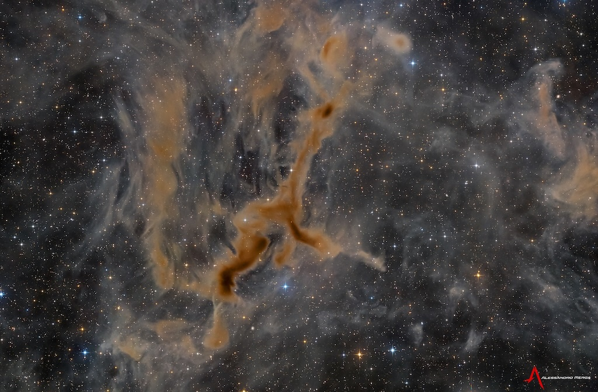

> What does this image look like to you?   Many see a giraffe facing right, with neck stretched high
> and long legs mid-stride (but some may see a squirrel instead).   The featured image shows LDN 1295,
> also called the Giraffe Nebula, in the constellation of the mythical queen of Aethiopia
> (Cassiopeia).   It is an object in the Lynds Catalogue of Dark Nebulas, compiled in 1962 by American
> astronomer Beverly Lynds, a pioneer for women in astronomy and astrophysics.   Dark nebulas are
> interstellar clouds of dust and gas that block the visible light of the stars behind them.   These
> nebulas are often faint and challenging targets for astrophotographers.   Why do we see animal
> shapes and faces in nebulas, clouds, and pretty much everywhere?   It is due to pareidolia, our
> tendency to look for familiar patterns.   Pareidolia may provide animals with an evolutionary
> advantage, for example in identifying (and avoiding) predators.     APOD's main NASA site is moving
> : From apod.nasa.gov to science.nasa.gov/apod

---

## 2026-09-09 — Witness XZ Andromedae Wink
**Copyright:** Public Domain

> Is this star winking at us? The central object in today’s animation is not one but two stars. XZ
> Andromedae, indicated by the bold lines, is an Algol-type eclipsing binary with a nearly edge-on
> orbit from Earth’s perspective. The bottom light curve shows the amount of light from the system dim
> and brighten as the cooler star eclipses its hotter, brighter companion. Analysis of several XZ
> Andromedae light curves indicates there may be two other stars orbiting the system. This particular
> light curve was created with Citizen Astronomy, an open-source software for differential photometry.
> The software takes the difference in brightness between a target and comparison star and traces its
> behavior over time. This technique reduces most variations from the instrument and Earth’s
> atmosphere. In addition to eclipsing binaries, this analysis is useful for studying transiting
> exoplanets, accreting black holes, supernovae, and many more time-varying astronomical phenomena.
> Astrophotographers: try it out on your own data!

---

## 2026-09-08 — Hubble: Decagon Around Saturn's South Pole
**Copyright:** Public Domain

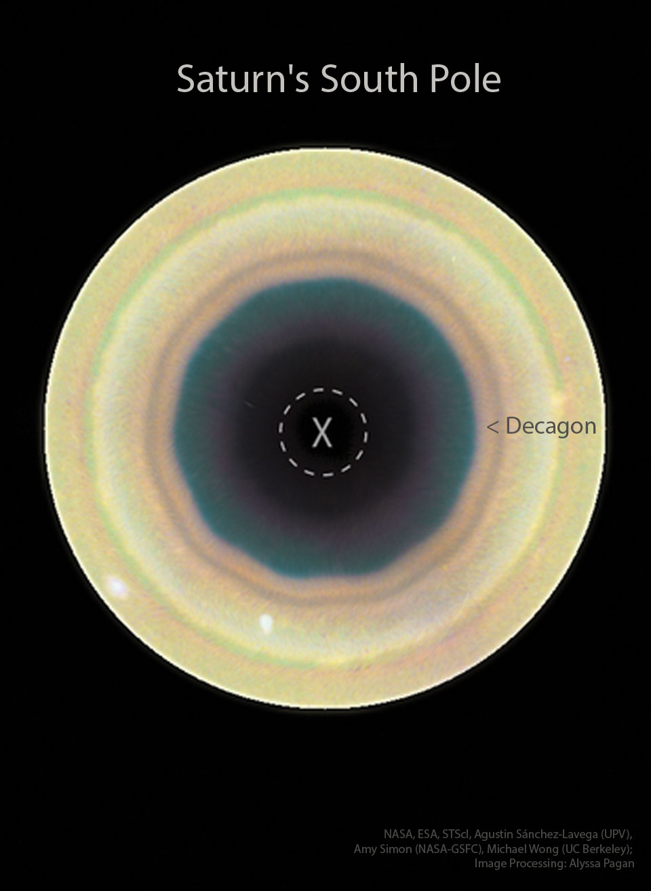

> Why are Saturn’s poles geometric? Saturn’s North Pole has been known to be surrounded by a hexagonal
> (6 sides) cloud since discovery in 1987 in data taken by NASA’s Voyager spacecrafts, which quickly
> flew past the ringed world in the early 1980s.  Now, recent observations of Saturn by the Hubble
> Space Telescope reveal a slightly different geometric cloud pattern around the South Pole: a decagon
> (10 sides).  The geometric boundaries are possibly caused by waves when the fast-moving gas away
> from the poles interacts with slower-moving gas closer to the poles.  In the featured image
> composite by the Hubble taken last year, the South Pole of Saturn is marked by an X and surrounded
> by bands of circulating clouds.  The decagon appears most prominent in the dark inner regions.  The
> northern hexagon has proven stable for over 40 years, while the stability of the southern decagon
> will surely remain a topic of research.   APOD's main NASA site is moving: From apod.nasa.gov to
> science.nasa.gov/apod

---

## 2026-09-07 — The Pelican Nebula in Gas, Dust, and Stars
**Copyright:** Mark Killion

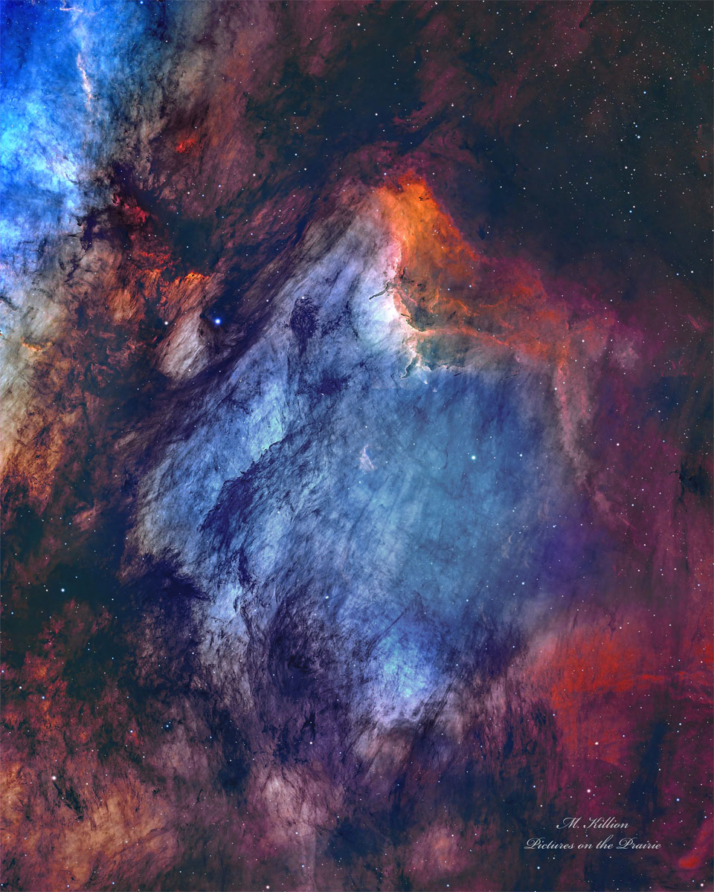

> The Pelican Nebula is slowly being transformed.  IC 5070 (an official designation) is divided from
> the larger North America Nebula by a molecular cloud filled with dark dust.  The deep featured
> picture from Utah, USA incorporates 25 hours of exposure and brings out great details of this
> filamentary dust. The Pelican Nebula receives much study because it is a particularly active mix of
> star formation and evolving gas clouds.  The light from young energetic stars is slowly transforming
> the cold gas to hot gas, with the advancing boundary between the two, known as an ionization front,
> visible in bright orange on the upper right. Particularly dense tentacles of cold gas remain.
> Millions of years from now, the Pelican Nebula, bounded by dark nebula LDN 935, might no longer be
> known as the Pelican, as the balance and placement of stars and gas will surely leave something that
> appears completely different.   APOD's main NASA site is moving: From apod.nasa.gov to
> science.nasa.gov/apod

---

## 2026-09-06 — Pluto in Enhanced Color
**Copyright:** Public Domain

> Pluto is more colorful than we can see. Color data and high-resolution images of our Solar System's
> most famous dwarf planet, taken by the robotic New Horizons spacecraft during its flyby in 2015
> July, have been digitally combined to give an enhanced-color view of this ancient world sporting an
> unexpectedly young surface. The featured enhanced color image is not only esthetically pretty but
> scientifically useful, making surface regions of differing chemical composition visually distinct.
> For example, the light-colored heart-shaped Tombaugh Regio on the lower right is clearly shown here
> to be divisible into two regions that are geologically different, with the leftmost lobe, Sputnik
> Planitia, also appearing unusually smooth. After Pluto, New Horizons continued on, shooting  past
> asteroid Arrokoth in 2019 with enough speed to escape our Solar System completely.

---

## 2026-09-05 — Chasing the Moon's Shadow
**Copyright:** Public Domain

> Chasing the shadow of a New Moon, NASA’s WB-57F high altitude research aircraft took to the skies
> off the coast of Iceland on August 12 to observe a total solar eclipse. At 50,000 feet the aircraft
> was piloted along the precisely determined path of totality to maximize its time in the Moon’s
> shadow. A suite of high-resolution cameras on board was able to record eclipse data from above the
> clouds, dust, and atmospheric water vapor that interfere with observations made closer to the
> ground. This view from the cockpit, taken from an inflight video, captures the solar corona emerging
> at the beginning of totality. The sky appears dark in the shadow of the Moon. Venus is shining left
> of center in the video frame, while Jupiter and Mercury are just visible to the right of the
> eclipsed Sun. But the sky is bright along the distant horizon below, beyond the reach of the Moon's
> shadow.  APOD's main NASA site is moving: From apod.nasa.gov to science.nasa.gov/apod

---

## 2026-09-04 — Nā ʻUhane Māhoe Huki Pū i ke Ola
**Copyright:** Public Domain

> Nā ʻUhane Māhoe Huki Pū i ke Ola, is the Hawaiian name given to this image of a pair of spiral
> galaxies locked in a mutual gravitational embrace. Some 200 million light-years distant toward the
> high flying constellation Pegasus their spectacular, galactic scale merger is captured in sharp
> detail in the image from the 8.1 meter Gemini North telescope on Maunakea, Hawai‘i. The galaxy pair,
> known as NGC 7253 and Arp 278, was chosen as a target, researched, and given a Hawaiian name by high
> school students in the joint Gemini Observatory and University of Hawaiʻi Project Hōkūlani
> internship program.  The name translates to "The Twin Spirits Pulling Together Creating Life".
> That's both culturally and astronomically appropriate for galaxy collisions that trigger a cosmic
> maelstrom of star formation from galactic reservoirs of elemental building blocks of life. These
> merging galaxies are found within a region of Pegasus identified as the Hawaiian navigational
> constellation Ka Lupe o Kawelo.  APOD's main NASA site is moving: From apod.nasa.gov to
> science.nasa.gov/apod

---

## 2026-09-03 — The Eclipse and the Stork
**Copyright:** Włodzimierz Bubak  Text:  Cecilia Chirenti  (NASA GSFC,  UMCP,  CRESST II)

> How do animals react to a total solar eclipse?   The featured image shows a stork roosting on her
> nest in Poland at a partial phase of the recent total solar eclipse.   If you are lucky enough to
> experience a total eclipse somewhere quiet and close to nature, you may be able to notice unusual
> daytime animal behaviors.     During totality, you may hear nighttime sounds like crickets and frogs
> and see fireflies.   In the dark, most birds are quiet.   Thinking that it is time to go to bed,
> ducks and other waterfowl prepare to sleep on one leg, with their heads turned around and their
> beaks tucked into their back feathers (they don't really sleep with their heads tucked under one
> wing).   When sunlight returns at the end of totality, songbirds greet the new "morning" with their
> dawn songs.   The crickets and frogs go quiet again.   Animals and people resume their lifes, only
> briefly disturbed by the chance alignment of our Sun and Moon.     APOD's main NASA site is moving :
> From apod.nasa.gov to science.nasa.gov/apod

---

## 2026-09-02 — Solar Eclipses and Culture
**Copyright:** Javier Castro  Text: Keighley Rockcliffe   (NASA GSFC,  UMBC CSST,  CRESST II)

> Pretend you have never heard of a solar eclipse. The Sun’s behavior has been predictable your whole
> life. One day, you witness the sky transform as it does in today’s spliced image spanning two hours
> of the August 12, 2026 solar eclipse. The Sun disappears, leaving behind a bright, empty ring. What
> would you think had happened? Humans have interpreted eclipses in countless ways throughout history,
> embedding beliefs about connection, rebirth, or danger into culture. “Eclipse” comes from the Greek
> word “ékleipsis” meaning “abandonment”. In ancient Greece, the solar eclipse marked the anger of the
> gods and the Sun abandoning humanity. To the Diné people, this celestial alignment is a time of
> renewal. Out of respect and to avoid the danger of sunlight, the Diné stay inside until the Sun and
> Moon separate. The Batammariba people of Benin and Togo believe that the Sun and Moon fight during
> an eclipse, so the community encourages peace among themselves. Eclipses are an example of the
> longstanding connection between astronomy and society.   Gallery: Solar Eclipse of 2026 August 12

---

## 2026-09-01 — A Plane Lunar Eclipse
**Copyright:** Public Domain

> Did you need to be on the right side of this airplane to see this eclipse? No.  Lunar eclipses are
> routinely seen from the half of the Earth facing the Moon when the eclipse occurs, making them some
> of the most commonly witnessed astronomical events. You don't even need any special equipment to see
> one -- just your unaided eyes.  Lunar eclipses are also some of the most photographed astronomical
> events because, unlike with a solar eclipse, your eyes and camera do not have to look toward the
> bright Sun. However, considering the featured image taken last week from Portugal, if you were on
> the left side of that airplane during takeoff, you might have trouble seeing it -- at first. But
> even then, after takeoff, since lunar eclipses typically last for hours, you might soon be able to
> safely cross the aisle(s) to see it.   Gallery: Lunar Eclipse of 2026 August APOD's main NASA site
> is moving: From apod.nasa.gov to science.nasa.gov/apod

---

