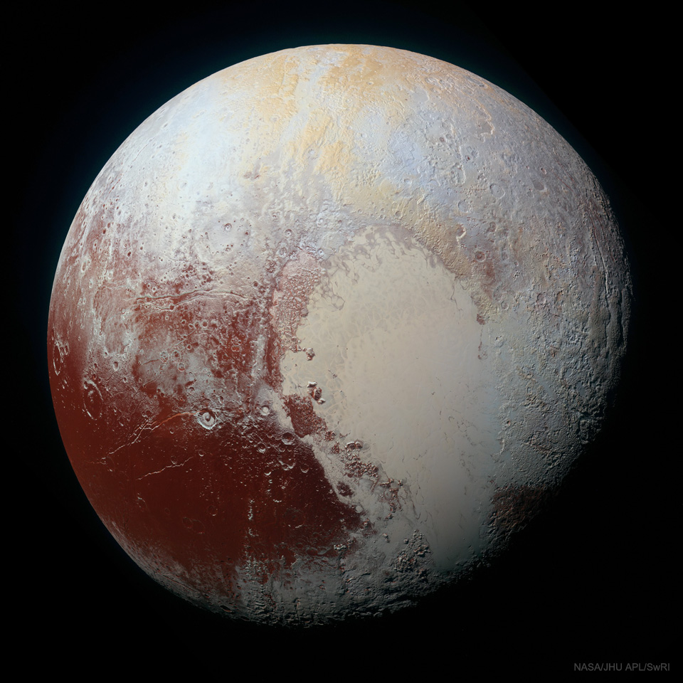
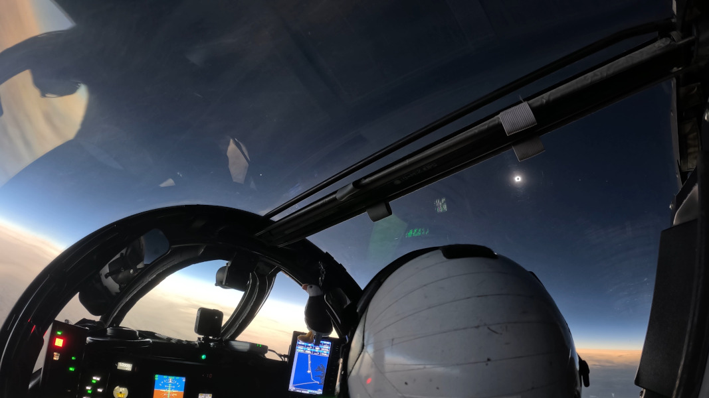
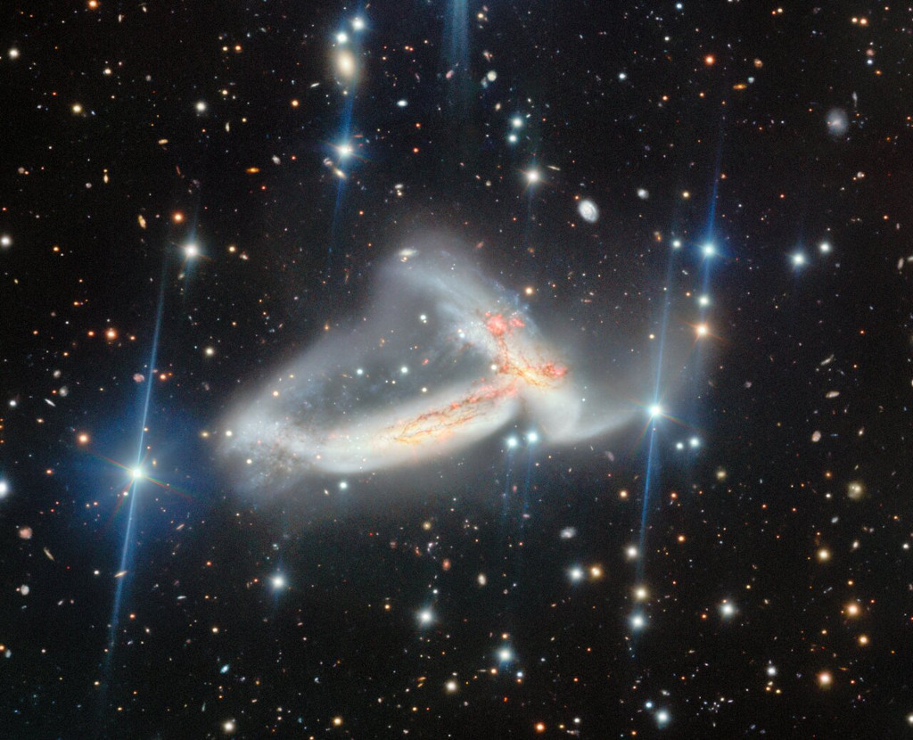
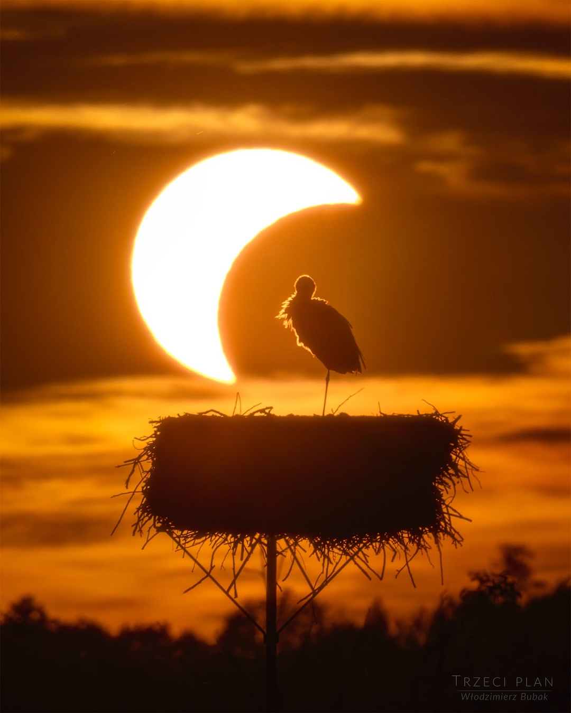
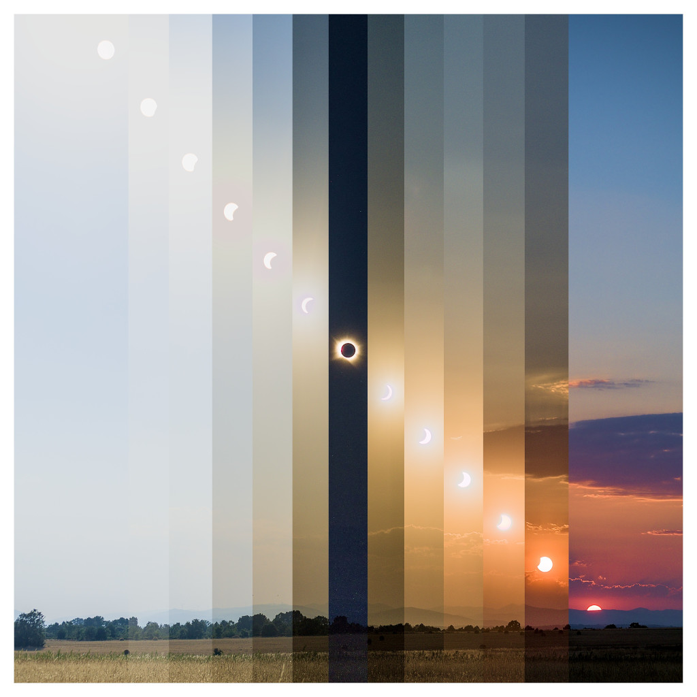
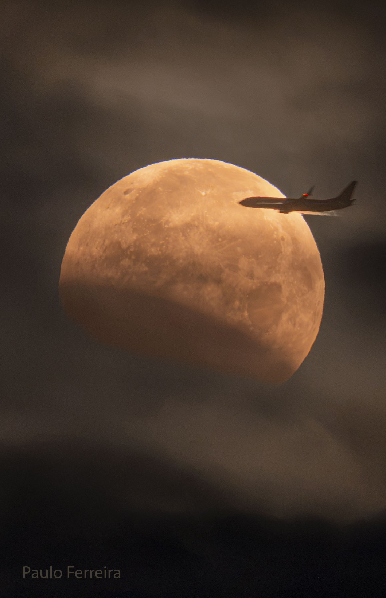

# Cosmos Log — Month 2026-09

## 2026-09-06 — Pluto in Enhanced Color
**Copyright:** Public Domain

> Pluto is more colorful than we can see. Color data and high-resolution images of our Solar System's
> most famous dwarf planet, taken by the robotic New Horizons spacecraft during its flyby in 2015
> July, have been digitally combined to give an enhanced-color view of this ancient world sporting an
> unexpectedly young surface. The featured enhanced color image is not only esthetically pretty but
> scientifically useful, making surface regions of differing chemical composition visually distinct.
> For example, the light-colored heart-shaped Tombaugh Regio on the lower right is clearly shown here
> to be divisible into two regions that are geologically different, with the leftmost lobe, Sputnik
> Planitia, also appearing unusually smooth. After Pluto, New Horizons continued on, shooting  past
> asteroid Arrokoth in 2019 with enough speed to escape our Solar System completely.

---

## 2026-09-05 — Chasing the Moon's Shadow
**Copyright:** Public Domain

> Chasing the shadow of a New Moon, NASA’s WB-57F high altitude research aircraft took to the skies
> off the coast of Iceland on August 12 to observe a total solar eclipse. At 50,000 feet the aircraft
> was piloted along the precisely determined path of totality to maximize its time in the Moon’s
> shadow. A suite of high-resolution cameras on board was able to record eclipse data from above the
> clouds, dust, and atmospheric water vapor that interfere with observations made closer to the
> ground. This view from the cockpit, taken from an inflight video, captures the solar corona emerging
> at the beginning of totality. The sky appears dark in the shadow of the Moon. Venus is shining left
> of center in the video frame, while Jupiter and Mercury are just visible to the right of the
> eclipsed Sun. But the sky is bright along the distant horizon below, beyond the reach of the Moon's
> shadow.  APOD's main NASA site is moving: From apod.nasa.gov to science.nasa.gov/apod

---

## 2026-09-04 — Nā ʻUhane Māhoe Huki Pū i ke Ola
**Copyright:** Public Domain

> Nā ʻUhane Māhoe Huki Pū i ke Ola, is the Hawaiian name given to this image of a pair of spiral
> galaxies locked in a mutual gravitational embrace. Some 200 million light-years distant toward the
> high flying constellation Pegasus their spectacular, galactic scale merger is captured in sharp
> detail in the image from the 8.1 meter Gemini North telescope on Maunakea, Hawai‘i. The galaxy pair,
> known as NGC 7253 and Arp 278, was chosen as a target, researched, and given a Hawaiian name by high
> school students in the joint Gemini Observatory and University of Hawaiʻi Project Hōkūlani
> internship program.  The name translates to "The Twin Spirits Pulling Together Creating Life".
> That's both culturally and astronomically appropriate for galaxy collisions that trigger a cosmic
> maelstrom of star formation from galactic reservoirs of elemental building blocks of life. These
> merging galaxies are found within a region of Pegasus identified as the Hawaiian navigational
> constellation Ka Lupe o Kawelo.  APOD's main NASA site is moving: From apod.nasa.gov to
> science.nasa.gov/apod

---

## 2026-09-03 — The Eclipse and the Stork
**Copyright:** Włodzimierz Bubak  Text:  Cecilia Chirenti  (NASA GSFC,  UMCP,  CRESST II)

> How do animals react to a total solar eclipse?   The featured image shows a stork roosting on her
> nest in Poland at a partial phase of the recent total solar eclipse.   If you are lucky enough to
> experience a total eclipse somewhere quiet and close to nature, you may be able to notice unusual
> daytime animal behaviors.     During totality, you may hear nighttime sounds like crickets and frogs
> and see fireflies.   In the dark, most birds are quiet.   Thinking that it is time to go to bed,
> ducks and other waterfowl prepare to sleep on one leg, with their heads turned around and their
> beaks tucked into their back feathers (they don't really sleep with their heads tucked under one
> wing).   When sunlight returns at the end of totality, songbirds greet the new "morning" with their
> dawn songs.   The crickets and frogs go quiet again.   Animals and people resume their lifes, only
> briefly disturbed by the chance alignment of our Sun and Moon.     APOD's main NASA site is moving :
> From apod.nasa.gov to science.nasa.gov/apod

---

## 2026-09-02 — Solar Eclipses and Culture
**Copyright:** Javier Castro  Text: Keighley Rockcliffe   (NASA GSFC,  UMBC CSST,  CRESST II)

> Pretend you have never heard of a solar eclipse. The Sun’s behavior has been predictable your whole
> life. One day, you witness the sky transform as it does in today’s spliced image spanning two hours
> of the August 12, 2026 solar eclipse. The Sun disappears, leaving behind a bright, empty ring. What
> would you think had happened? Humans have interpreted eclipses in countless ways throughout history,
> embedding beliefs about connection, rebirth, or danger into culture. “Eclipse” comes from the Greek
> word “ékleipsis” meaning “abandonment”. In ancient Greece, the solar eclipse marked the anger of the
> gods and the Sun abandoning humanity. To the Diné people, this celestial alignment is a time of
> renewal. Out of respect and to avoid the danger of sunlight, the Diné stay inside until the Sun and
> Moon separate. The Batammariba people of Benin and Togo believe that the Sun and Moon fight during
> an eclipse, so the community encourages peace among themselves. Eclipses are an example of the
> longstanding connection between astronomy and society.   Gallery: Solar Eclipse of 2026 August 12

---

## 2026-09-01 — A Plane Lunar Eclipse
**Copyright:** Public Domain

> Did you need to be on the right side of this airplane to see this eclipse? No.  Lunar eclipses are
> routinely seen from the half of the Earth facing the Moon when the eclipse occurs, making them some
> of the most commonly witnessed astronomical events. You don't even need any special equipment to see
> one -- just your unaided eyes.  Lunar eclipses are also some of the most photographed astronomical
> events because, unlike with a solar eclipse, your eyes and camera do not have to look toward the
> bright Sun. However, considering the featured image taken last week from Portugal, if you were on
> the left side of that airplane during takeoff, you might have trouble seeing it -- at first. But
> even then, after takeoff, since lunar eclipses typically last for hours, you might soon be able to
> safely cross the aisle(s) to see it.   Gallery: Lunar Eclipse of 2026 August APOD's main NASA site
> is moving: From apod.nasa.gov to science.nasa.gov/apod

---

